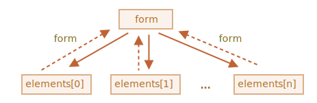

# Vlastnosti a metody formulářů

Formuláře a ovládací elementy, např. `<input>`, mají mnoho speciálních vlastností a událostí.

Když se je naučíme, práce s formuláři bude mnohem pohodlnější.

## Navigace: formulář a elementy

Formuláře v dokumentu jsou prvky speciální kolekce `document.forms`.

Je to tzv. *„jmenná kolekce“*: je současně pojmenovaná a seřazená. Můžeme získat formulář podle jeho názvu i podle jeho pořadí v dokumentu.

```js no-beautify
document.forms.můj; // formulář s name="můj"
document.forms[0]; // první formulář v dokumentu
```

Když máme formulář, je každý jeho element k dispozici ve jmenné kolekci `formulář.elements`.

Příklad:

```html run height=40
<form name="můj">
  <input name="jedna" value="1">
  <input name="dvě" value="2">
</form>

<script>
  // získáme formulář
  let form = document.forms.můj; // element <form name="můj">

  // získáme element
  let elem = form.elements.jedna; // element <input name="jedna">

  alert(elem.value); // 1
</script>
```

Stejný název může mít více elementů, což je typické pro rádiová tlačítka a checkboxy.

V takovém případě je `formulář.elements[název]` *kolekce*. Příklad:

```html run height=40
<form>
  <input type="radio" *!*name="věk"*/!* value="10">
  <input type="radio" *!*name="věk"*/!* value="20">
</form>

<script>
let formulář = document.forms[0];

let elementyVěků = formulář.elements.věk;

*!*
alert(elementyVěků[0]); // [object HTMLInputElement]
*/!*
</script>
```

Tyto navigační vlastnosti nezávisejí na struktuře značek. Ve `formulář.elements` jsou k dispozici všechny ovládací elementy, ať jsou ve formuláři jakkoli hluboko.


````smart header="Sady polí (fieldsety) jako „podformuláře“"
Formulář může obsahovat jeden nebo více elementů `<fieldset>`. I ty mají vlastnost `elements`, která obsahuje ovládací prvky formulářů uvnitř nich.

Příklad:

```html run height=80
<body>
  <form id="formulář">
    <fieldset name="uživatelskáPole">
      <legend>info</legend>
      <input name="login" type="text">
    </fieldset>
  </form>

  <script>
    alert(formulář.elements.login); // <input name="login">

*!*
    let sadaPolí = formulář.elements.uživatelskáPole;
    alert(sadaPolí); // HTMLFieldSetElement

    // můžeme získat vstup podle názvu jak z formuláře, tak ze sady polí
    alert(sadaPolí.elements.login == formulář.elements.login); // true
*/!*
  </script>
</body>
```
````

````warn header="Kratší notace: `formulář.název`"
Existuje kratší notace: můžeme k elementu přistupovat pomocí `formulář[index/název]`.

Jinými slovy, místo `formulář.elements.login` můžeme psát `formulář.login`.

To funguje také, ale má to drobnou nevýhodu: když přistoupíme k elementu a pak změníme jeho název (`name`), bude element stále dostupný pod starým názvem (stejně jako pod novým).

Snadno to uvidíme na příkladu:

```html run height=40
<form id="formulář">
  <input name="login">
</form>

<script>
  alert(formulář.elements.login == formulář.login); // true, stejný <input>

  formulář.login.name = "uživatelskéJméno"; // změníme název vstupního pole

  // formulář.elements aktualizovala název:
  alert(formulář.elements.login); // undefined
  alert(formulář.elements.uživatelskéJméno); // input

*!*
  // formulář umožňuje oba názvy: nový i starý
  alert(formulář.uživatelskéJméno == formulář.login); // true
*/!*
</script>
```

Obvykle to však není problém, protože názvy elementů formuláře měníme jen málokdy.

````

## Zpětný odkaz: element.form

V každém elementu je formulář dostupný jako `element.form`. Formulář se tedy odkazuje na všechny elementy a elementy se odkazují na formulář.

Zde je obrázek:



Příklad:

```html run height=40
<form id="formulář">
  <input type="text" name="login">
</form>

<script>
*!*
  // formulář -> element
  let login = formulář.login;

  // element -> formulář
  alert(login.form); // HTMLFormElement
*/!*
</script>
```

## Elementy formulářů

Promluvme si o ovládacích prvcích formulářů.

### input a textarea

K jejich hodnotám můžeme přistupovat pomocí `input.value` (řetězec) nebo v případě checkboxů a rádiových tlačítek `input.checked` (boolean).

Příklad:

```js
input.value = "Nová hodnota";
textarea.value = "Nový text";

input.checked = true; // pro checkbox nebo rádiové tlačítko
```

```warn header="Používejte `textarea.value`, ne `textarea.innerHTML`"
Prosíme všimněte si, že i když `<textarea>...</textarea>` udržuje svou hodnotu jako vnořený HTML kód, nikdy bychom k ní neměli přistupovat použitím `textarea.innerHTML`.

Ukládá si totiž jen HTML kód, který byl na stránce původně, ne aktuální hodnotu.
```

### select a option

Element `<select>` má tři důležité vlastnosti:

1. `select.options` -- kolekce podelementů `<option>`,
2. `select.value` -- *hodnota* aktuálně zvolené `<option>`,
3. `select.selectedIndex` -- *číslo* aktuálně zvolené `<option>`.

Poskytují tři různé způsoby, jak nastavit hodnotu `<select>`:

1. Najdeme odpovídací element `<option>` (např. mezi `select.options`) a nastavíme jeho vlastnost `option.selected` na `true`.
2. Pokud známe novou hodnotu: nastavíme `select.value` na tuto hodnotu.
3. Pokud známe číslo nově zvolené možnosti: nastavíme `select.selectedIndex` na toto číslo.

Příklad všech tří metod:

```html run
<select id="select">
  <option value="jablko">Jablko</option>
  <option value="hruška">Hruška</option>
  <option value="banán">Banán</option>
</select>

<script>
  // všechny tři řádky udělají totéž
  select.options[2].selected = true; 
  select.selectedIndex = 2;
  select.value = 'banán';
  // prosíme všimněte si: možnosti se číslují od nuly, takže index 2 znamená 3. možnost.
</script>
```

Na rozdíl od většiny ostatních ovládacích prvků `<select>` umožňuje zvolit více možností najednou, pokud má atribut `multiple`. Ten se však používá jen zřídka.

Více zvolených hodnot nastavujte prvním uvedeným způsobem: přidáváním a odstraňováním vlastnosti `selected` na podelementech `<option>`.

Následující příklad ukazuje, jak získat zvolené hodnoty z vícenásobné volby:

```html run
<select id="select" *!*multiple*/!*>
  <option value="blues" selected>Blues</option>
  <option value="rock" selected>Rock</option>
  <option value="klasika">Klasika</option>
</select>

<script>
  // získáme všechny hodnoty zvolené vícenásobnou volbou
  let zvolené = Array.from(select.options)
    .filter(možnost => možnost.selected)
    .map(možnost => možnost.value);

  alert(zvolené); // blues,rock  
</script>
```

Úplná specifikace elementu `<select>` je k dispozici ve specifikaci <https://html.spec.whatwg.org/multipage/forms.html#the-select-element>.

### new Option

Ve [specifikaci](https://html.spec.whatwg.org/multipage/forms.html#the-option-element) je uvedena pěkná krátká syntaxe vytvoření elementu `<option>`:

```js
možnost = new Option(text, hodnota, standardněZvolen, zvolen);
```

Tato syntaxe je nepovinná. Můžeme použít `document.createElement('option')` a nastavit atributy ručně. Může však být kratší, takže její parametry jsou:

- `text` -- text uvnitř možnosti,
- `hodnota` -- hodnota možnosti,
- `standardněZvolen` -- pokud je `true`, pak je vytvořen HTML atribut `selected`,
- `zvolen` -- pokud je `true`, pak je tato možnost zvolena.

Rozdíl mezi `standardněZvolen` a `zvolen` spočívá v tom, že `standardněZvolen` nastaví HTML atribut (který můžeme získat pomocí `option.getAttribute('selected')`), zatímco `zvolen` nastaví, zda je tato možnost zvolena nebo ne.

V praxi bychom zpravidla měli _obě_ hodnoty nastavit na `true` nebo na `false` (nebo je jednoduše vynechat; obě jsou standardně `false`).

Například zde vytvoříme novou „nezvolenou“ možnost:

```js
let možnost = new Option("Text", "hodnota");
// vytvoří <option value="hodnota">Text</option>
```

Stejná možnost, ale zvolená:

```js
let možnost = new Option("Text", "hodnota", true, true);
```

Elementy možností mají tyto vlastnosti:

`option.selected`
: Zda je možnost zvolena.

`option.index`
: Pořadové číslo možnosti mezi ostatními v jejím `<select>`.

`option.text`
: Textový obsah možnosti (který vidí návštěvník).

## Odkazy

- Specifikace: <https://html.spec.whatwg.org/multipage/forms.html>.

## Shrnutí

Navigace ve formuláři:

`document.forms`
: Formulář je k dispozici jako `document.forms[název/index]`.

`formulář.elements`  
: Elementy formuláře jsou k dispozici jako `formulář.elements[název/index]` nebo stačí použít `formulář[název/index]`. Vlastnost `elements` funguje i pro `<fieldset>`.

`element.form`
: Elementy se odkazují na svůj formulář ve vlastnosti `form`.

Hodnota je k dispozici jako `input.value`, `textarea.value`, `select.value` atd. (Pro checkboxy a rádiová tlačítka používejte ke zjištění, zda je tlačítko zaškrtnuto, `input.checked`.)

Pro `<select>` můžeme zvolenou hodnotu získat také podle indexu `select.selectedIndex` nebo z kolekce možností `select.options`.

To jsou základy k zahájení práce s formuláři. Dále v tomto tutoriálu se setkáme s mnoha příklady.

V následující kapitole probereme události `focus` a `blur`, které mohou nastat na kterémkoli elementu, ale nejčastěji se zpracovávají na formulářích.
