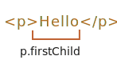
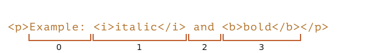
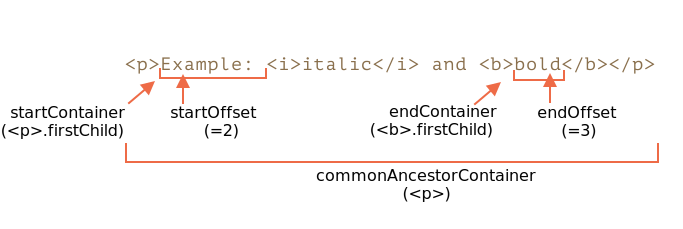
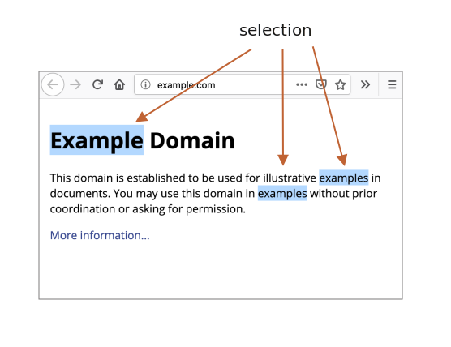
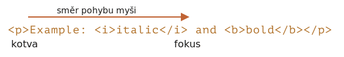
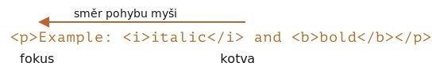

libs:
  - d3
  - domtree

---

# Výběr textu: třídy Selection a Range

V této kapitole probereme výběr textu v dokumentu i ve formulářových polích, jako je `<input>`.

JavaScript umí přistupovat k existujícímu výběru, vybírat nebo rušit výběr celých DOM uzlů i jejich částí, odstranit vybraný obsah z dokumentu, zabalit jej do značky a podobně.

Návody na nejčastější úlohy najdete na konci kapitoly v části „Shrnutí“. Vaše aktuální potřeby to možná pokryje, ale pokud si přečtete celý text, dozvíte se mnohem víc.

Základní objekty `Range` a `Selection` se snadno používají a nebudete pak potřebovat žádný návod, jak je přinutit udělat to, co chcete.

## Range

Základním konceptem výběru je třída [Range](https://dom.spec.whatwg.org/#ranges) (rozsah), což je v zásadě dvojice „hraničních bodů“: začátek a konec rozsahu.

Objekt třídy `Range` se vytváří bez parametrů:

```js
let rozsah = new Range();
```

Pak můžeme nastavit hranice výběru voláním `rozsah.setStart(uzel, pozice)` a `rozsah.setEnd(uzel, pozice)`.

Jak možná tušíte, později použijeme objekty třídy `Range` k výběru textu, ale napřed jich několik vytvořme.

### Částečný výběr textu

Zajímavé je, že první argument `uzel` v obou metodách může být buď textový, nebo elementový uzel, a na tom pak závisí význam druhého argumentu.

**Pokud je `uzel` textový uzel, pak `pozice` musí být pozice v jeho textu.**

Máme-li například element `<p>Hello</p>`, můžeme vytvořit rozsah obsahující písmena „ll“ následovně:

```html run
<p id="p">Hello</p>
<script>
  let rozsah = new Range();
  rozsah.setStart(p.firstChild, 2);
  rozsah.setEnd(p.firstChild, 4);
  
  // toString na rozsahu vrátí jeho obsah jako text
  console.log(rozsah); // ll
</script>
```

Zde vezmeme první dítě uzlu `<p>` (což je textový uzel) a specifikujeme pozice textu uvnitř něho:



### Výběr elementových uzlů

**Jestliže `uzel` je elementový uzel, pak `pozice` musí být pořadové číslo jeho dítěte.** 

To se hodí pro vytváření rozsahů, které obsahují celé uzly a nezastaví se někde uprostřed jejich textu.

Mějme například složitější fragment dokumentu:

```html autorun
<p id="p">Example: <i>italic</i> and <b>bold</b></p>
```

Zde je jeho DOM struktura s elementovými i textovými uzly:

<div class="select-p-domtree"></div>

<script>
let selectPDomtree = {
  "name": "P",
  "nodeType": 1,
  "children": [{
    "name": "#text",
    "nodeType": 3,
    "content": "Example: "
  }, {
    "name": "I",
    "nodeType": 1,
    "children": [{
      "name": "#text",
      "nodeType": 3,
      "content": "italic"
    }]
  }, {
    "name": "#text",
    "nodeType": 3,
    "content": " and "
  }, {
    "name": "B",
    "nodeType": 1,
    "children": [{
      "name": "#text",
      "nodeType": 3,
      "content": "bold"
    }]
  }]
}

drawHtmlTree(selectPDomtree, 'div.select-p-domtree', 690, 320);
</script>

Vytvořme rozsah pro `"Example: <i>italic</i>"`.

Jak vidíme, tato věta se skládá z právě dvou dětí uzlu `<p>`, jejichž indexy jsou `0` a `1`:



- Počáteční bod má `<p>` jako rodičovský `uzel` a jeho pozice je `0`.

    Můžeme jej tedy nastavit voláním `rozsah.setStart(p, 0)`.
- Koncový bod má také `<p>` jako rodičovský `uzel`, ale jeho pozice je `2` (specifikuje, kde má rozsah skončit, ale `pozice` není zahrnuta).

    Můžeme jej tedy nastavit voláním `rozsah.setStart(p, 2)`.

Když si spustíte následující demo, uvidíte, že se text vybral:

```html run
<p id="p">Example: <i>italic</i> and <b>bold</b></p>

<script>
*!*
  let rozsah = new Range();

  rozsah.setStart(p, 0);
  rozsah.setEnd(p, 2);
*/!*

  // toString na rozsahu vrací jeho obsah jako text bez značek
  console.log(rozsah); // Example: italic

  // tento rozsah aplikujeme na výběr v dokumentu (bude později vysvětleno)
  document.getSelection().addRange(rozsah);
</script>
```

Zde je flexibilnější zkušební příklad, v němž si můžete nastavit počáteční a koncové pořadí a prozkoumat jiné varianty:

```html run autorun
<p id="p">Example: <i>italic</i> and <b>bold</b></p>

Od <input id="počátek" type="number" value=1> – Do <input id="konec" type="number" value=4>
<button id="tlačítko">Kliknutím vyberete</button>
<script>
  tlačítko.onclick = () => {
  *!*
    let rozsah = new Range();

    rozsah.setStart(p, počátek.value);
    rozsah.setEnd(p, konec.value);
  */!*

    // aplikujeme výběr, bude později vysvětleno
    document.getSelection().removeAllRanges();
    document.getSelection().addRange(rozsah);
  };
</script>
```

Například výběr ve stejném `<p>` od pozice `1` do `4` nám vydá rozsah `<i>italic</i> a <b>bold</b>`:


```smart header="Počáteční a koncový uzel se mohou lišit"
V `setStart` a `setEnd` nemusíme používat tentýž uzel. Rozsah se může táhnout přes mnoho navzájem nesouvisejících uzlů. Důležité je jen to, aby konec byl v dokumentu až za začátkem.
```

### Výběr většího fragmentu

Vyberme v našem příkladu více textu, například:


Už víme, jak na to. Musíme jen nastavit začátek a konec jako relativní pozice v textových uzlech.

Potřebujeme vytvořit rozsah, který:
- začíná na pozici 2 v prvním dítěti `<p>` (vezme všechna písmena „Ex<b>ample:</b> “ kromě prvních dvou),
- končí na pozici 2 v prvním dítěti `<b>` (vezme první tři písmena „<b>bol</b>d“ , ale žádné další):

```html run
<p id="p">Example: <i>italic</i> and <b>bold</b></p>

<script>
  let rozsah = new Range();

  rozsah.setStart(p.firstChild, 2);
  rozsah.setEnd(p.querySelector('b').firstChild, 3);

  console.log(rozsah); // ample: italic and bol

  // použijeme tento rozsah pro výběr (vysvětlíme později)
  window.getSelection().addRange(rozsah);
</script>
```

Jak vidíte, je docela jednoduché vytvořit rozsah, jaký chceme.

Kdybychom chtěli vybírat celé uzly, můžeme do `setStart/setEnd` předávat elementy. Jinak můžeme pracovat na úrovni textu.

## Vlastnosti objektu rozsahu

Objekt rozsahu, který jsme v našem příkladu vytvořili, má následující vlastnosti:



- `startContainer`, `startOffset` -- uzel a pozice začátku,
  - v uvedeném příkladu: první textový uzel uvnitř `<p>` a `2`.
- `endContainer`, `endOffset` -- uzel a pozice konce,
  - v uvedeném příkladu: první textový uzel uvnitř `<b>` a `3`.
- `collapsed` -- booleovská vlastnost, `true`, jestliže rozsah začíná a končí ve stejném bodě (uvnitř rozsahu tedy není žádný obsah),
  - v uvedeném příkladu: `false`.
- `commonAncestorContainer` -- nejbližší společný předek všech uzlů v rozsahu,
  - v uvedeném příkladu: `<p>`.


## Metody pro nastavení rozsahu

K manipulaci s rozsahy slouží množství vhodných metod.

Už jsme viděli `setStart` a `setEnd`, nyní uvedeme jiné podobné metody.

Nastavení začátku:

- `setStart(uzel, pozice)` nastaví začátek na pozici `pozice` v `uzel`
- `setStartBefore(uzel)` nastaví začátek právě před `uzel`
- `setStartAfter(uzel)` nastaví začátek právě za `uzel`

Nastavení konce (obdobné metody):

- `setEnd(uzel, pozice)` nastaví konec na pozici `pozice` v `uzel`
- `setEndBefore(uzel)` nastaví konec právě před `uzel`
- `setEndAfter(uzel)` nastaví konec právě za `uzel`

Technicky mohou cokoli z toho udělat i `setStart/setEnd`, ale jiné metody jsou pohodlnější.

Ve všech těchto metodách může `uzel` být jak textový, tak elementový uzel: u textových uzlů `pozice` přeskočí uvedený počet znaků, zatímco u elementových uzlů uvedený počet dětských uzlů.

Existují i další metody pro vytvoření rozsahu:
- `selectNode(uzel)` nastaví rozsah tak, aby byl vybrán celý `uzel`
- `selectNodeContents(uzel)` nastaví rozsah tak, aby byl vybrán celý obsah uzlu `uzel`
- `collapse(naZačátek)`: pokud je `naZačátek=true`, nastaví konec=začátek, jinak nastaví začátek=konec, čímž se rozsah smrskne
- `cloneRange()` vytvoří nový rozsah se stejným začátkem a koncem

## Metody pro editaci rozsahu

Když je rozsah vytvořen, můžeme s jeho obsahem manipulovat pomocí následujících metod:

- `deleteContents()` -- odstraní obsah rozsahu z dokumentu
- `extractContents()` -- odstraní obsah rozsahu z dokumentu a vrátí jej jako [DocumentFragment](info:modifying-document#document-fragment)
- `cloneContents()` -- naklonuje obsah rozsahu a vrátí jej jako [DocumentFragment](info:modifying-document#document-fragment)
- `insertNode(uzel)` -- vloží `uzel` do dokumentu na začátek rozsahu
- `surroundContents(uzel)` -- zapouzdří obsah rozsahu do uzlu `uzel`. Aby to fungovalo, musí rozsah obsahovat otevírací i uzavírací značku pro všechny elementy uvnitř: nesmí to být částečný rozsah, např. `<i>abc`.

Pomocí těchto metod můžeme s vybranými uzly provádět v zásadě cokoli.

Zde je zkušební příklad, abyste je viděli v akci:

```html run refresh autorun height=260
Klikáním na tlačítka spouštějte metody na výběru, "resetPříkladu" jej resetuje.

<p id="p">Example: <i>italic</i> and <b>bold</b></p>

<p id="výsledek"></p>
<script>
  let rozsah = new Range();

  // Zde je uvedena každá předváděná metoda:
  let metody = {
    deleteContents() {
      rozsah.deleteContents()
    },
    extractContents() {
      let obsah = rozsah.extractContents();
      výsledek.innerHTML = "";
      výsledek.append("extrahováno: ", obsah);
    },
    cloneContents() {
      let obsah = rozsah.cloneContents();
      výsledek.innerHTML = "";
      výsledek.append("klonováno: ", obsah);
    },
    insertNode() {
      let novýUzel = document.createElement('u');
      novýUzel.innerHTML = "NOVÝ UZEL";
      rozsah.insertNode(novýUzel);
    },
    surroundContents() {
      let novýUzel = document.createElement('u');
      try {
        rozsah.surroundContents(novýUzel);
      } catch(e) { console.log(e) }
    },
    resetPříkladu() {
      p.innerHTML = `Example: <i>italic</i> and <b>bold</b>`;
      výsledek.innerHTML = "";

      rozsah.setStart(p.firstChild, 2);
      rozsah.setEnd(p.querySelector('b').firstChild, 3);

      window.getSelection().removeAllRanges();  
      window.getSelection().addRange(rozsah);  
    }
  };

  for(let metoda in metody) {
    document.write(`<div><button onclick="metody.${metoda}()">${metoda}</button></div>`);
  }

  metody.resetPříkladu();
</script>
```

Existují i metody pro porovnávání rozsahů, ale ty se používají jen zřídka. Kdybyste je potřebovali, prosíme obraťte se na [specifikaci](https://dom.spec.whatwg.org/#interface-range) nebo [manuál MDN](mdn:/api/Range).


## Výběr

`Range` je obecný objekt pro správu rozsahů výběru, ale vytvoření `Range` neznamená, že uvidíme výběr na obrazovce.

Můžeme objekty `Range` vytvářet, předávat -- samy o sobě vizuálně nic nevybírají.

Výběr v dokumentu představuje objekt třídy `Selection`, který můžeme získat pomocí `window.getSelection()` nebo `document.getSelection()`. Výběr může obsahovat nula nebo více rozsahů. Alespoň to tvrdí [specifikace API Selection](https://www.w3.org/TR/selection-api/). V praxi však umožňuje výběr více rozsahů v dokumentu jedině Firefox, a to pomocí `key:Ctrl+kliknutí` (na Macu `key:Cmd+kliknutí`).

Zde je screenshot výběru se třemi rozsahy, vytvořený ve Firefoxu:



Ostatní prohlížeče podporují maximálně jeden rozsah. Jak uvidíme, některé metody třídy `Selection` předpokládají, že rozsahů může být víc, ale opakujeme, že ve všech prohlížečích s výjimkou Firefoxu je maximálně jeden.

Následuje malé demo, které zobrazí aktuální výběr (něco označte a klikněte) jako text:

<button onclick="alert(document.getSelection())">alert(document.getSelection())</button>

## Vlastnosti třídy Selection

Jak bylo řečeno, výběr může teoreticky obsahovat více rozsahů. Objekty těchto rozsahů můžeme získat metodou:

- `getRangeAt(i)` -- vrátí i-tý rozsah, počínaje `0`. Ve všech prohlížečích kromě Firefoxu se používá pouze `0`.

Třída má i vlastnosti, jejichž používání je často pohodlnější.

Podobně jako rozsah, i objekt výběru má začátek, nazývaný „kotva“ („anchor“), a konec, nazývaný „fokus“ („focus“).

Hlavní vlastnosti výběru jsou:

- `anchorNode` -- uzel, kde výběr začíná,
- `anchorOffset` -- pozice v `anchorNode`, kde výběr začíná,
- `focusNode` -- uzel, kde výběr končí,
- `focusOffset` -- pozice ve `focusNode`, kde výběr končí,
- `isCollapsed` -- `true`, jestliže výběr nic neobsahuje (prázdný rozsah) nebo neexistuje,
- `rangeCount` -- počet rozsahů ve výběru, ve všech prohlížečích kromě Firefoxu maximálně `1`.

```smart header="Začátek/konec objektu Selection oproti Range"

Mezi kotvou/fokusem výběru a začátkem/koncem objektu `Range` je důležitý rozdíl.

Jak víme, objekty `Range` mají vždy začátek před koncem.

U výběrů tomu tak vždy není.

Vybrat něco myší je možné oběma směry: „zleva doprava“ nebo „zprava doleva“.

Jinými slovy, když stisknete tlačítko myši a pak jí posunujete v dokumentu směrem dopředu, pak konec výběru (fokus) bude za začátkem (kotvou).

Například když uživatel začne vybírat myší a jde od „Example“ k „italic“:



...Ale stejný výběr lze provést i obráceně: začít od „italic“ a postupovat k „Example“ (směrem zpět), pak jeho konec (fokus) bude před začátkem (kotvou):


```

## Události výběru

Následující události umožňují sledovat výběr:

- `elem.onselectstart` -- když je výběr *zahájen* specificky na elementu `elem` (nebo uvnitř něj). Například když na něm uživatel stiskne tlačítko myši a začne pohybovat ukazatelem.
    - Zákaz standardní akce zruší zahájení výběru. Začít výběr tímto elementem tedy přestane být možné, ale element bude stále možné vybrat. Návštěvník bude muset jen zahájit výběr jinde.
- `document.onselectionchange` -- když je výběr zahájen nebo změněn.
    - Prosíme všimněte si: tento handler lze nastavit jen na `document`, sleduje všechny výběry na něm.

### Demo sledování výběru

Následuje malé demo, které sleduje aktuální výběr na `document` a zobrazí jeho hranice:

```html run height=80
<p id="p">Vyberte mě: <i>italic</i> and <b>bold</b></p>

Od <input id="výběrOd" disabled> – Do <input id="výběrDo" disabled>
<script>
  document.onselectionchange = function() {
    let výběr = document.getSelection();

    let {anchorNode, anchorOffset, focusNode, focusOffset} = výběr;

    // anchorNode a focusNode jsou obvykle textové uzly
    výběrOd.value = `${anchorNode?.data}, index ${anchorOffset}`;
    výběrDo.value = `${focusNode?.data}, index ${focusOffset}`;
  };
</script>
```

### Demo kopírování výběru

Kopírovat vybraný obsah je možné dvěma způsoby:

1. Můžeme jej pomocí `document.getSelection().toString()` získat jako text.
2. Chceme-li zkopírovat úplný DOM, tj. chceme zachovat formátování, můžeme získat příslušné rozsahy pomocí `getRangeAt(...)`. Objekt `Range` obsahuje metodu `cloneContents()`, která naklonuje jeho obsah a vrátí jej jako objekt třídy `DocumentFragment`, který můžeme vložit jinam.

Následuje demo kopírování vybraného obsahu jako text i jako DOM uzly:

```html run height=100
<p id="p">Vyberte mě: <i>italic</i> and <b>bold</b></p>

Klonováno: <span id="klonováno"></span>
<br>
Jako text: <span id="jakoText"></span>

<script>
  document.onselectionchange = function() {
    let výběr = document.getSelection();

    klonováno.innerHTML = jakoText.innerHTML = "";

    // Naklonujeme DOM uzly z rozsahů (zde podporujeme vícenásobný výběr)
    for (let i = 0; i < výběr.rangeCount; i++) {
      klonováno.append(výběr.getRangeAt(i).cloneContents());
    }

    // Získáme výběr jako text
    jakoText.innerHTML += výběr;
  };
</script>
```

## Metody výběru

S výběrem můžeme pracovat pomocí přidávání a odstraňování rozsahů:

- `getRangeAt(i)` -- vrátí i-tý rozsah, počínaje `0`. Ve všech prohlížečích kromě Firefoxu se používá pouze `0`.
- `addRange(rozsah)` -- přidá `rozsah` do výběru. Jestliže už výběr má přidělený rozsah, všechny prohlížeče kromě Firefoxu toto volání ignorují.
- `removeRange(rozsah)` -- odstraní `rozsah` z výběru.
- `removeAllRanges()` -- odstraní všechny rozsahy.
- `empty()` -- totéž jako `removeAllRanges`.

Existují i pohodlnější metody, které umožňují manipulovat s rozsahem výběru přímo, bez mezilehlého objektu `Range`:

- `collapse(uzel, pozice)` -- nahradí vybraný rozsah novým, který začíná a končí v zadaném uzlu `uzel` na pozici `pozice`,
- `setPosition(uzel, pozice)` -- totéž jako `collapse`,
- `collapseToStart()` -- smrskne výběr (nahradí jej prázdným rozsahem) na jeho začátek,
- `collapseToEnd()` -- smrskne výběr na jeho konec,
- `extend(uzel, pozice)` -- přesune fokus výběru na zadaný `uzel` na pozici `pozice`,
- `setBaseAndExtent(kotvaUzel, kotvaPozice, fokusUzel, fokusPozice)` -- nahradí vybraný rozsah zadaným začátkem `kotvaUzel/kotvaPozice` a koncem `fokusUzel/fokusPozice`. Veškerý obsah mezi nimi bude vybrán,
- `selectAllChildren(uzel)` -- vybere všechny děti uzlu `uzel`,
- `deleteFromDocument()` -- odstraní vybraný obsah z dokumentu,
- `containsNode(uzel, umožnitČástečnýVýběr = false)` -- ověří, zda výběr obsahuje `uzel` (je-li druhý argument `true`, stačí, když obsahuje jen jeho část).

Pro většinu úloh tyto metody vyhovují a není třeba přistupovat k podkladovému objektu `Range`.

Například vybereme celý obsah odstavce `<p>`:

```html run
<p id="p">Vyberte mě: <i>italic</i> and <b>bold</b></p>

<script>
  // výběr od 0. dítěte značky <p> do posledního dítěte
  document.getSelection().setBaseAndExtent(p, 0, p, p.childNodes.length);
</script>
```

Totéž za použití rozsahů:

```html run
<p id="p">Vyberte mě: <i>italic</i> a <b>bold</b></p>

<script>
  let rozsah = new Range();
  rozsah.selectNodeContents(p); // nebo selectNode(p), chceme-li vybrat i značku <p>

  document.getSelection().removeAllRanges(); // zrušíme existující výběr, je-li nějaký
  document.getSelection().addRange(rozsah);
</script>
```

```smart header="Když něco vybíráte, napřed odstraňte již existující výběr"
Jestliže v dokumentu již nějaký výběr existuje, napřed jej vyprázdněte voláním `removeAllRanges()` a teprve pak přidávejte rozsahy. Jinak budou všechny prohlížeče kromě Firefoxu nové rozsahy ignorovat.

Výjimkou jsou některé metody pro výběr, které nahrazují existující výběr, například `setBaseAndExtent`.
```

## Výběr v ovládacích prvcích formulářů

Elementy formulářů, např. `input` a `textarea`, poskytují [speciální API pro výběr](https://html.spec.whatwg.org/#textFieldSelection), které neobsahuje objekty `Selection` nebo `Range`. Protože vstupní hodnota je čistý text a nikoli HTML kód, nejsou takové objekty zapotřebí a všechno je pak mnohem snazší.

Vlastnosti:
- `input.selectionStart` -- pozice začátku výběru (zapisovatelná),
- `input.selectionEnd` -- pozice konce výběru (zapisovatelná),
- `input.selectionDirection` -- směr výběru, jeden z `"forward"` (dopředu), `"backward"` (dozadu) nebo `"none"` (žádný, např. pokud byl výběr proveden dvojitým kliknutím myši).

Události:
- `input.onselect` -- spustí se, když je něco vybráno.

Metody:

- `input.select()` -- vybere všechen obsah textového ovládacího prvku (místo `input` může být `textarea`),
- `input.setSelectionRange(začátek, konec, [směr])` -- změní výběr tak, aby se táhl od pozice `začátek` do pozice `konec` v zadaném směru (nepovinný),
- `input.setRangeText(náhrada, [začátek], [konec], [režimVýběru])` -- nahradí text v zadaném rozsahu novým textem.

    Pokud jsou uvedeny nepovinné argumenty `začátek` a `konec`, nastavují začátek a konec rozsahu, jinak se použije uživatelský výběr.

    Poslední argument, `režimVýběru`, stanovuje, jak bude výběr nastaven po nahrazení textu. Možné hodnoty jsou:

    - `"select"` -- bude vybrán nově vložený text.
    - `"start"` -- rozsah výběru se smrskne právě před vložený text (kurzor bude hned před ním).
    - `"end"` -- rozsah výběru se smrskne právě za vložený text (kurzor bude hned za ním).
    - `"preserve"` -- pokusí se zachovat výběr. Tato hodnota je standardní.

Podívejme se nyní na tyto metody v akci.

### Příklad: sledování výběru

Například následující kód sleduje výběr pomocí události `onselect`:

```html run autorun
<textarea id="area" style="width:80%;height:60px">
Výběr v tomto textu aktualizuje hodnoty pod ním.
</textarea>
<br>
Od <input id="výběrOd" disabled> – Do <input id="výběrDo" disabled>

<script>
  area.onselect = function() {
    výběrOd.value = area.selectionStart;
    výběrDo.value = area.selectionEnd;
  };
</script>
```

Prosíme všimněte si:
- Událost `onselect` se spustí, když je něco vybráno, ale ne tehdy, když je výběr odstraněn.
- Událost `document.onselectionchange` by se podle [specifikace](https://w3c.github.io/selection-api/#dfn-selectionchange) neměla spouštět při výběrech uvnitř formulářového ovládacího prvku, protože ty se nevztahují k výběru a rozsahům v `document`. Některé prohlížeče ji generují, ale neměli bychom se na to spoléhat.


### Příklad: pohyb kurzoru

Vlastnosti `selectionStart` a `selectionEnd` můžeme měnit a tím nastavovat výběr.

Důležitý krajní případ je, když se `selectionStart` a `selectionEnd` navzájem rovnají. Pak specifikují právě pozici kurzoru. Nebo, jinak řečeno, když není nic zvoleno, výběr je smrsknut na pozici kurzoru.

Nastavením `selectionStart` a `selectionEnd` na stejnou hodnotu tedy pohybujeme kurzorem.

Příklad:

```html run autorun
<textarea id="area" style="width:80%;height:60px">
Když na mě vstoupíte, kurzor bude na pozici 10.
</textarea>

<script>
  area.onfocus = () => {
    // setTimeout s nulovou prodlevou se spustí poté, co skončí akce prohlížeče "focus"
    setTimeout(() => {
      // můžeme nastavit jakýkoli výběr
      // bude-li start=end, kurzor se přesune právě na toto místo
      area.selectionStart = area.selectionEnd = 10;
    });
  };
</script>
```

### Příklad: modifikace výběru

K modifikaci výběru můžeme použít metodu `input.setRangeText()`. Můžeme samozřejmě načíst `selectionStart/End` a při znalosti výběru změnit odpovídající podřetězec hodnoty `value`, ale `setRangeText` je silnější a často i vhodnější.

Tato metoda je trochu složitější. V nejjednodušší formě s jedním argumentem nahradí uživatelem vybraný řetězec a odstraní výběr.

Například zde bude uživatelův výběr obklopen `*...*`:

```html run autorun
<input id="vstup" style="width:200px" value="Vyberte zde text a stiskněte tlačítko">
<button id="tlačítko">Obklopit výběr hvězdičkami *...*</button>

<script>
tlačítko.onclick = () => {
  if (vstup.selectionStart == vstup.selectionEnd) {
    return; // nebylo nic vybráno
  }

  let výběr = vstup.value.slice(vstup.selectionStart, vstup.selectionEnd);
  vstup.setRangeText(`*${výběr}*`);
};
</script>
```

Dalšími argumenty můžeme nastavit `začátek` a `konec` rozsahu.

V tomto příkladu najdeme ve vstupním textu `"TOTO"`, nahradíme je a ponecháme nahrazující text vybraný:

```html run autorun
<input id="vstup" style="width:200px" value="Nahradit TOTO v textu">
<button id="tlačítko">Nahradit TOTO</button>

<script>
tlačítko.onclick = () => {
  let pozice = vstup.value.indexOf("TOTO");
  if (pozice >= 0) {
    vstup.setRangeText("*TOTO*", pozice, pozice + 4, "select");
    vstup.focus(); // nastavením fokusu zviditelníme výběr
  }
};
</script>
```

### Příklad: vložení textu na pozici kurzoru

Jestliže není nic vybráno nebo jestliže v `setRangeText` použijeme stejný `začátek` a `konec`, pak bude pouze vložen nový text a nic se neodstraní.

Pomocí `setRangeText` můžeme také něco vložit „na pozici kurzoru“.

Následující tlačítko vloží `"AHOJ"` na pozici kurzoru a umístí kurzor hned za něj. Pokud výběr není prázdný, bude nahrazen (porovnáním `selectionStart!=selectionEnd` to můžeme zjistit a pak místo toho udělat něco jiného):

```html run autorun
<input id="vstup" style="width:200px" value="Text Text Text Text Text">
<button id="tlačítko">Vložit "AHOJ" na pozici kurzoru</button>

<script>
  tlačítko.onclick = () => {
    vstup.setRangeText("AHOJ", vstup.selectionStart, vstup.selectionEnd, "end");
    vstup.focus();
  };    
</script>
```


## Zákaz výběru

K tomu, abychom zakázali něco vybrat, máme tři možnosti:

1. Použít CSS vlastnost `user-select: none`.

    ```html run
    <style>
    #elem {
      user-select: none;
    }
    </style>
    <div>Lze vybrat <div id="elem">Nelze vybrat</div> Lze vybrat</div>
    ```

    Tím se zabrání tomu, aby výběr začínal na `elem`, ale uživatel může zahájit výběr jinde a `elem` do něj zahrnout.

    Pak se `elem` stane součástí `document.getSelection()`, takže k výběru ve skutečnosti dojde, ale jeho obsah bude při operaci kopírování a vložení obvykle ignorován.


2. Zakázat standardní akci v událostech `onselectstart` nebo `mousedown`.

    ```html run
    <div>Lze vybrat <div id="elem">Nelze vybrat</div> Lze vybrat</div>

    <script>
      elem.onselectstart = () => false;
    </script>
    ```

    Tím se zabrání zahájit výběr na `elem`, ale návštěvník jej může zahájit na jiném elementu a pak rozšířit na `elem`.

    To se hodí, když je na stejné akci, která spouští výběr (např. `mousedown`), jiný handler události. Tím tedy zakážeme výběr, abychom se vyhnuli konfliktu, ale stále umožníme kopírovat obsah `elem`.

3. Můžeme také pomocí `document.getSelection().empty()` odstranit výběr poté, co k němu dojde. To se však používá zřídka, neboť to způsobuje nechtěné blikání, když se výběr objeví a zmizí.

## Odkazy

- [Specifikace DOMu: Range](https://dom.spec.whatwg.org/#ranges)
- [API Selection](https://www.w3.org/TR/selection-api/#dom-globaleventhandlers-onselectstart)
- [Specifikace HTML: API pro výběry v textových ovládacích prvcích](https://html.spec.whatwg.org/multipage/form-control-infrastructure.html#textFieldSelection)


## Shrnutí

Probrali jsme dvě různá API pro výběr:

1. Pro dokument: objekty `Selection` a `Range`.
2. Pro `input`, `textarea`: další metody a vlastnosti.

Druhé uvedené API je velmi jednoduché, neboť pracuje s textem.

Pravděpodobně nejčastěji používané návody jsou:

1. Získání výběru:
    ```js
    let výběr = document.getSelection();

    let klonovaný = /* element, do kterého chceme naklonovat vybrané uzly */;

    // pak aplikujeme metody Range na výběr.getRangeAt(0)
    // nebo jako zde na všechny rozsahy, chceme-li podporovat vícenásobný výběr
    for (let i = 0; i < výběr.rangeCount; i++) {
      klonovaný.append(výběr.getRangeAt(i).cloneContents());
    }
    ```
2. Nastavení výběru:
    ```js
    let výběr = document.getSelection();

    // přímo:
    výběr.setBaseAndExtent(...od...do...);

    // nebo můžeme vytvořit rozsah a:
    výběr.removeAllRanges();
    výběr.addRange(rozsah);
    ```

A nakonec ke kurzoru. Pozice kurzoru v editovatelných prvcích, např. `<textarea>`, je vždy na začátku nebo na konci výběru. Pomocí výběru můžeme zjistit pozici kurzoru nebo přemístit kurzor nastavením `elem.selectionStart` a `elem.selectionEnd`.
