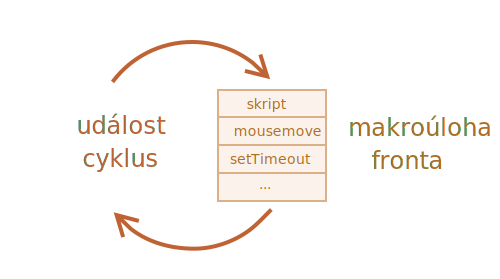
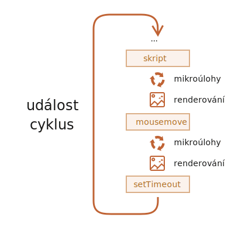

# Smyčka událostí: mikroúlohy a makroúlohy

Běh JavaScriptu v prohlížeči i v Node.js je založen na *smyčce událostí*.

Porozumět, jak smyčka událostí funguje, je důležité pro optimalizace a někdy pro správnou architekturu.

V této kapitole nejprve probereme teoretické podrobnosti o tom, jak to vše funguje, a pak se podíváme na praktické aplikace těchto znalostí.

## Smyčka událostí

Koncept *smyčky událostí* je velmi jednoduchý. Je to nekonečná smyčka, v níž motor JavaScriptu čeká na úlohy, spouští je a pak spí a čeká na další úlohy.

Obecný algoritmus motoru:

1. Dokud jsou úlohy:
    - spouštěj je v pořadí od nejstarší.
2. Čekej, dokud se neobjeví úloha, a pak přejdi k bodu 1.

To je formalizace toho, co vidíme při prohlížení stránky. Motor JavaScriptu většinu času nic nedělá a spustí se jen tehdy, když se aktivuje skript, handler nebo událost.

Příklady úloh:

- Když se načte externí skript `<script src="...">`, úlohou je spustit jej.
- Když uživatel pohne myší, úlohou je vyvolat událost `mousemove` a spustit handlery.
- Když nastal čas na naplánovaný `setTimeout`, úlohou je spustit jeho callback.
- ...a podobně.

Úlohy se nastaví -- motor je zpracuje -- a pak čeká na další úlohy (zatímco spí a nespotřebovává téměř žádné zdroje CPU).

Může se stát, že úloha přijde v době, kdy motor zrovna pracuje. Pak se úloha zařadí do fronty.

Úlohy tvoří frontu, nazývanou „fronta makroúloh“ (pojem z [v8](https://v8.dev/)):



Například zatímco je motor zaneprázdněn výkonem skriptu, uživatel může pohnout myší a vyvolat `mousemove`, může nastat čas na `setTimeout` a podobně. Tyto úlohy vytvoří frontu, jak je zobrazeno na uvedeném obrázku.

Úlohy z fronty se zpracovávají principem „kdo dřív přijde, ten je dřív obsloužen“. Když motor v prohlížeči dokončí `script`, zpracuje událost `mousemove`, pak handler `setTimeout` a tak dále.

Zatím je to docela jednoduché, že?

Dva další detaily:
1. Dokud motor provádí úlohu, nikdy se neprovádí vykreslování. Nezáleží na tom, že provádění úlohy bude trvat dlouhou dobu. Změny v DOMu se vykreslí až po dokončení úlohy.
2. Jestliže úloha trvá příliš dlouho, prohlížeč nemůže provádět jiné úlohy, například zpracování uživatelských událostí. Po nějaké době tedy zobrazí oznámení jako „Stránka nereaguje“ a navrhne ukončit úlohu spolu s celou stránkou. To se stane tehdy, když úloha obsahuje spoustu složitých výpočtů nebo když programátorská chyba vede k nekonečnému cyklu.

To byla teorie. Nyní se podívejme, jak můžeme tyto znalosti využít.

## Případ použití 1: rozdělení úloh náročných na CPU

Řekněme, že máme úlohu náročnou na CPU.

Například zvýrazňování syntaxe (používané k obarvení příkladů kódu na této stránce) je na CPU poměrně náročné. Aby bylo možné kód obarvit, musí se provést analýza, vytvořit mnoho barevných elementů, přidat je do dokumentu -- pro velké množství textu to trvá dlouhou dobu.

Zatímco motor pracuje na zvýrazňování syntaxe, nemůže provádět jiné věci vztahující se k DOMu, zpracovávat uživatelské události a podobně. Může dokonce způsobit, že se prohlížeč „zadrhne“ nebo dokonce na nějakou dobu „zatuhne“, což je nepřijatelné.

Těmto problémům se můžeme vyhnout, když velkou úlohu rozdělíme na části. Zvýrazníme prvních 100 řádků, pak naplánujeme `setTimeout` (s nulovou prodlevou) pro dalších 100 řádků, a tak dále.

Abychom tento přístup předvedli, pro zjednodušení místo zvýrazňování syntaxe použijeme funkci, která bude počítat od `1` do `1000000000`.

Když spustíte následující kód, motor na nějakou dobu „zatuhne“. U JS na serverové straně je to zjevně vidět, a pokud si ho spustíte v prohlížeči, pokuste se klikat na jiná tlačítka na stránce -- uvidíte, že dokud počítání neskončí, žádné jiné události nebudou zpracovány.

```js run
let i = 0;

let začátek = Date.now();

function počítej() {

  // provede těžkou práci
  for (let j = 0; j < 1e9; j++) {
    i++;
  }

  alert("Hotovo za " + (Date.now() - začátek) + ' ms');
}

počítej();
```

Prohlížeč může dokonce zobrazit upozornění „skript trvá příliš dlouho“.

Rozdělme tuto práci pomocí vnořených volání `setTimeout`:

```js run
let i = 0;

let začátek = Date.now();

function počítej() {

  // provede část těžké práce (*)
  do {
    i++;
  } while (i % 1e6 != 0);

  if (i == 1e9) {
    alert("Hotovo za " + (Date.now() - začátek) + ' ms');
  } else {
    setTimeout(počítej); // naplánujeme další volání (**)
  }

}

počítej();
```

Nyní je rozhraní prohlížeče během procesu „počítání“ plně funkční.

Jedno spuštění `počítej` odvede část práce `(*)` a pak se znovu naplánuje `(**)`, pokud je to zapotřebí:

1. První běh spočítá: `i=1...1000000`.
2. Druhý běh spočítá: `i=1000001..2000000`.
3. ...a tak dále.

Pokud se nyní objeví nová vedlejší úloha (např. událost `onclick`), zatímco je motor zaneprázdněn výkonem části 1, zařadí se do fronty a pak se spustí, až bude část 1 dokončena, ještě před další částí. Periodické návraty do smyčky událostí mezi spuštěními `počítej` poskytnou motoru JavaScriptu dostatek „vzduchu k nadechnutí“, aby prováděl něco jiného, aby reagoval na jiné uživatelské akce.

Stojí za zmínku, že obě varianty -- s rozdělením práce pomocí `setTimeout` i bez něj -- mají srovnatelnou rychlost. V celkové době výpočtu není velký rozdíl.

Abychom je ještě přiblížili, vytvořme zlepšení.

Přesuneme naplánování na začátek funkce `počítej()`:

```js run
let i = 0;

let začátek = Date.now();

function počítej() {

  // přesuneme naplánování na začátek
  if (i < 1e9 - 1e6) {
    setTimeout(počítej); // naplánujeme nové volání
  }

  do {
    i++;
  } while (i % 1e6 != 0);

  if (i == 1e9) {
    alert("Hotovo za " + (Date.now() - začátek) + ' ms');
  }

}

počítej();
```

Když nyní zahájíme funkci `počítej()` a vidíme, že budeme potřebovat volat `počítej()` dál, naplánujeme to hned, ještě před provedením práce.

Když si to spustíte, všimnete si, že to trvá výrazně méně času.

Proč? 

Důvod je jednoduchý: jak si pamatujete, v prohlížeči je minimální prodleva pro mnoho vnořených volání funkce `setTimeout` 4 ms. I když nastavíme `0`, bude to `4 ms` (nebo o trochu víc). Čím dříve ji tedy nastavíme, tím rychleji se spustí.

Nakonec jsme tedy rozdělili úlohu náročnou na CPU na části -- nyní neblokuje uživatelské rozhraní. A její celková doba běhu není příliš delší.

## Případ použití 2: zobrazování průběhu

Další výhodou rozdělení těžkých úloh v prohlížečových skriptech je, že můžeme zobrazovat indikátor průběhu.

Jak jsme uvedli dříve, změny v DOMu se vykreslí teprve po dokončení aktuálně běžící úlohy, ať trvá jakkoli dlouho.

Na jednu stranu je to skvělé, protože naše funkce může vytvořit množství elementů, přidávat je do dokumentu jeden po druhém a měnit jejich styly -- návštěvník nespatří žádný nedokončený „mezistav“. To je důležité, ne?

V následujícím demu se změny proměnné `i` nezobrazí, dokud funkce neskončí, takže uvidíme pouze poslední hodnotu:


```html run
<div id="průběh"></div>

<script>

  function počítej() {
    for (let i = 0; i < 1e6; i++) {
      i++;
      průběh.innerHTML = i;
    }
  }

  počítej();
</script>
```

...Ale současně můžeme chtít při běhu úlohy něco zobrazovat, například ukazatel průběhu.

Jestliže rozdělíme těžkou úlohu na části pomocí `setTimeout`, budou změny vykresleny mezi nimi.

Tohle vypadá lépe:

```html run
<div id="průběh"></div>

<script>
  let i = 0;

  function počítej() {

    // provede část těžké práce (*)
    do {
      i++;
      průběh.innerHTML = i;
    } while (i % 1e3 != 0);

    if (i < 1e7) {
      setTimeout(počítej);
    }

  }

  počítej();
</script>
```

Nyní bude `<div>` zobrazovat zvyšující se hodnoty `i`, tedy něco jako ukazatel průběhu.


## Případ použití 3: provedení něčeho po události

V handleru události se můžeme rozhodnout odložit některé akce až na dobu, kdy událost probublala a byla zpracována na všech úrovních. To můžeme udělat zapouzdřením kódu do `setTimeout` s nulovou prodlevou.

Příklad jsme již viděli v kapitole <info:dispatch-events>: naše vlastní událost `otevři-menu` je vyvolána v `setTimeout`, takže nastane až poté, co je událost `click` plně zpracována.

```js
menu.onclick = function() {
  // ...

  // vytvoříme vlastní událost s daty kliknutého prvku menu
  let vlastníUdálost = new CustomEvent("otevři-menu", {
    bubbles: true
  });

  // asynchronně vyvoláme vlastní událost
  setTimeout(() => menu.dispatchEvent(vlastníUdálost));
};
```

## Makroúlohy a mikroúlohy

Kromě *makroúloh*, popsaných v této kapitole, existují také *mikroúlohy*, o nichž jsme se zmínili v kapitole <info:microtask-queue>.

Mikroúlohy pocházejí výhradně z našeho kódu. Obvykle je vytvářejí přísliby: spuštění handleru `.then/catch/finally` se stane mikroúlohou. Mikroúlohy se používají i „pod pláštíkem“ `await`, což je vlastně jen další způsob zpracování příslibů.

Existuje i speciální funkce `queueMicrotask(funkce)`, která zařadí spuštění `funkce` do fronty mikroúloh.

**Ihned po každé *makroúloze* motor spustí všechny úlohy z fronty *mikroúloh* ještě před spuštěním dalších makroúloh, vykreslování nebo čehokoli jiného.**

Podívejme se na příklad:

```js run
setTimeout(() => alert("timeout"));

Promise.resolve()
  .then(() => alert("příslib"));

alert("kód");
```

V jakém pořadí se to bude dít?

1. Jako první se zobrazí `kód`, protože to je běžné synchronní volání.
2. Jako druhý se zobrazí `příslib`, protože `.then` projde frontou mikroúloh a spustí se po aktuálním kódu.
3. Jako poslední se zobrazí `timeout`, protože to je makroúloha.

Bohatší obrázek smyčky událostí vypadá takto (pořadí shora dolů, tedy: nejprve skript, pak mikroúlohy, vykreslování a tak dále):



Všechny mikroúlohy se dokončí dříve, než se uskuteční zpracování dalších handlerů událostí, vykreslování nebo jakákoli jiná makroúloha.

To je důležité, neboť nám to zaručuje, že aplikační prostředí zůstane mezi mikroúlohami v zásadě stejné (nebudou změny v souřadnicích myši, nová data ze sítě atd.).

Jestliže chceme spustit funkci asynchronně (po aktuálním kódu), ale ještě před vykreslením změn nebo zpracování nových událostí, můžeme ji naplánovat voláním `queueMicrotask`.

Následuje příklad s „ukazatelem průběhu počítání“, podobný dříve uvedenému, ale místo `setTimeout` použijeme `queueMicrotask`. Vidíte, že k vykreslení dojde až na samotném konci, stejně jako u synchronního kódu:

```html run
<div id="průběh"></div>

<script>
  let i = 0;

  function počítej() {

    // provede část těžké práce (*)
    do {
      i++;
      průběh.innerHTML = i;
    } while (i % 1e3 != 0);

    if (i < 1e6) {
  *!*
      queueMicrotask(počítej);
  */!*
    }

  }

  počítej();
</script>
```

## Shrnutí

Podrobnější algoritmus smyčky událostí (ačkoli ve srovnání se [specifikací](https://html.spec.whatwg.org/multipage/webappapis.html#event-loop-processing-model) stále zjednodušený):

1. Vyjmi z fronty a spusť nejstarší úlohu z fronty *makroúloh* (např. skript).
2. Spusť všechny *mikroúlohy*:
    - Dokud není fronta mikroúloh prázdná:
        - Vyjmi z fronty a spusť nejstarší mikroúlohu.
3. Vykresli změny, pokud k nějakým došlo.
4. Pokud je fronta makroúloh prázdná, vyčkej na příchod nové makroúlohy.
5. Přejdi k bodu 1.

Chcete-li naplánovat novou *makroúlohu*:
- Použijte `setTimeout(f)` s nulovou prodlevou.

Tímto způsobem můžete rozdělit velkou, výpočetně náročnou úlohu na části, aby mezi nimi prohlížeč mohl reagovat na uživatelské události a zobrazovat průběh.

Používá se to i v handlerech událostí, abychom naplánovali akci až na dobu, kdy bude událost plně zpracována (bublání je dokončeno).

Chcete-li naplánovat novou *mikroúlohu*:
- Použijte `queueMicrotask(f)`.
- Frontou mikroúloh procházejí také handlery příslibů.

Mezi mikroúlohami nedochází ke zpracování událostí uživatelského rozhraní nebo sítě: spouštějí se okamžitě jedna za druhou.

Můžeme tedy chtít použít `queueMicrotask`, abychom spustili funkci asynchronně, ale ve stejném stavu prostředí.

```smart header="Web Workers"
Pro dlouhé a těžké výpočty, které by neměly blokovat smyčku událostí, můžeme použít [Web Workers](https://html.spec.whatwg.org/multipage/workers.html).

To je způsob, jak spustit kód v jiném, paralelním vlákně.

Web Workers si mohou vyměňovat zprávy s hlavním procesem, ale mají své vlastní proměnné a svou vlastní smyčku událostí.

Web Workers nemají přístup k DOMu, jsou tedy užitečné zejména k výpočtům, abychom využili více jader CPU současně.
```
