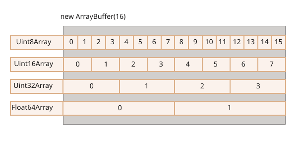
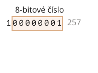
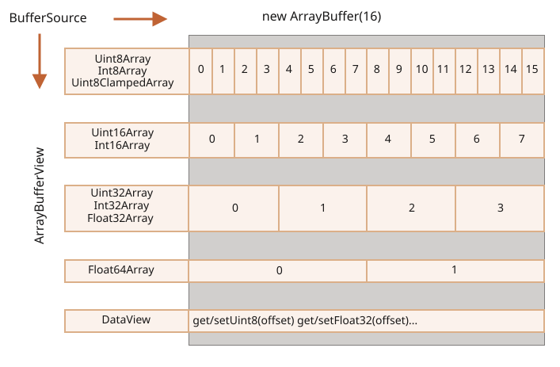

# ArrayBuffer, binární pole

Při vývoji webů se setkáváme s binárními daty převážně při práci se soubory (vytváření, ukládání, stahování). Další typický případ použití je zpracování obrázků.

V JavaScriptu je to všechno proveditelné a binární operace jsou vysoce výkonné.

Mohou však způsobit menší zmatení, protože pro práci s nimi existuje mnoho tříd. Jmenujme některé:
- `ArrayBuffer`, `Uint8Array`, `DataView`, `Blob`, `File`, atd.

Ve srovnání s jinými jazyky jsou binární data v JavaScriptu implementována nestandardním způsobem. Ale když si to všechno utřídíme, začne nám to rychle připadat jednoduché.

**Základním binárním objektem je `ArrayBuffer` -- odkaz na souvislou oblast paměti pevné délky.**

Vytvoříme jej následovně:
```js run
let buffer = new ArrayBuffer(16); // vytvoříme buffer o délce 16
alert(buffer.byteLength); // 16
```

Tím obsadíme souvislou oblast paměti o délce 16 bytů a vyplníme ji nulami.

```warn header="`ArrayBuffer` není pole ničeho"
Vyhněme se možnému zdroji zmatků. `ArrayBuffer` nemá nic společného s `Array`:
- Má pevnou délku, kterou nemůžeme zvýšit ani snížit.
- V paměti zabírá přesně uvedené množství místa.
- Pro přístup k jednotlivým bytům je zapotřebí další objekt „náhledu“, není to možné pomocí `buffer[index]`.
```

`ArrayBuffer` je oblast v paměti. Co je v ní uloženo? O tom nemá ponětí. Jen planá posloupnost bytů.

**K manipulaci s `ArrayBuffer` musíme použít objekt „náhledu“.**

Objekt náhledu sám o sobě nic neukládá. Jsou to jen „brýle“, které nám poskytují interpretaci bytů uložených v `ArrayBuffer`.

Například:

- **`Uint8Array`** -- zachází s každým bytem v `ArrayBuffer` jako se samostatným číslem s možnými hodnotami od 0 do 255 (byte má 8 bitů, takže nemůže uschovat větší číslo). Taková hodnota se nazývá „8-bitové celé číslo bez znaménka“.
- **`Uint16Array`** -- zachází s každými 2 byty jako s celým číslem s možnými hodnotami od 0 do 65535. To se nazývá „16-bitové celé číslo bez znaménka“.
- **`Uint32Array`** -- zachází s každými 4 byty jako s celým číslem s možnými hodnotami od 0 do 4294967295. To se nazývá „32-bitové celé číslo bez znaménka“.
- **`Float64Array`** -- zachází s každými 8 byty jako s číslem s pohyblivou řádovou čárkou s možnými hodnotami od <code>5.0x10<sup>-324</sup></code> do <code>1.8x10<sup>308</sup></code>.

Binární data v `ArrayBuffer` o délce 16 bytů je tedy možné interpretovat jako 16 „malých čísel“, nebo 8 větších čísel (každé o 2 bytech), nebo 4 ještě větší čísla (každé o 4 bytech), nebo 2 hodnoty s pohyblivou řádovou čárkou s vysokou přesností (každá o 8 bytech).



`ArrayBuffer` je jádrový objekt, kořen všeho, planá binární data.

Když do něj však chceme zapisovat, iterovat nad ním, v zásadě pro téměř jakoukoli operaci -- musíme použít náhled, například:

```js run
let buffer = new ArrayBuffer(16); // vytvoříme buffer o délce 16

*!*
let náhled = new Uint32Array(buffer); // zacházíme s ním jako s posloupností 32-bitových celých čísel

alert(Uint32Array.BYTES_PER_ELEMENT); // 4 byty na jedno číslo
*/!*

alert(náhled.length); // 4, počet čísel, která dokáže uložit
alert(náhled.byteLength); // 16, velikost v bytech

// zapišme do něj hodnotu
náhled[0] = 123456;

// iterujme nad hodnotami
for(let číslo of náhled) {
  alert(číslo); // 123456, pak 0, 0, 0 (celkem 4 hodnoty)
}

```

## TypedArray

Společným pojmem pro všechny tyto náhledy (`Uint8Array`, `Uint32Array`, atd.) je [TypedArray](https://tc39.github.io/ecma262/#sec-typedarray-objects) -- typové pole. Všechny mají společnou sadu metod a vlastností.

Prosíme všimněte si, že neexistuje konstruktor s názvem `TypedArray`. Je to jen společný „zastřešující“ pojem, který představuje jeden z náhledů na `ArrayBuffer`: `Int8Array`, `Uint8Array` a tak dále. Úplný seznam bude brzy následovat.

Když vidíte něco jako `new TypedArray`, znamená to cokoli z `new Int8Array`, `new Uint8Array`, atd.

Typová pole se chovají stejně jako běžná pole: mají indexy a jsou iterovatelná.

Konstruktor typového pole (ať je to `Int8Array` nebo `Float64Array`, na tom nezáleží) se chová různě v závislosti na typech svých argumentů.

Má 5 možných variant argumentů:

```js
new TypedArray(buffer, [poziceBytu], [délka]);
new TypedArray(objekt);
new TypedArray(typovéPole);
new TypedArray(délka);
new TypedArray();
```

1. Pokud je uveden argument `ArrayBuffer`, náhled se vytvoří nad ním. Tuto syntaxi jsme již použili.

    Nepovinně můžeme uvést `poziceBytu`, což je pozice, od které se má začít (standardně 0), a `délka` (standardně až do konce bufferu). Pak se náhled vytvoří jen nad částí `buffer`.

2. Pokud je uvedeno `Array` nebo objekt podobný poli, vytvoří se typové pole stejné délky a obsah se do něj zkopíruje.

    To můžeme použít k předvyplnění pole daty:
    ```js run
    *!*
    let pole = new Uint8Array([0, 1, 2, 3]);
    */!*
    alert( pole.length ); // 4, vzniklo binární pole o stejné délce
    alert( pole[1] ); // 1, zaplnilo se 4 byty (8-bitová celá čísla bez znaménka) se zadanými hodnotami
    ```
3. Pokud je uvedeno jiné `TypedArray`, stane se totéž: vytvoří se typové pole stejné délky a zkopírují se hodnoty. Při tomto procesu se hodnoty převedou na nový typ, je-li to nutné.
    ```js run
    let pole16 = new Uint16Array([1, 1000]);
    *!*
    let pole8 = new Uint8Array(pole16);
    */!*
    alert( pole8[0] ); // 1
    alert( pole8[1] ); // 232, snažilo se zkopírovat 1000, ale 1000 se nevejde do 8 bitů (vysvětleno dále)
    ```

4. Pro číselný argument `délka` se vytvoří typové pole, které bude obsahovat uvedený počet prvků. Jeho délka v bytech bude `délka` násobená počtem bytů v jednom prvku `TypedArray.BYTES_PER_ELEMENT`:
    ```js run
    let pole = new Uint16Array(4); // vytvoří typové pole pro 4 celá čísla
    alert( Uint16Array.BYTES_PER_ELEMENT ); // 2 byty na číslo
    alert( pole.byteLength ); // 8 (velikost v bytech)
    ```

5. Bez argumentů se vytvoří typové pole s nulovou délkou.

Můžeme vytvořit `TypedArray` přímo, bez uvedení `ArrayBuffer`. Náhled však nemůže existovat bez podkladového `ArrayBuffer`, takže ten se vytvoří automaticky ve všech uvedených případech kromě prvního (kdy je předán).

Pro přístup k podkladovému `ArrayBuffer` slouží následující vlastnosti `TypedArray`:
- `buffer` -- odkaz na `ArrayBuffer`.
- `byteLength` -- délka `ArrayBuffer`.

Kdykoli tedy můžeme přejít od jednoho náhledu k druhému:
```js
let pole8 = new Uint8Array([0, 1, 2, 3]);

// jiný náhled na stejná data
let pole16 = new Uint16Array(pole8.buffer);
```

Seznam typových polí je následující:

- `Uint8Array`, `Uint16Array`, `Uint32Array` -- pro celá čísla o velikosti 8, 16 a 32 bitů.
  - `Uint8ClampedArray` -- pro 8-bitová celá čísla, při přiřazení budou „stlačena“ (*clamp*, viz dále).
- `Int8Array`, `Int16Array`, `Int32Array` -- pro celá čísla se znaménkem (mohou být záporná).
- `Float32Array`, `Float64Array` -- pro čísla s pohyblivou řádovou čárkou se znaménkem o velikosti 32 a 64 bitů.

```warn header="Neexistuje `int8` nebo podobný typ pro jedinou hodnotu"
Prosíme všimněte si, že i přes názvy jako `Int8Array` v JavaScriptu neexistuje typ pro jedinou hodnotu jako `int` nebo `int8`.

Je to logické, neboť `Int8Array` není pole těchto jednotlivých hodnot, ale náhled na `ArrayBuffer`.
```

### Chování při překročení mezí

Co se stane, když se pokusíme zapsat do typového pole hodnotu mimo jeho meze? Nenastane chyba, ale přebytečné bity budou odříznuty.

Pokusme se například uložit 256 do `Uint8Array`. 256 je v binární podobě `100000000` (9 bitů), ale `Uint8Array` poskytuje pro každou hodnotu jen 8 bitů, což dává dostupný rozsah od 0 do 255.

Pro větší čísla se uloží jen 8 bitů zprava (méně významných) a zbytek se odřízne:


Dostaneme tedy nulu.

Pro 257 je binární podoba `100000001` (9 bitů), uloží se 8 bitů zprava, v poli tedy budeme mít `1`:



Jinými slovy, uloží se zbytek po dělení tohoto čísla číslem 2<sup>8</sup>.

Následuje ukázka:

```js run
let uint8array = new Uint8Array(16);

let číslo = 256;
alert(číslo.toString(2)); // 100000000 (binární reprezentace)

uint8array[0] = 256;
uint8array[1] = 257;

alert(uint8array[0]); // 0
alert(uint8array[1]); // 1
```

`Uint8ClampedArray` je v tomto směru zvláštní, jeho chování je odlišné. Místo každého čísla většího než 255 se uloží 255 a místo každého záporného čísla se uloží 0. Toto chování je užitečné při zpracování obrázků.

## Metody TypedArray

`TypedArray` obsahuje metody běžného `Array` s určitými výjimkami.

Můžeme nad ním iterovat, volat `map`, `slice`, `find`, `reduce` atd.

Je tady však několik věcí, které dělat nemůžeme:

- Není zde `splice` -- nemůžeme „smazat“ hodnotu, protože typová pole jsou náhledy na buffer a ten představuje pevnou, souvislou oblast paměti. Jediné, co můžeme dělat, je přiřadit nulu.
- Není zde metoda `concat`.

Jsou tady však dvě další metody:

- `pole.set(zdrojovéPole, [pozice])` zkopíruje všechny prvky ze `zdrojovéPole` do `pole`, počínajíc od `pozice` (standardně 0).
- `pole.subarray([začátek, konec])` vytvoří nový náhled na stejný typ od `začátek` do `konec` (nebude zahrnut). Podobá se metodě `slice` (ta je rovněž podporována), ale nic se nekopíruje -- vytvoří se jen nový náhled, který bude pracovat nad zadanou částí dat.

Tyto metody nám umožňují typová pole kopírovat, směšovat, vytvářet nová pole z existujících a podobně.


## DataView

[DataView](mdn:/JavaScript/Reference/Global_Objects/DataView) je speciální, vysoce flexibilní „beztypový“ náhled na `ArrayBuffer`, který nám umožňuje přistupovat k datům na jakékoli pozici v jakémkoli formátu.

- U typových polí je formát stanoven konstruktorem. Celé pole se považuje za uniformní. Jeho i-tý člen je `pole[i]`.
- V `DataView` přistupujeme k datům pomocí metod jako `.getUint8(i)` nebo `.getUint16(i)`. Formát si volíme až při volání metody, ne při vytvoření.

Syntaxe:

```js
new DataView(buffer, [poziceBytu], [délkaVBytech])
```

- **`buffer`** -- podkladový `ArrayBuffer`. Na rozdíl od typových polí `DataView` nevytváří buffer sám o sobě. Musíme ho již mít připravený.
- **`poziceBytu`** -- pozice počátečního bytu náhledu (standardně 0).
- **`délkaVBytech`** -- délka náhledu v bytech (standardně až do konce `buffer`).

Například zde vytahujeme ze stejného bufferu čísla v různých formátech:

```js run
// binární pole 4 bytů, všechny mají nejvyšší možnou hodnotu 255
let buffer = new Uint8Array([255, 255, 255, 255]).buffer;

let dataView = new DataView(buffer);

// získáme 8-bitové číslo na pozici 0
alert( dataView.getUint8(0) ); // 255

// nyní získáme 16-bitové číslo na pozici 0, skládá se ze 2 bytů, společně interpretovaných jako 65535
alert( dataView.getUint16(0) ); // 65535 (nejvyšší 16-bitové celé číslo bez znaménka)

// získáme 32-bitové číslo na pozici 0
alert( dataView.getUint32(0) ); // 4294967295 (nejvyšší 32-bitové celé číslo bez znaménka)

dataView.setUint32(0, 0); // nastaví 4-bytové číslo na nulu, tedy nastaví všechny byty na 0
```

`DataView` je vynikající, když ukládáme do stejného bufferu data v různých formátech. Například když ukládáme posloupnost dvojic (16-bitové celé číslo, 32-bitové číslo s pohyblivou řádovou čárkou), `DataView` nám k nim umožňuje snadno přistupovat.

## Shrnutí

`ArrayBuffer` je jádrový objekt, odkaz na souvislou oblast paměti pevné délky.

K provedení téměř jakékoli operace na `ArrayBuffer` potřebujeme náhled.

- Může to být `TypedArray`:
    - `Uint8Array`, `Uint16Array`, `Uint32Array` -- pro celá čísla bez znaménka o velikosti 8, 16 a 32 bitů.
    - `Uint8ClampedArray` -- pro 8-bitová celá čísla, při přiřazení jsou „stlačena“.
    - `Int8Array`, `Int16Array`, `Int32Array` -- pro celá čísla se znaménkem (mohou být záporná).
    - `Float32Array`, `Float64Array` -- pro čísla s pohyblivou řádovou čárkou se znaménkem o velikosti 32 a 64 bitů.
- Nebo `DataView` -- náhled, který ke specifikaci formátu používá metody, např. `getUint8(pozice)`.

Ve většině případů vytváříme a pracujeme s typovými poli a `ArrayBuffer` ponecháváme pod pláštěm jako „společného jmenovatele“. Pokud to potřebujeme, můžeme k němu přistoupit pomocí `.buffer` a vytvořit jiný náhled.

Při popisech metod pracujících nad binárními daty se používají ještě následující dva pojmy:
- `ArrayBufferView` je zastřešující pojem pro všechny tyto druhy náhledů.
- `BufferSource` je zastřešující pojem pro `ArrayBuffer` a `ArrayBufferView`.

Tyto pojmy uvidíme v dalších kapitolách. `BufferSource` je jeden z nejčastěji používaných pojmů, neboť znamená „jakýkoli druh binárních dat“ -- `ArrayBuffer` nebo náhled na něj.

Zde je přehled:


