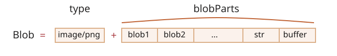

# Blob

`ArrayBuffer` a náhledy jsou součásti standardu ECMA, součásti JavaScriptu.

V prohlížeči jsou i další objekty vyšší úrovně, popsané ve specifikaci [souborového API](https://www.w3.org/TR/FileAPI/), konkrétně `Blob`.

`Blob` se skládá z nepovinného řetězce `type` (zpravidla MIME typ) a z `blobParts` -- posloupnost jiných objektů `Blob`, řetězců a objektů `BufferSource`.



Syntaxe konstruktoru je:

```js
new Blob(blobParts, volby);
```

- **`blobParts`** je pole hodnot `Blob`/`BufferSource`/`String`.
- **`volby`** je nepovinný objekt:
  - **`type`** -- typ blobu, zpravidla MIME typ, např. `image/png`,
  - **`endings`** -- zda převádět znaky konce řádku v `Blob` tak, aby odpovídaly koncům řádků v aktuálním OS (`\r\n` nebo `\n`). Standardně `"transparent"` (nedělá nic), ale může být i `"native"` (převádí).

Příklad:

```js
// vytvoříme Blob z řetězce
let blob = new Blob(["<html>…</html>"], {type: 'text/html'});
// všimněte si: první argument musí být pole [...]
```

```js
// vytvoříme Blob z typového pole a řetězců
let ahoj = new Uint8Array([65, 104, 111, 106]); // "Ahoj" v binárním tvaru

let blob = new Blob([ahoj, ' ', 'světe'], {type: 'text/plain'});
```

Části blobu můžeme získat pomocí:

```js
blob.slice([počátečníByte], [koncovýByte], [typObsahu]);
```

- **`počátečníByte`** -- počáteční byte, standardně 0.
- **`koncovýByte`** -- poslední byte (nebude zahrnut, standardně až do konce).
- **`typObsahu`** -- `type` nového blobu, standardně stejný jako ve zdroji.

Argumenty se podobají argumentům `pole.slice`, jsou povoleny i záporné hodnoty.

```smart header="Objekty `Blob` jsou neměnné"
V objektech `Blob` nemůžeme přímo měnit data, ale můžeme z nich extrahovat jejich části, vytvářet z nich nové objekty `Blob`, smíchávat je do nového objektu `Blob` a podobně.

Toto chování se podobá JavaScriptovým řetězcům: nemůžeme změnit znak v řetězci, ale můžeme vytvořit nový, opravený řetězec.
```

## Blob jako URL

Blob můžeme snadno použít jako URL pro `<a>`, `` nebo jiné značky, abychom zobrazili jeho obsah.

Díky vlastnosti `type` můžeme také `Blob` objekty stahovat nebo je nahrávat jinam. Z jejich `type` se pak přirozeně stane `Content-Type` v síťových požadavcích.

Začneme jednoduchým příkladem. Kliknutím na odkaz si stáhnete dynamicky generovaný `Blob` s obsahem `Ahoj, světe!` jako soubor:

```html run
<!-- atribut download donutí prohlížeč soubor stáhnout a nepřecházet na něj -->
<a download="hello.txt" href='#' id="odkaz">Stáhnout</a>

<script>
let blob = new Blob(["Ahoj, světe!"], {type: 'text/plain'});

odkaz.href = URL.createObjectURL(blob);
</script>
```

Můžeme také vytvořit odkaz dynamicky v JavaScriptu a simulovat kliknutí na něj voláním `odkaz.click()`. Pak se stahování automaticky spustí.

Následuje podobný kód, který přiměje uživatele stáhnout dynamicky vytvořený `Blob` bez jakéhokoli HTML:

```js run
let odkaz = document.createElement('a');
odkaz.download = 'hello.txt';

let blob = new Blob(['Ahoj, světe!'], {type: 'text/plain'});

odkaz.href = URL.createObjectURL(blob);

odkaz.click();

URL.revokeObjectURL(odkaz.href);
```

`URL.createObjectURL` vezme `Blob` a vytvoří pro něj unikátní URL ve tvaru `blob:<původ>/<uuid>`.

Hodnota `odkaz.href` vypadá následovně:

```
blob:https://javascript.info/1e67e00e-860d-40a5-89ae-6ab0cbee6273
```

Pro každé URL generované voláním `URL.createObjectURL` si prohlížeč vnitřně uloží mapování URL -> `Blob`. Taková URL jsou tedy krátká, ale umožňují přístup k blobu.

Vygenerované URL (a tedy i odkaz s ním) je platné jedině uvnitř aktuálního dokumentu, dokud je otevřený. A umožňuje odkazovat se na `Blob` v ``, `<a>`, v zásadě v kterémkoli jiném objektu, který očekává URL.

Má to však vedlejší efekt. Dokud existuje mapování pro `Blob`, samotný `Blob` přetrvává v paměti. Prohlížeč jej nemůže uvolnit.

Když je dokument zavřen, mapování se automaticky odstraní, takže objekty `Blob` jsou poté uvolněny. Jestliže však aplikace běží dlouhou dobu, nestane se to hned tak brzy.

**Když tedy vytvoříme URL, tento `Blob` zůstane viset v paměti, i když už není zapotřebí.**

`URL.revokeObjectURL(url)` odstraní odkaz z vnitřního mapování, čímž umožní, aby byl `Blob` smazán (pokud na něj není žádný jiný odkaz) a paměť uvolněna.

V posledním uvedeném příkladu jsme zamýšleli použít `Blob` pouze jednou, pro okamžité stažení, proto okamžitě voláme `URL.revokeObjectURL(odkaz.href)`.

V předchozím příkladu s HTML odkazem, na který lze kliknout, však `URL.revokeObjectURL(odkaz.href)` nevoláme, protože tím bychom URL blobu zneplatnili. Po jeho zrušení a odstranění mapování již URL nefunguje.

## Blob na base64

Alternativou k `URL.createObjectURL` je převedení objektu `Blob` na řetězec zakódovaný do base64.

Toto kódování reprezentuje binární data jako řetězec ultrabezpečných „čitelných“ znaků s ASCII kódy od 0 do 64. A co je ještě důležitější, toto kódování můžeme používat v „datových URL“.

[Datové URL](mdn:/http/Data_URIs) má tvar `data:[<mediatype>][;base64],<data>`. Taková URL můžeme používat všude, kde můžeme používat „běžná“ URL.

Například zde je smajlík:

```html

```

Prohlížeč dekóduje řetězec a zobrazí obrázek: 

K převedení objektu `Blob` na base64 použijeme zabudovaný objekt `FileReader`, který může načítat data z blobů v mnoha formátech. Podrobněji to probereme v [příští kapitole](info:file).

Následuje demo stahování blobu, nyní pomocí base64:

```js run
let odkaz = document.createElement('a');
odkaz.download = 'hello.txt';

let blob = new Blob(['Ahoj, světe!'], {type: 'text/plain'});

*!*
let reader = new FileReader();
reader.readAsDataURL(blob); // převede blob na base64 a volá onload
*/!*

reader.onload = function() {
  odkaz.href = reader.result; // datové URL
  odkaz.click();
};
```

Oba způsoby vytvoření URL pro `Blob` jsou použitelné, ale `URL.createObjectURL(blob)` je obvykle jednodušší a rychlejší.

```compare title-plus="URL.createObjectURL(blob)" title-minus="Datové URL z blobu"
+ Pokud se staráme o paměť, musíme je odstranit.
+ Přímý přístup do blobu bez „kódování/dekódování“.
- Není třeba nic odstraňovat.
- Na velkých objektech `Blob` dochází kvůli kódování ke spotřebě výkonu a paměti.
```

## Převod obrázku na blob

Můžeme vytvořit `Blob` z obrázku, části obrázku nebo dokonce můžeme vytvořit screenshot stránky. To se hodí, když jej chceme někam nahrát.

Operace s obrázky provádíme pomocí elementu `<canvas>`:

1. Nakreslíme obrázek (nebo jeho část) na plátno voláním [canvas.drawImage](mdn:/api/CanvasRenderingContext2D/drawImage).
2. Voláme metodu plátna [.toBlob(callback, format, quality)](mdn:/api/HTMLCanvasElement/toBlob), která vytvoří `Blob`, a až bude hotový, spustí na něm `callback`.

V následujícím příkladu je obrázek jen zkopírován, ale před vytvořením blobu můžeme také vyjmout jeho část nebo jej na plátně nějak transformovat:

```js run
// vezmeme libovolný obrázek
let obrázek = document.querySelector('img');

// vytvoříme <canvas> stejné velikosti
let plátno = document.createElement('canvas');
plátno.width = obrázek.clientWidth;
plátno.height = obrázek.clientHeight;

let kontext = plátno.getContext('2d');

// zkopírujeme do něj obrázek (tato metoda umožňuje vyjmout jeho část)
kontext.drawImage(obrázek, 0, 0);
// na plátně můžeme volat kontext.rotate() a provádět mnoho dalších věcí

// toBlob je asynchronní operace, po jejím dokončení se volá callback
plátno.toBlob(function(blob) {
  // blob je připraven, stáhneme ho
  let odkaz = document.createElement('a');
  odkaz.download = 'example.png';

  odkaz.href = URL.createObjectURL(blob);
  odkaz.click();

  // smažeme vnitřní odkaz na blob, aby ho prohlížeč mohl uvolnit z paměti
  URL.revokeObjectURL(odkaz.href);
}, 'image/png');
```

Pokud před callbacky dáváme přednost `async/await`:
```js
let blob = await new Promise(splň => plátno.toBlob(splň, 'image/png'));
```

Pro vytvoření screenshotu stránky můžeme použít knihovnu jako <https://github.com/niklasvh/html2canvas>, která provádí to, že prostě jen projde stránku a vykreslí ji na `<canvas>`. Pak můžeme získat její `Blob` stejným způsobem jako výše.

## Od Blobu k ArrayBufferu

Konstruktor `Blob` umožňuje vytvořit blob téměř z čehokoli, včetně jakéhokoli `BufferSource`.

Pokud však potřebujeme provádět zpracování na nižší úrovni, můžeme získat `ArrayBuffer` nejnižší úrovně voláním `blob.arrayBuffer()`:

```js
// získáme arrayBuffer z blobu
const příslibBufferu = await blob.arrayBuffer();

// nebo
blob.arrayBuffer().then(buffer => /* zpracování ArrayBufferu */);
```

## Od Blobu k proudu

Když načítáme a zapisujeme do blobu více než `2 GB` dat, bude pro nás používání `arrayBuffer` paměťově náročnější. V této chvíli můžeme převést blob přímo na proud.

Proud (stream) je speciální objekt, ze kterého můžeme číst (nebo do něj zapisovat) po částech. Zde je to mimo náš rámec, ale bude následovat příklad a více se o tom můžete dočíst v <https://developer.mozilla.org/en-US/docs/Web/API/Streams_API>. Proudy se hodí pro data, která je vhodné zpracovávat po jednotlivých částech.

Metoda `stream()` rozhraní `Blob` vrací proud `ReadableStream`, který při čtení vrací data obsažená v tomto blobu.

Pak z něj můžeme číst následovně:

```js
// získáme readableStream z blobu
const readableStream = blob.stream();
const stream = readableStream.getReader();

while (true) {
  // pro každou iteraci: value (hodnota) je další fragment blobu
  let { done, value } = await stream.read();
  if (done) {
    // v proudu již nejsou další data
    console.log('celý blob zpracován.');
    break;
  }

  // provedeme něco s částí dat, kterou jsme právě načetli z blobu
  console.log(value);
}
```

## Shrnutí

Zatímco `ArrayBuffer`, `Uint8Array` a jiné objekty `BufferSource` jsou „binární data“, [Blob](https://www.w3.org/TR/FileAPI/#dfn-Blob) reprezentuje „binární data spolu s typem“.

Díky tomu jsou bloby vhodné pro operace stahování a nahrávání, které se v prohlížeči používají velice často.

Metody, které provádějí webové požadavky, např. [XMLHttpRequest](info:xmlhttprequest), [fetch](info:fetch) a tak dále, mohou s `Blob` přirozeně pracovat stejně jako s jinými binárními typy.

Mezi `Blob` a binárními datovými typy nižší úrovně můžeme snadno převádět:

- Můžeme vytvořit `Blob` z typového pole konstruktorem `new Blob(...)`.
- Z blobu můžeme získat zpět `ArrayBuffer` voláním `blob.arrayBuffer()` a pak na něm vytvořit náhled pro binární zpracování na nižší úrovni.

Když potřebujeme pracovat s velkým blobem, jsou velmi užitečné konverzní proudy. Z blobu můžeme snadno vytvořit `ReadableStream`. Metoda `stream()` rozhraní `Blob` vrátí `ReadableStream`, který při čtení vrací data obsažená v blobu.
