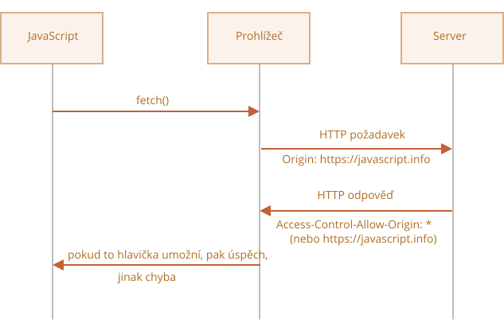
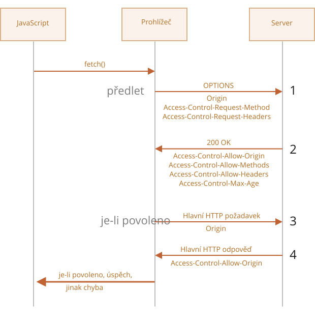

# Fetch: požadavky jiného původu

Jestliže pošleme požadavek `fetch` na jiné webové sídlo, pravděpodobně neuspěje.

Zkusme například stáhnout `http://example.com`:

```js run async
try {
  await fetch('http://example.com');
} catch(err) {
  alert(err); // Failed to fetch
}
```

Jak jsme očekávali, stažení selhalo.

Klíčovým konceptem je zde *původ* -- trojice doména/port/protokol.

Požadavky jiného (křížového) původu -- ty, které jsou posílány na jinou doménu (nebo i subdoménu), protokol nebo port -- vyžadují speciální hlavičky ze vzdálené strany.

Tato politika se nazývá „CORS“: Cross-Origin Resource Sharing -- sdílení zdrojů křížového původu.

## Proč je CORS zapotřebí? Stručná historie

CORS existuje proto, aby chránila internet před zlými hackery.

Teď vážně. Udělejme si kraťoučkou odbočku do historie.

**Mnoho let nemohl skript z jednoho sídla přistupovat k obsahu z jiného sídla.**

Toto jednoduché, ale silné pravidlo bylo základem internetové bezpečnosti. Například zlý skript z webového sídla `hacker.com` nemohl přistupovat k uživatelově poštovní schránce na webovém sídle `gmail.com`. Lidé měli pocit bezpečí.

Navíc JavaScript v té době neměl žádné speciální metody k provádění síťových požadavků. Byl to jen jazyk „na hraní“, sloužící k dekoraci webových stránek.

Jenže vývojáři webů požadovali další možnosti. Byla vyvinuta celá řada triků, jak toto omezení obejít a odesílat požadavky na jiná webová sídla.

### Používání formulářů

Jedním způsobem, jak komunikovat s jiným serverem, bylo odeslat na něj `<form>`. Lidé ho vkládali do `<iframe>`, aby zůstali na aktuální stránce, například:

```html
<!-- cíl formuláře -->
*!*
<iframe name="iframe"></iframe>
*/!*

<!-- formulář může být dynamicky vygenerován a odeslán JavaScriptem -->
*!*
<form target="iframe" method="POST" action="http://jiny-server.com/…">
*/!*
  ...
</form>
```

I bez síťových metod tedy bylo možné vytvořit požadavek GET/POST na jiné sídlo, neboť formuláře mohou posílat data kamkoli. Protože však je zakázáno přistupovat k obsahu `<iframe>` z jiného sídla, nebylo možné načíst odpověď.

Abychom byli přesní, i na to ve skutečnosti existovaly triky, které vyžadovaly speciální skripty jak ve vnitřním rámu, tak na stránce. Komunikace s vnitřním rámem tedy byla technicky možná. Dnes již nemá smysl zabíhat do detailů, nechme tyto dinosaury v klidu spát.

### Používání skriptů

Dalším trikem bylo použití značky `script`. Skript může mít libovolný `src`, s libovolnou doménou, například `<script src="http://jiny-server.com/…">`. Je možné spustit skript z libovolného webového sídla.

Jestliže webové sídlo, např. `jiny-server.com`, mělo v úmyslu zviditelnit svá data tomuto druhu přístupu, používal se tzv. protokol „JSONP“ („JSON with padding“ -- „JSON s vycpávkou“).

Fungovalo to následovně.

Řekněme, že na našem sídle potřebujeme získat data z `http://jiny-server.com`, například informace o počasí:

1. Nejprve deklarujeme globální funkci, která tato data přijme, např. `počasíZískáno`.

    ```js
    // 1. Deklarujeme funkci, která bude zpracovávat data o počasí
    function počasíZískáno({ teplota, vlhkost }) {
      alert(`teplota: ${teplota}, vlhkost: ${vlhkost}`);
    }
    ```
2. Pak vytvoříme značku `<script>` se `src="http://jiny-server.com/weather.json?callback=počasíZískáno"`. Název naší funkce vložíme do URL parametru `callback`.

    ```js
    let skript = document.createElement('script');
    skript.src = `http://jiny-server.com/weather.json?callback=počasíZískáno`;
    document.body.append(skript);
    ```
3. Vzdálený server `jiny-server.com` dynamicky vygeneruje skript, který volá `počasíZískáno(...)` s daty, která chce, abychom získali.
    ```js
    // Očekávaná odpověď ze serveru vypadá takto:
    počasíZískáno({
      teplota: 25,
      vlhkost: 78
    });
    ```
4. Když se vzdálený skript načte a spustí, vyvolá se `počasíZískáno`, a protože je to naše funkce, máme data.

To funguje a neporušuje to bezpečnost, protože obě strany souhlasily, že si budou data takto posílat. A když obě strany souhlasily, nemůže to být hacknutí. Některé služby takový přístup poskytují dodnes, protože funguje i ve velmi starých prohlížečích.

Po nějaké době se v prohlížečovém JavaScriptu objevily síťové metody.

Požadavky jiného původu byly nejdříve zakázány. Po dlouhých diskusích však byly nakonec povoleny, ale s tím, že nové schopnosti vyžadují výslovné povolení od serveru, uvedené ve speciálních hlavičkách.

## Bezpečné požadavky

Požadavky jiného původu se dělí na dva druhy:

1. Bezpečné požadavky.
2. Všechny ostatní.

Vytváření bezpečných požadavků je jednodušší, začněme tedy s nimi.

Požadavek je bezpečný, jestliže splňuje tyto dvě podmínky:

1. [Bezpečná metoda](https://fetch.spec.whatwg.org/#cors-safelisted-method): GET, POST nebo HEAD.
2. [Bezpečné hlavičky](https://fetch.spec.whatwg.org/#cors-safelisted-request-header) -- jsou povoleny jedině tyto vlastní hlavičky:
    - `Accept`,
    - `Accept-Language`,
    - `Content-Language`,
    - `Content-Type` s hodnotou `application/x-www-form-urlencoded`, `multipart/form-data` nebo `text/plain`.

Jakýkoli jiný požadavek se považuje za „nebezpečný“. Například požadavek s metodou `PUT` nebo s HTTP hlavičkou `API-Key` tato omezení nesplňuje.

**Podstatným rozdílem je, že bezpečný požadavek je možné vytvořit pomocí `<form>` nebo `<script>`, bez jakýchkoli speciálních metod.**

I velmi starý server by tedy měl být připraven přijmout bezpečný požadavek.

Naproti tomu požadavky s nestandardními hlavičkami nebo např. s metodou `DELETE` nemohou být vytvořeny tímto způsobem. JavaScript dlouho nedokázal takové požadavky vytvářet. Starší server tedy může předpokládat, že takové požadavky přicházejí z privilegovaného zdroje, „protože webová stránka je není schopna posílat“.

Když se pokoušíme vytvořit nebezpečný požadavek, prohlížeč pošle speciální „předběžný“ („preflight“) požadavek, který se zeptá serveru: souhlasíš s přijetím takového požadavku jiného původu, nebo ne?

A pokud k tomu server výslovně nedá souhlas v hlavičkách odpovědi, nebezpečný požadavek nebude poslán.

Nyní pojďme do detailů.

## CORS pro bezpečné požadavky

Pokud požadavek je z jiného původu, prohlížeč do něj vždy přidá hlavičku `Origin`.

Například pokud posíláme požadavek na    `https://kdekoli.com/request` z `https://javascript.info/page`, hlavičky budou vypadat takto:

```http
GET /request
Host: kdekoli.com
*!*
Origin: https://javascript.info
*/!*
...
```

Jak vidíte, hlavička `Origin` obsahuje jedině původ (doménu/protokol/port) bez cesty.

Server může `Origin` prozkoumat, a pokud s přijetím takového požadavku souhlasí, přidá do odpovědi speciální hlavičku `Access-Control-Allow-Origin`. Tato hlavička by měla obsahovat povolený původ (v našem případě `https://javascript.info`) nebo hvězdičku `*`. Pak je odpověď úspěšná. V opačném případě nastane chyba.

Prohlížeč zde hraje roli důvěryhodného prostředníka:
1. Zajišťuje, že v požadavku jiného původu je odeslán správný `Origin`.
2. Ověří, zda odpověď obsahuje `Access-Control-Allow-Origin` s povolením. Pokud ano, povolí JavaScriptu přístup k odpovědi, v opačném případě vyvolá chybu.
 


Zde je příklad odpovědi serveru s povolením:

```http
200 OK
Content-Type:text/html; charset=UTF-8
*!*
Access-Control-Allow-Origin: https://javascript.info
*/!*
```

## Hlavičky odpovědi

U požadavku jiného původu může JavaScript standardně přistupovat jen k tzv. „bezpečným“ hlavičkám odpovědi:

- `Cache-Control`
- `Content-Language`
- `Content-Length`
- `Content-Type`
- `Expires`
- `Last-Modified`
- `Pragma`

Přístup ke kterékoli jiné hlavičce vyvolá chybu.

Aby server povolil JavaScriptu přístup k jiným hlavičkám odpovědi, musí poslat hlavičku `Access-Control-Expose-Headers`, která obsahuje seznam názvů nebezpečných hlaviček, které mají být zpřístupněny, oddělených čárkou.

Příklad:

```http
200 OK
Content-Type:text/html; charset=UTF-8
Content-Length: 12345
Content-Encoding: gzip
API-Key: 2c9de507f2c54aa1
Access-Control-Allow-Origin: https://javascript.info
*!*
Access-Control-Expose-Headers: Content-Encoding,API-Key
*/!*
```

S takovou hlavičkou `Access-Control-Expose-Headers` má skript dovoleno číst hlavičky odpovědi `Content-Encoding` a `API-Key`.

## „Nebezpečné“ požadavky

Můžeme použít jakoukoli HTTP metodu: nejenom `GET/POST`, ale také `PATCH`, `DELETE` i jiné.

Před nějakou dobou si nikdo neuměl ani představit, že by webová stránka mohla vytvářet takové požadavky. Stále tedy mohou existovat webové služby, které nestandardní metodu považují za signál: „Tohle není prohlížeč.“ Mohou to vzít v úvahu, když budou ověřovat přístupová práva.

Abychom tedy předešli nedorozumění, když jde o „nebezpečný“ požadavek, jaký nemohl být v dřívější době vytvořen, prohlížeč takový požadavek neposílá okamžitě. Napřed pošle předběžný požadavek, tzv. „preflight“, kterým požádá o povolení.

Předběžný požadavek používá metodu `OPTIONS`, nemá žádné tělo a má tři hlavičky:

- Hlavička `Access-Control-Request-Method` obsahuje metodu nebezpečného požadavku.
- Hlavička `Access-Control-Request-Headers` poskytuje seznam jeho nebezpečných HTTP hlaviček, oddělených čárkou.
- Hlavička `Origin` sděluje, odkud požadavek přišel (např. `https://javascript.info`).

Pokud server souhlasí s obsluhováním takových požadavků, měl by poslat odpověď s prázdným tělem, statusem 200 a hlavičkami:

- `Access-Control-Allow-Origin` musí být buď `*`, nebo požadovaný původ, např. `https://javascript.info`, který má být povolen.
- `Access-Control-Allow-Methods` musí obsahovat povolenou metodu.
- `Access-Control-Allow-Headers` musí obsahovat seznam povolených hlaviček.
- Navíc hlavička `Access-Control-Max-Age` může specifikovat čas v sekundách, jak dlouho si server bude povolení pamatovat. Prohlížeč tedy v tomto čase nebude muset posílat předběžné požadavky před dalšími požadavky, které splňují daná povolení.



Podívejme se krok za krokem, jak to funguje, na příkladu požadavku `PATCH` jiného původu (tato metoda se často používá k aktualizaci dat):

```js
let odpověď = await fetch('https://site.com/service.json', {
  method: 'PATCH',
  headers: {
    'Content-Type': 'application/json',
    'API-Key': 'secret'
  }
});
```

Tento požadavek má tři důvody, proč je nebezpečný (stačil by jeden):
- Metoda `PATCH`.
- `Content-Type` není jeden z: `application/x-www-form-urlencoded`, `multipart/form-data`, `text/plain`.
- „Nebezpečná“ hlavička `API-Key`.

### Krok 1 (předběžný požadavek)

Před odesláním takového požadavku prohlížeč sám o sobě odešle předběžný požadavek, který vypadá následovně:

```http
OPTIONS /service.json
Host: site.com
Origin: https://javascript.info
Access-Control-Request-Method: PATCH
Access-Control-Request-Headers: Content-Type,API-Key
```

- Metoda: `OPTIONS`.
- Cesta je přesně stejná, jako v hlavním požadavku: `/service.json`.
- Speciální hlavičky jiného původu:
    - `Origin` -- původ zdroje.
    - `Access-Control-Request-Method` -- požadovaná metoda.
    - `Access-Control-Request-Headers` -- seznam „nebezpečných“ hlaviček oddělených čárkou.

### Krok 2 (předběžná odpověď)

Server by měl odpovědět statusem 200 a těmito hlavičkami:
- `Access-Control-Allow-Origin: https://javascript.info`
- `Access-Control-Allow-Methods: PATCH`
- `Access-Control-Allow-Headers: Content-Type,API-Key`

To umožní následnou komunikaci, jinak bude vyvolána chyba.

Pokud server v budoucnu očekává i jiné metody a hlavičky, má smysl je s předstihem povolit a zahrnout do seznamu.

Například tato odpověď povoluje také metody `PUT`, `DELETE` a další hlavičky:

```http
200 OK
Access-Control-Allow-Origin: https://javascript.info
Access-Control-Allow-Methods: PUT,PATCH,DELETE
Access-Control-Allow-Headers: API-Key,Content-Type,If-Modified-Since,Cache-Control
Access-Control-Max-Age: 86400
```

Nyní prohlížeč vidí, že `PATCH` je v `Access-Control-Allow-Methods` a `Content-Type,API-Key` jsou v seznamu `Access-Control-Allow-Headers`, takže pošle hlavní požadavek.

Pokud je uvedena hlavička `Access-Control-Max-Age` s časem v sekundách, pak se předběžná povolení na zadanou dobu uloží do paměti. Uvedená odpověď bude v paměti 86400 sekund (jeden den). Po tuto dobu se před dalšími požadavky nebude posílat předběžný požadavek. Pokud budou splňovat uvedená povolení, budou odeslány rovnou.

### Krok 3 (skutečný požadavek)

Když je předběžný požadavek úspěšný, prohlížeč vytvoří hlavní požadavek. Je to stejný proces jako u bezpečných požadavků.

Hlavní požadavek obsahuje hlavičku `Origin` (protože je jiného původu):

```http
PATCH /service.json
Host: site.com
Content-Type: application/json
API-Key: secret
Origin: https://javascript.info
```

### Krok 4 (skutečná odpověď)

Server by neměl zapomenout přidat do hlavní odpovědi `Access-Control-Allow-Origin`. Úspěšný předběžný požadavek ho z toho nevyvazuje:

```http
Access-Control-Allow-Origin: https://javascript.info
```

Pak je JavaScript schopen načíst hlavní odpověď serveru.

```smart
Předběžné požadavky se odehrávají „za scénou“ a pro JavaScript jsou neviditelné.

JavaScript dostane jen odpověď na hlavní požadavek anebo chybu, pokud server nevrátil povolení.
```

## Přihlašovací údaje

Požadavek jiného původu vytvořený JavaScriptovým kódem standardně neobsahuje žádné přihlašovací údaje (cookies nebo HTTP autentifikaci).

Pro HTTP požadavky je to neobvyklé. Požadavek na `http://site.com` je zpravidla doprovázen všemi cookies z této domény. Požadavky jiného původu vytvořené metodami v JavaScriptu jsou však výjimkou.

Například `fetch('http://jiny-server.com')` nepošle žádné cookies, dokonce ani ty (!), které patří doméně `jiny-server.com`.

Proč?

Je to proto, že požadavek s přihlašovacími údaji je mnohem silnější než bez nich. Kdyby byly povoleny, poskytly by JavaScriptu plnou moc jednat jménem uživatele a skrz jeho přihlašovací údaje přistupovat k důvěrným informacím.

Co když server opravdu skriptu věří natolik, že mu to chce umožnit? Pak musí v další hlavičce výslovně povolit požadavky s přihlašovacími údaji.

Abychom ve `fetch` poslali přihlašovací údaje, musíme přidat volbu `credentials: "include"`, například:

```js
fetch('http://jiny-server.com', {
  credentials: "include"
});
```

Nyní `fetch` posílá cookies pocházející z `jiny-server.com` spolu s požadavkem na toto sídlo.

Jestliže server souhlasí s přijetím požadavku *s přihlašovacími údaji*, měl by do odpovědi kromě hlavičky `Access-Control-Allow-Origin` přidat i hlavičku `Access-Control-Allow-Credentials: true`.

Příklad:

```http
200 OK
Access-Control-Allow-Origin: https://javascript.info
Access-Control-Allow-Credentials: true
```

Prosíme všimněte si, že `Access-Control-Allow-Origin` nesmí u požadavků s přihlašovacími údaji obsahovat hvězdičku `*`. Jak zde vidíme, musí tentokrát poskytnout přesný původ. To je další bezpečnostní opatření, které zajistí, že server opravdu ví, komu důvěřuje natolik, aby mu povolil takové požadavky.

## Shrnutí

Z pohledu prohlížeče existují dva druhy požadavků jiného původu: „bezpečné“ a všechny ostatní.

„Bezpečné“ požadavky musejí splňovat následující podmínky:
- Metoda: GET, POST nebo HEAD.
- Hlavičky -- můžeme nastavit jedině tyto:
    - `Accept`
    - `Accept-Language`
    - `Content-Language`
    - `Content-Type` na hodnotu `application/x-www-form-urlencoded`, `multipart/form-data` nebo `text/plain`.

Podstatným rozdílem je, že bezpečné požadavky byly proveditelné již před dlouhou dobou pomocí značek `<form>` nebo `<script>`, zatímco nebezpečné nemohly prohlížeče dlouhou dobu vůbec vytvářet.

Praktický rozdíl je tedy v tom, že bezpečné požadavky se posílají rovnou a s hlavičkou `Origin`, zatímco pro ostatní prohlížeč vytvoří předběžný požadavek, tzv. „preflight“, kterým žádá o povolení.

**Pro bezpečné požadavky:**

- → Prohlížeč posílá hlavičku `Origin` s původem.
- ← Pro požadavky bez přihlašovacích údajů (ty se standardně neposílají) by server měl nastavit:
    - `Access-Control-Allow-Origin` na `*` nebo na stejnou hodnotu jako `Origin`
- ← Pro požadavky s přihlašovacími údaji by server měl nastavit:
    - `Access-Control-Allow-Origin` na stejnou hodnotu jako `Origin`
    - `Access-Control-Allow-Credentials` na `true`

Navíc aby server umožnil JavaScriptu přístup k jiným hlavičkám odpovědi než `Cache-Control`,  `Content-Language`, `Content-Type`, `Expires`, `Last-Modified` nebo `Pragma`, měl by příslušné hlavičky vyjmenovat v seznamu v hlavičce`Access-Control-Expose-Headers`.

**Pro nebezpečné požadavky je před skutečným požadavkem vydán předběžný požadavek, tzv. „preflight“:**

- → Prohlížeč pošle na stejné URL požadavek `OPTIONS` s těmito hlavičkami:
    - `Access-Control-Request-Method` obsahuje požadovanou metodu.
    - `Access-Control-Request-Headers` obsahuje seznam nebezpečných hlaviček požadavku.
- ← Server by měl odpovědět statusem 200 a těmito hlavičkami:
    - `Access-Control-Allow-Methods` se seznamem povolených metod,
    - `Access-Control-Allow-Headers` se seznamem povolených hlaviček,
    - `Access-Control-Max-Age` s časem v sekundách, jak dlouho si bude povolení pamatovat.
- Pak je odeslán skutečný požadavek a aplikuje se předchozí „bezpečné“ schéma.
