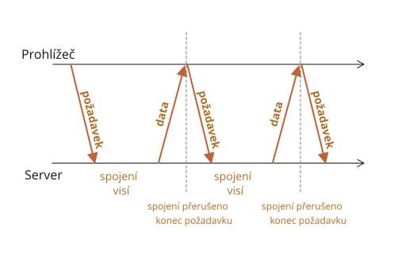

# Dlouhé dotazování

Dlouhé dotazování (long polling) je nejjednodušší způsob, jak udržovat stále spojení se serverem, bez nutnosti použít specifický protokol jako WebSocket nebo Server Sent Events.

Je velmi snadné na implementaci a v mnoha případech dostačuje.

## Pravidelné dotazování

Nejjednodušší způsob, jak ze serveru dostávat nové informace, je periodické dotazování. To znamená pravidelně odesílat na server požadavek: „Ahoj, jsem tady, máš pro mě nějaké informace?“ Například každých 10 sekund.

Při odpovídání si server nejprve poznamená, že klient je online, a pak mu pošle paket se zprávami, které do této chvíle obdržel.

Funguje to, ale má to své nevýhody:
1. Zprávy se předávají se zpožděním až 10 sekund (mezi požadavky).
2. I když nejsou žádné zprávy, server je každých 10 sekund bombardován požadavky, i když se uživatel přepnul jinam nebo usnul. To představuje docela velkou zátěž, která snižuje výkon.

Když tedy jde o velmi malou službu, může tento přístup být použitelný, ale obecně potřebuje vylepšení.

## Dlouhé dotazování

Mnohem lepším způsobem, jak se serveru dotazovat, je tzv. „dlouhé dotazování“ (*long polling*).

I to je velmi snadné na implementaci a navíc doručuje zprávy bez prodlení.

Průběh je následující:

1. Na server je poslán požadavek.
2. Server neuzavře spojení, dokud nebude mít zprávu k odeslání.
3. Když se zpráva objeví, server odpoví touto zprávou na požadavek.
4. Prohlížeč okamžitě učiní nový požadavek.

Tato situace, kdy prohlížeč pošle požadavek a pak udržuje se serverem čekající spojení, je pro tuto metodu standardní. Teprve až bude zpráva doručena, bude spojení uzavřeno a znovu vytvořeno.



Pokud je spojení ztraceno, například kvůli síťové chybě, prohlížeč okamžitě pošle nový požadavek.

Nástin funkce `podpis` na straně klienta, která vytváří dlouhé požadavky:

```js
async function podpis() {
  let odpověď = await fetch("/podpis");

  if (odpověď.status == 502) {
    // Status 502 je vypršení časového limitu spojení,
    // může nastat, když spojení čeká příliš dlouho
    // a vzdálený server nebo proxy je uzavřel
    // pak se připojíme znovu
    await podpis();
  } else if (odpověď.status != 200) {
    // Chyba - zobrazíme ji
    zobrazZprávu(odpověď.statusText);
    // Za jednu sekundu se připojíme znovu
    await new Promise(splň => setTimeout(splň, 1000));
    await podpis();
  } else {
    // Načteme a zobrazíme zprávu
    let zpráva = await odpověď.text();
    zobrazZprávu(zpráva);
    // Znovu zavoláme podpis(), abychom obdrželi další zprávu
    await podpis();
  }
}

podpis();
```

Jak vidíte, funkce `podpis` vytvoří požadavek, pak počká na odpověď, zpracuje ji a znovu volá sama sebe.

```warn header="Server by měl být schopen poradit si s mnoha čekajícími spojeními"

Architektura serveru musí být schopna pracovat s mnoha čekajícími spojeními.

Některé serverové architektury spouštějí pro každé spojení jeden proces, což vede k tomu, že vznikne tolik procesů, kolik je spojení, přičemž každý proces zabírá určité množství paměti. Příliš mnoho spojení tedy může zahltit celou paměť.

Často je to případ backendů napsaných v jazycích jako PHP nebo Ruby.

Servery napsané v Node.js tento problém obvykle nemají.

Tím netvrdíme, že je to vina programovacího jazyka. Většina moderních jazyků, včetně PHP a Ruby, umožňuje implementovat vhodný backend. Jen se prosíme přesvědčte, že vaše serverová architektura dobře funguje i při mnoha spojeních současně.
```

## Demo: chat

Následuje demonstrativní chat. Můžete si jej také stáhnout a spustit u sebe lokálně (pokud znáte Node.js a můžete instalovat moduly):

[codetabs src="longpoll" height=500]

Kód pro prohlížeč se nachází v `browser.js`.

## Oblast použití

Dlouhé dotazování funguje výborně v situacích, kdy zpráv není příliš mnoho.

Jestliže však zprávy přicházejí velmi často, bude výše zobrazený nákres odesílání požadavků a přijímání zpráv vypadat jako zuby pily.

Každá zpráva je samostatný požadavek, vybavený hlavičkami, autentifikací a podobně.

Proto se v takovém případě dává přednost jiným metodám, například [Websocket](info:websocket) nebo [Server Sent Events](info:server-sent-events).
