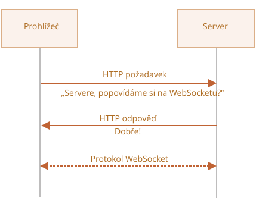

# WebSocket

Protokol `WebSocket`, popsaný ve specifikaci [RFC 6455](https://datatracker.ietf.org/doc/html/rfc6455), poskytuje způsob výměny dat mezi prohlížečem a serverem pomocí trvalého spojení. Data mohou být posílána oběma směry jako „pakety“ bez přerušení spojení a bez nutnosti posílat další HTTP požadavky.

WebSocket je obzvláště vhodný pro služby, které vyžadují nepřetržitou výměnu dat, např. online hry, obchodní systémy v reálném čase a podobně.

## Jednoduchý příklad

Abychom otevřeli websocketové spojení, musíme vytvořit `new WebSocket` se speciálním protokolem `ws` v URL:

```js
let socket = new WebSocket("*!*ws*/!*://javascript.info");
```

Existuje i šifrovaný protokol `wss://`. Je to něco jako HTTPS pro websockety.

```smart header="Vždy dávejte přednost `wss://`"
Protokol `wss://` je nejen šifrovaný, ale i spolehlivější.

Je to proto, že data ve `ws://` nejsou zašifrovaná, a tedy jsou viditelná pro všechny prostředníky. Staré proxy servery neznají WebSocket, proto mohou spatřit „podivné“ hlavičky a ukončit spojení.

Na druhou stranu `wss://` je WebSocket nad TLS (stejně jako HTTPS je HTTP nad TLS). TLS (transport security layer -- přenosová zabezpečovací vrstva) zašifruje data u odesílatele a dešifruje je u příjemce. Datové pakety se tedy přes proxy přenášejí zašifrované, takže proxy nevidí jejich obsah a nechá je projít.
```

Když je socket vytvořen, můžeme naslouchat jeho událostem. Tyto události jsou celkem čtyři:
- **`open`** -- spojení vytvořeno,
- **`message`** -- data přijata,
- **`error`** -- chyba websocketu,
- **`close`** -- spojení uzavřeno.

...A když chceme něco odeslat, slouží k tomu `socket.send(data)`.

Zde je příklad:

```js run
let socket = new WebSocket("wss://javascript.info/article/websocket/demo/hello");

socket.onopen = function(e) {
  alert("[open] Spojení vytvořeno");
  alert("Posílám na server");
  socket.send("My name is John");
};

socket.onmessage = function(událost) {
  alert(`[message] Přijata data ze serveru: ${událost.data}`);
};

socket.onclose = function(událost) {
  if (událost.wasClean) {  
    alert(`[close] Spojení čistě uzavřeno, kód=${událost.code} důvod=${událost.reason}`);
  } else {
    // např. proces serveru je zastaven nebo spadne síť
    // událost.code je v takovém případě obvykle 1006
    alert('[close] Spojení ztraceno');
  }
};

socket.onerror = function(chyba) {
  alert(`[error]`);
};
```

Pro demonstrační účely je pro uvedený příklad spuštěn malý server [server.js](demo/server.js), napsaný v Node.js. Odpoví „Hello from server, John“, pak počká 5 sekund a uzavře spojení.

Uvidíte tedy události `open` -> `message` -> `close`.

To je v zásadě všechno, nyní můžeme komunikovat WebSocketem. Docela jednoduché, že?

Nyní si o tom promluvme podrobněji.

## Otevření websocketu

Když je vytvořen `new WebSocket(url)`, začne se okamžitě připojovat.

Při spojení se prohlížeč (pomocí hlaviček) zeptá serveru: „Podporuješ WebSocket?“ A pokud server odpoví „ano“, pak hovor pokračuje v protokolu WebSocket, což je něco úplně jiného než HTTP.



Následuje příklad hlaviček prohlížeče v požadavku, který byl vytvořen voláním `new WebSocket("wss://javascript.info/chat")`.

```
GET /chat
Host: javascript.info
Origin: https://javascript.info
Connection: Upgrade
Upgrade: websocket
Sec-WebSocket-Key: Iv8io/9s+lYFgZWcXczP8Q==
Sec-WebSocket-Version: 13
```

- `Origin` -- původ klientské stránky, např. `https://javascript.info`. Objekty WebSocketu jsou ze své povahy jiného původu. Nejsou zde žádné speciální hlavičky ani jiná omezení. Staré servery stejně nedokáží WebSocket zpracovávat, takže problémy s kompatibilitou se nevyskytnou. Důležitá je však hlavička `Origin`, která umožňuje serveru rozhodnout se, zda bude s tímto webovým sídlem komunikovat WebSocketem nebo ne.
- `Connection: Upgrade` -- signalizuje, že klient chce změnit protokol.
- `Upgrade: websocket` -- požadovaný protokol je „websocket“.
- `Sec-WebSocket-Key` -- náhodný klíč generovaný prohlížečem, používaný k ujištění, že server podporuje protokol WebSocket. Je náhodný, aby si proxy servery následnou komunikaci neukládaly do mezipaměti.
- `Sec-WebSocket-Version` -- verze protokolu WebSocket, aktuální je 13.

```smart header="Podání rukou pro WebSocket nelze emulovat"
HTTP požadavek tohoto druhu nemůžeme vytvořit pomocí `XMLHttpRequest` nebo `fetch`, protože JavaScript nemá dovoleno tyto hlavičky nastavovat.
```

Jestliže server souhlasí s přepnutím na WebSocket, měl by poslat odpověď s kódem 101:

```
101 Switching Protocols
Upgrade: websocket
Connection: Upgrade
Sec-WebSocket-Accept: hsBlbuDTkk24srzEOTBUlZAlC2g=
```

Zde `Sec-WebSocket-Accept` je `Sec-WebSocket-Key`, překódovaný speciálním algoritmem. Když ho prohlížeč uvidí, pozná, že server skutečně podporuje protokol WebSocket.

Poté jsou data přenášena protokolem WebSocket. Jeho strukturu („rámce“) brzy uvidíme. A ten nemá nic společného s HTTP.

### Rozšíření a subprotokoly

Požadavek může obsahovat další hlavičky `Sec-WebSocket-Extensions` a `Sec-WebSocket-Protocol`, které popisují rozšíření a subprotokoly.

Například:

- `Sec-WebSocket-Extensions: deflate-frame` znamená, že prohlížeč podporuje kompresi dat. Rozšíření je něco, co má nějaký vztah k přenosu dat, funkcionalita, která rozšiřuje protokol WebSocket. Prohlížeč automaticky posílá hlavičku `Sec-WebSocket-Extensions` se seznamem všech rozšíření, která podporuje.

- `Sec-WebSocket-Protocol: soap, wamp` znamená, že nechceme posílat jen tak nějaká data, ale data v protokolech [SOAP](https://cs.wikipedia.org/wiki/SOAP) nebo WAMP („The WebSocket Application Messaging Protocol“ -- Websocketový protokol pro zprávy aplikací). Subprotokoly WebSocketu jsou registrovány v [katalogu IANA](https://www.iana.org/assignments/websocket/websocket.xml). Tato hlavička tedy popisuje formáty dat, které se chystáme použít.

    Tato nepovinná hlavička se nastavuje druhým parametrem konstruktoru `new WebSocket`, který obsahuje pole subprotokolů, např. když chceme použít SOAP nebo WAMP:

    ```js
    let socket = new WebSocket("wss://javascript.info/chat", ["soap", "wamp"]);
    ```

Server by měl odpovědět seznamem protokolů a rozšíření, s jejichž používáním souhlasí.

Příklad požadavku:

```
GET /chat
Host: javascript.info
Upgrade: websocket
Connection: Upgrade
Origin: https://javascript.info
Sec-WebSocket-Key: Iv8io/9s+lYFgZWcXczP8Q==
Sec-WebSocket-Version: 13
*!*
Sec-WebSocket-Extensions: deflate-frame
Sec-WebSocket-Protocol: soap, wamp
*/!*
```

Odpověď:

```
101 Switching Protocols
Upgrade: websocket
Connection: Upgrade
Sec-WebSocket-Accept: hsBlbuDTkk24srzEOTBUlZAlC2g=
*!*
Sec-WebSocket-Extensions: deflate-frame
Sec-WebSocket-Protocol: soap
*/!*
```

Zde server odpovídá, že podporuje rozšíření `deflate-frame` a z požadovaných subprotokolů jedině SOAP.

## Přenos dat

Komunikace WebSocketem se skládá z „rámců“ -- fragmentů dat, které mohou posílat obě strany a které mohou být několika druhů:

- „textové rámce“ -- obsahují textová data, která si strany navzájem posílají.
- „binární rámce“ -- obsahují binární data, která si strany navzájem posílají.
- „ping-pongové rámce“ se používají ke kontrole spojení, posílá je server a prohlížeč na ně automaticky odpovídá.
- existují i „uzavírací rámce“ a několik dalších servisních rámců.

V prohlížeči přímo pracujeme jen s textovými a binárními rámci.

**Metoda WebSocket `.send()` umí poslat textová i binární data.**

Volání `socket.send(tělo)` umožňuje, aby `tělo` byl řetězec nebo binární formát, např. `Blob`, `ArrayBuffer` atd. Není třeba nic nastavovat: prostě pošle data v jakémkoli formátu.

**Když přijímáme data, textová data přicházejí vždy jako řetězec. U binárních dat si můžeme vybrat mezi formáty `Blob` a `ArrayBuffer`.**

To se nastavuje vlastností `socket.binaryType`. Standardně je `"blob"`, takže binární data přicházejí jako objekty `Blob`.

[Blob](info:blob) je binární objekt vysoké úrovně. Je přímo integrován s `<a>`, `` a jinými značkami, proto je to rozumný standard. Pro binární zpracování a přístup k jednotlivým bytům dat však můžeme změnit formát na `"arraybuffer"`:

```js
socket.binaryType = "arraybuffer";
socket.onmessage = (událost) => {
  // událost.data je buď řetězec (u textových dat), nebo arraybuffer (u binárních dat)
};
```

## Omezení rychlosti

Představme si, že naše aplikace generuje velké množství dat k odesílání, ale uživatel má pomalé síťové připojení, třeba mobilní internet mimo město.

Můžeme volat `socket.send(data)` znovu a znovu. Data se však budou ukládat do bufferu (vyrovnávací paměti) a posílat jen tak rychle, jak rychlost sítě dovolí.

Vlastnost `socket.bufferedAmount` sděluje, kolik bytů zůstává v této chvíli v bufferu a čeká na poslání po síti.

Jejím prozkoumáním můžeme zjistit, zda je socket právě dostupný pro přenos dat.

```js
// každých 100 ms prozkoumáme socket a další data pošleme
// teprve tehdy, až budou všechna existující data odeslána
setInterval(() => {
  if (socket.bufferedAmount == 0) {
    socket.send(dalšíData());
  }
}, 100);
```


## Uzavření spojení

Běžně, když chce některá strana uzavřít spojení (prohlížeč i server mají stejná práva), pošle „uzavírací rámec“ s číselným kódem a textovým odůvodněním.

K tomu slouží metoda:
```js
socket.close([kód], [důvod]);
```

- `kód` je speciální WebSocketový uzavírací kód (nepovinný)
- `důvod` je řetězec, který popisuje důvod uzavření (nepovinný)

Pak druhá strana obdrží tento kód a důvod v handleru události `close`, například:

```js
// uzavírací strana:
socket.close(1000, "Práce hotova");

// druhá strana
socket.onclose = událost => {
  // událost.code === 1000
  // událost.reason === "Práce hotova"
  // událost.wasClean === true (čisté uzavření)
};
```

Nejčastější hodnoty kódu:

- `1000` -- standardní, běžné uzavření (použije se, není-li `kód` uveden),
- `1006` -- tento kód nelze nastavit ručně, oznamuje, že spojení bylo ztraceno (bez uzavíracího rámce).

Existují i jiné kódy, například:

- `1001` -- strana odchází, např. server se vypíná nebo prohlížeč opouští stránku,
- `1009` -- zpráva je pro zpracování příliš velká,
- `1011` -- neočekávaná chyba na serveru,
- ...a podobně.

Celý seznam najdete v [RFC6455, §7.4.1](https://tools.ietf.org/html/rfc6455#section-7.4.1).

Kódy WebSocketu se trochu podobají kódům HTTP, ale jejich hodnoty jsou jiné. Například kódy nižší než `1000` jsou rezervovány a pokud se takový kód pokusíme nastavit, nastane chyba.

```js
// v případě přerušení spojení
socket.onclose = událost => {
  // událost.code === 1006
  // událost.reason === ""
  // událost.wasClean === false (nebyl uzavírací rámec)
};
```


## Stav spojení

K získání stavu spojení slouží vlastnost `socket.readyState` s těmito hodnotami:

- **`0`** -- „CONNECTING“: spojení ještě nebylo vytvořeno,
- **`1`** -- „OPEN“: komunikace probíhá,
- **`2`** -- „CLOSING“: spojení se uzavírá,
- **`3`** -- „CLOSED“: spojení je uzavřeno.


## Příklad chatu

Přepracujme příklad chatu s použitím prohlížečového WebSocketového API a WebSocketového modulu <https://github.com/websockets/ws> pro Node.js. Pozornost budeme věnovat převážně straně klienta, ale server je také jednoduchý.

HTML: potřebujeme `<form>` k posílání zpráv a `<div>` pro přicházející zprávy:

```html
<!-- formulář pro zprávy -->
<form name="odesílání">
  <input type="text" name="zpráva">
  <input type="submit" value="Odeslat">
</form>

<!-- div se zprávami -->
<div id="zprávy"></div>
```

Od JavaScriptu chceme tři věci:
1. Otevřít spojení.
2. Při odeslání formuláře zavolat `socket.send(zpráva)` s odesílanou zprávou.   
3. Při příchodu zprávy ji připojit k `div#zprávy`.

Zde je kód:

```js
let socket = new WebSocket("wss://javascript.info/article/websocket/chat/ws");

// poslání zprávy z formuláře
document.forms.publish.onsubmit = function() {
  let odesílanáZpráva = this.zpráva.value;

  socket.send(odesílanáZpráva);
  return false;
};

// zpráva přijata - zobrazíme ji v div#zprávy
socket.onmessage = function(událost) {
  let zpráva = událost.data;

  let elementZprávy = document.createElement('div');
  elementZprávy.textContent = zpráva;
  document.getElementById('zprávy').prepend(elementZprávy);
}
```

Kód na straně serveru je poněkud mimo náš rámec. Zde používáme Node.js, ale to není nutné. I jiné platformy mají své způsoby práce s WebSocketem.

Algoritmus na straně serveru bude:

1. Vytvoříme `klienti = new Set()` -- množina socketů.
2. Každý přijatý websocket přidáme do množiny `klienti.add(socket)` a nastavíme posluchače události `message`, aby přijímal jeho zprávy.
3. Když je zpráva přijata: iterujeme nad klienty a pošleme ji každému z nich.
4. Když je spojení uzavřeno: `klienti.delete(socket)`.

```js
const ws = new require('ws');
const wss = new ws.Server({noServer: true});

const klienti = new Set();

http.createServer((požadavek, odpověď) => {
  // zde zpracováváme jen websocketová spojení
  // ve skutečném projektu bychom zde měli i jiný kód, který by zpracovával jiné než websocketové požadavky
  wss.handleUpgrade(požadavek, požadavek.socket, Buffer.alloc(0), onSocketConnect);
});

function onSocketConnect(ws) {
  klienti.add(ws);

  ws.on('message', function(zpráva) {
    zpráva = zpráva.slice(0, 50); // maximální délka zprávy bude 50

    for(let klient of klienti) {
      klient.send(zpráva);
    }
  });

  ws.on('close', function() {
    klienti.delete(ws);
  });
}
```

Zde je funkční příklad:

[iframe src="chat" height="100" zip]

Můžete si jej také stáhnout (tlačítko vpravo nahoře ve vnitřním rámu) a spustit si jej lokálně. Jen si nezapomeňte nainstalovat [Node.js](https://nodejs.org/en/) a před spuštěním příkladu spustit `npm install ws`.

## Shrnutí

WebSocket je moderní způsob, jak získat stálé spojení prohlížeče se serverem.

- WebSockety nemají omezení jiného původu.
- V prohlížečích jsou široce podporovány.
- Mohou odesílat i přijímat řetězce a binární data.

Jejich API je jednoduché.

Metody:
- `socket.send(data)`,
- `socket.close([kód], [důvod])`.

Události:
- `open`,
- `message`,
- `error`,
- `close`.

WebSocket sám o sobě neobsahuje obnovu spojení, autentifikaci a mnoho dalších mechanismů vysoké úrovně. K tomu existují knihovny pro klienta i pro server a můžeme si také tyto schopnosti implementovat ručně.

Aby lidé integrovali WebSocket do existujících projektů, někdy spouštějí WebSocketový server paralelně s hlavním HTTP serverem a oba servery přistupují do stejné databáze. Požadavky na WebSocket používají `wss://ws.site.com`, subdoménu vedoucí na WebSocketový server, zatímco `https://site.com` vede na hlavní HTTP server.

Samozřejmě jsou možné i jiné způsoby integrace.
