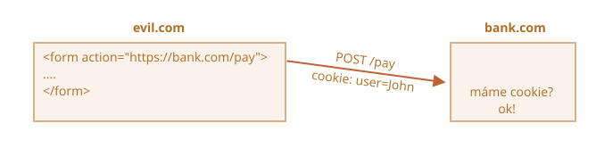
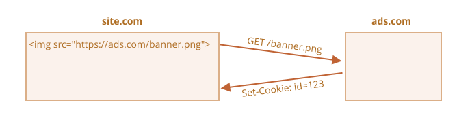
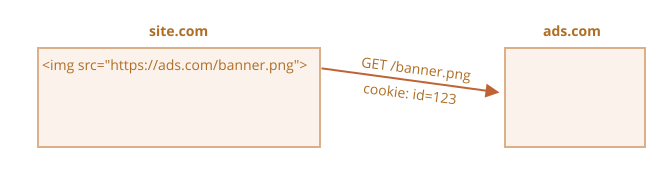

# Cookies, document.cookie

Cookies (někdy „sušenky“) jsou malé datové řetězce, které jsou uloženy přímo v prohlížeči. Jsou součástí protokolu HTTP a jsou definovány ve specifikaci [RFC 6265](https://tools.ietf.org/html/rfc6265).

Cookies obvykle nastavuje webový server v HTTP hlavičce odpovědi `Set-Cookie`. Pak je prohlížeč automaticky přidává do (téměř) každého požadavku na stejnou doménu do HTTP hlavičky `Cookie`.

Jedním z nejrozšířenějších případů jejich použití je autentifikace:

1. Po přihlášení server pošle v odpovědi HTTP hlavičku `Set-Cookie`, v níž nastaví cookie s „unikátním identifikátorem přihlášení“.
2. Když bude příště poslán požadavek na stejnou doménu, prohlížeč pošle po síti tuto cookie v HTTP hlavičce `Cookie`.
3. Tak se server dozví, kdo učinil požadavek.

Ke cookies můžeme přistupovat i z prohlížeče, a to pomocí vlastnosti `document.cookie`.

Cookies a jejich atributy s sebou přinášejí mnoho záludností. V této kapitole je podrobně probereme.

## Načítání z document.cookie

```online
Ukládá si váš prohlížeč nějaké cookies z tohoto sídla? Podívejme se:
```

```offline
Jestliže jste na webovém sídle, je možné si zobrazit cookies odtamtud následovně:
```

```js run
// Na javascript.info používáme Google Analytics pro statistiku,
// takže by tam nějaké cookies měly být
alert( document.cookie ); // cookie1=hodnota1; cookie2=hodnota2;...
```

Hodnota `document.cookie` se skládá z dvojic `název=hodnota`, oddělených `; `. Každá z nich představuje samostatnou cookie.

Chceme-li najít konkrétní cookie, můžeme rozdělit `document.cookie` podle `; ` a pak najít správný název. Můžeme k tomu použít regulární výraz nebo funkce polí.

Ponecháváme to čtenáři jako cvičení. Na konci této kapitoly najdete několik pomocných funkcí, které vám pomohou manipulovat s cookies.

## Zápis do document.cookie

Do `document.cookie` můžeme zapisovat. Není to však datová vlastnost, nýbrž [přístupová vlastnost (getter/setter)](info:property-accessors). Přiřazení do ní se zpracovává speciálním způsobem.

**Operace zápisu do `document.cookie` změní jen cookie, která je v ní uvedena, a ostatní cookies ponechá nezměněné.**

Například následující volání nastaví cookie s názvem `uživatel` a hodnotou `Jan`:

```js run
document.cookie = "uživatel=Jan"; // změní jen cookie s názvem 'uživatel'
alert(document.cookie); // zobrazí všechny cookies
```

Když si jej spustíte, uvidíte pravděpodobně několik cookies. Je to tím, že operace `document.cookie=` nepřepíše všechny cookies, ale jen nastaví uvedenou cookie `uživatel`.

Technicky mohou název a hodnota obsahovat jakékoli znaky. Aby bylo zachováno platné formátování, měly by být zakódovány vestavěnou funkcí `encodeURIComponent`:

```js run
// speciální znaky (mezery) musejí být zakódovány
let název = "muj nazev";
let hodnota = "Jan Novak";

// zakóduje cookie jako muj%20nazev=Jan%20Novak
document.cookie = encodeURIComponent(název) + '=' + encodeURIComponent(hodnota);

alert(document.cookie); // ...; muj%20nazev=Jan%20Novak
```


```warn header="Omezení"
Je tady několik omezení:
- Pomocí `document.cookie` můžeme nastavit nebo změnit pouze jednu cookie současně.
- Dvojice `název=hodnota` by po zakódování funkcí `encodeURIComponent` neměla překročit 4 KB. Do cookie tedy nemůžeme uložit nic velkého.
- Celkový počet cookies na jednu doménu je omezen přibližně na 20 nebo více, přesný limit závisí na prohlížeči.
```

Cookies mají několik atributů. Mnoho z nich je důležitých a měli bychom je nastavit.

Atributy jsou vyjmenovány po `klíč=hodnota` a jsou odděleny `;`, například:

```js run
document.cookie = "uživatel=Jan; path=/; expires=Tue, 19 Jan 2038 03:14:07 GMT"
```

## domain

- **`domain=site.com`**

Atribut `domain` definuje, kde je cookie dostupná. V praxi však existují určitá omezení a nemůžeme nastavit jakoukoli doménu.

**Není žádný způsob, jak učinit cookie dostupnou z jiné domény druhého řádu, takže `other.com` nikdy nezíská cookie nastavenou na `site.com`.**

To je bezpečnostní omezení, které nám umožňuje ukládat do cookies důvěrná data, která by měla být dostupná jen na jednom sídle.

Standardně je cookie dostupná jen na doméně, která ji nastavila.

Prosíme všimněte si, že standardně není cookie sdílena se subdoménou, například `forum.site.com`.

```js
// pokud nastavíme cookie na webovém sídle site.com...
document.cookie = "uživatel=Jan"

// ...neuvidíme ji na forum.site.com
alert(document.cookie); // uživatel není
```

...To však můžeme změnit. Jestliže chceme umožnit subdoménám jako `forum.site.com` získávat cookie nastavenou na `site.com`, můžeme to provést.

Aby k tomu došlo, měli bychom při nastavování cookie na `site.com` explicitně nastavit atribut `domain` na kořenovou doménu: `domain=site.com`. Pak tuto cookie uvidí všechny subdomény.

Příklad:

```js
// na site.com
// zpřístupníme tuto cookie na jakékoli subdoméně *.site.com:
document.cookie = "uživatel=Jan; *!*domain=site.com*/!*"

// později

// na forum.site.com
alert(document.cookie); // obsahuje cookie uživatel=Jan
```

```warn header="Zastaralá syntaxe"
V historii fungovalo stejným způsobem i `domain=.site.com` (s tečkou před `site.com`), i to umožňovalo přístup ke cookie ze subdomén. Nyní se tečky na začátku názvů domén ignorují, ale některé prohlížeče mohou odmítnout nastavit cookie, která tyto tečky obsahuje.
```

Když to shrneme, atribut `domain` umožňuje zpřístupnit cookie na subdoménách.

## path

- **`path=/mypath`**

Prefix URL cesty musí být absolutní. Tento atribut zpřístupňuje cookie stránkám pod touto cestou. Standardně je to aktuální cesta.

Pokud je cookie nastavena s atributem `path=/admin`, bude viditelná na stránkách `/admin` a `/admin/something`, ale ne na `/home`, `/home/admin` nebo `/`.

Obvykle bychom měli nastavit `path` na kořenový adresář: `path=/`, aby byla cookie dostupná ze všech stránek na tomto sídle. Pokud tento atribut není nastaven, je standardně vypočítáván [touto metodou](https://developer.mozilla.org/en-US/docs/Web/HTTP/Cookies#path_default_value).

## expires, max-age

Standardně, jestliže cookie neobsahuje jeden z těchto atributů, zmizí při zavření prohlížeče nebo záložky. Takové cookies se nazývají „session cookies“.

Aby cookies zůstala naživu i po zavření prohlížeče, můžeme nastavit atribut `expires` nebo `max-age`. Pokud nastavíme oba, má přednost `max-age`.

- **`expires=Tue, 19 Jan 2038 03:14:07 GMT`**

Datum expirace cookie definuje čas, kdy ji prohlížeč automaticky smaže (podle časového pásma prohlížeče).

Datum musí být přesně v tomto formátu v časovém pásmu GMT (Greenwichský střední čas). Můžeme jej získat metodou `datum.toUTCString`. Například můžeme nastavit cookie, aby expirovala za 1 den:

```js
// +1 den od nynějška
let datum = new Date(Date.now() + 86400e3);
datum = datum.toUTCString();
document.cookie = "uživatel=Jan; expires=" + datum;
```

Pokud nastavíme `expires` na datum v minulosti, bude cookie smazána.

-  **`max-age=3600`**

Tento atribut je alternativou k `expires` a specifikuje expiraci cookie v sekundách od tohoto okamžiku.

Pokud jej nastavíme na nulu nebo zápornou hodnotu, cookie bude smazána:

```js
// cookie bude odstraněna za +1 hodinu od nynějška
document.cookie = "uživatel=Jan; max-age=3600";

// smažeme cookie (necháme ji expirovat právě teď)
document.cookie = "uživatel=Jan; max-age=0";
```

## secure

- **`secure`**

Tato cookie může být přenesena pouze v HTTPS.

**Standardně, jestliže nastavíme cookie na `http://site.com`, objeví se i na `https://site.com` a naopak.**

Je to proto, že cookies jsou založeny na doméně a nerozlišují mezi protokoly.

S tímto atributem platí, že jestliže je cookie nastavena na `https://site.com`, neobjeví se při přístupu na stejné sídlo přes HTTP jako `http://site.com`. Má-li tedy cookie citlivý obsah, který by nikdy neměl být odeslán přes nezašifrovaný HTTP, je přepínač `secure` ta správná věc.

```js
// předpokládáme, že nyní jsme na https://
// nastavíme cookie jako bezpečnou (dostupnou jen přes HTTPS)
document.cookie = "uživatel=Jan; secure";
```

## samesite

Dalším bezpečnostním atributem je `samesite`, který je navržen k ochraně před tzv. XSRF (cross-site request forgery) útoky.

Abychom pochopili, jak funguje a kdy je užitečný, podívejme se na XSRF útoky.

### XSRF útok

Představte si, že se připojíte na sídlo `bank.com`. To znamená: máte z tohoto sídla autentifikační cookie. Váš prohlížeč ji posílá na `bank.com` s každým požadavkem, takže vás sídlo rozezná a provede všechny citlivé finanční operace.

Když si nyní prohlížíte web v jiném okně, náhodou se dostanete na jinou stránku `evil.com`. Tato stránka obsahuje kód v JavaScriptu, který odešle na `bank.com` formulář `<form action="https://bank.com/pay">` s poli, která spustí transakci z vašeho konta na hackerovo.

Prohlížeč posílá cookies pokaždé, když navštívíte sídlo `bank.com`, i když byl formulář odeslán z `evil.com`. Banka vás tedy rozezná a provede platbu.



Tento útok se nazývá „Cross-Site Request Forgery“ („padělání požadavků z jiného sídla“, zkráceně XSRF).

Skutečné banky jsou před ním samozřejmě chráněny. Všechny formuláře generované sídlem `bank.com` obsahují speciální pole, tzv. „XSRF ochranný token“, který zlá stránka nedokáže generovat nebo vytáhnout ze vzdálené stránky. Může tam poslat formulář, ale nemůže získat data zpět. Sídlo `bank.com` kontroluje tento token v každém formuláři, který přijme.

Implementace takové ochrany ovšem zabere nějaký čas. Musíme zajistit, aby požadované pole s tokenem obsahoval každý formulář, a musíme také kontrolovat všechny požadavky.

### Používání cookie atributu samesite

Cookie atribut `samesite` poskytuje jiný způsob ochrany před takovými útoky, který by (teoreticky) neměl vyžadovat „XSRF ochranné tokeny“.

Má dvě možné hodnoty:

- **`samesite=strict`**

Cookie s atributem `samesite=strict` nebude nikdy odeslána, pokud uživatel přichází odjinud než ze stejného sídla.

Jinými slovy, kdykoli uživatel následuje odkaz ze svého emailu, odesílá formulář z `evil.com` nebo provádí jakoukoli operaci pocházející z jiné domény, cookie se neodešle.

Jestliže autentifikační cookies mají atribut `samesite=strict`, XSRF útok nemá šanci na úspěch, protože požadavek odeslaný z `evil.com` přijde bez cookies. Sídlo `bank.com` tedy uživatele nepozná a platbu neprovede.

Tato ochrana je poměrně spolehlivá. Cookie s atributem `samesite=strict` odešlou jen operace přicházející z `bank.com`, např. odeslání formuláře z jiné stránky na `bank.com`.

Má však určitou nevýhodu.

Když uživatel následuje legitimní odkaz na `bank.com`, například ze svých poznámek, bude překvapen, že ho `bank.com` nepozná. Cookies se `samesite=strict` se v takovém případě samozřejmě neodešlou.

To můžeme překonat použitím dvou cookies: jedné pro „obecné rozpoznávání“, jen aby řekla: „Ahoj, Jane“, a druhé, která bude mít `samesite=strict`, pro operace měnící data. Pak osoba přicházející odjinud spatří uvítání, ale platby musejí být spuštěny z webového sídla banky, aby byla odeslána druhá cookie.

- **`samesite=lax` (totéž jako `samesite` bez hodnoty)**

Toto je uvolněnější přístup, který také chrání před XSRF a navíc nenaruší uživatelovo pohodlí.

Režim `lax` zakazuje prohlížeči odesílat cookies při příchodu z jiného sídla, podobně jako `strict`, ale s jednou výjimkou.

Cookie se `samesite=lax` je odeslána, jestliže jsou splněny obě tyto podmínky:
1. HTTP metoda je „bezpečná“ (např. GET, ale ne POST).

    Celý seznam bezpečných HTTP metod se nachází ve [specifikaci RFC 7231](https://tools.ietf.org/html/rfc7231#section-4.2.1). Jsou to metody, které by se měly používat ke čtení, ale ne k zápisu dat. Nesmějí provádět žádné operace, které mění data. Následování odkazu je vždy GET, tedy bezpečná metoda.

2. Operace provádí navigaci na nejvyšší úrovni (mění URL v adresové liště prohlížeče).

    Zpravidla tomu tak je, ale jestliže je navigace prováděna v `<iframe>`, není to na nejvyšší úrovni. Navíc metody JavaScriptu pro síťové požadavky žádnou navigaci neprovádějí.

Atribut `samesite=lax` tedy dělá to, že umožňuje, aby nejběžnější operace „jdi na URL“ měla cookies. Například otevření odkazu na webové sídlo z poznámek, které tyto podmínky splňují.

Ale cokoli složitějšího, například síťový požadavek z jiného sídla nebo odeslání formuláře, cookies ztratí.

Pokud vám to vyhovuje, přidáním `samesite=lax` pravděpodobně nepokazíte uživatelovo pohodlí a zajistíte ochranu.

Celkově je `samesite` vynikající atribut.

Má však nevýhodu:

- `samesite` je ignorován (není podporován) velmi starými prohlížeči, zhruba z roku 2017 a staršími.

**Jestliže se tedy s ochranou spolehneme výhradně na `samesite`, staré prohlížeče budou zranitelné.**

Můžeme však použít `samesite` společně s jinými ochrannými prvky, například XSRF tokeny, abychom přidali ochrannou vrstvu a v budoucnu, až staré prohlížeče vymizí, budeme pravděpodobně moci XSRF tokeny zrušit.

## httpOnly

Tento atribut nemá nic společného s JavaScriptem, ale pro úplnost jej musíme uvést.

Webový server používá k nastavení cookie hlavičku `Set-Cookie`. Může také nastavit atribut `httpOnly`.

Tento atribut zakazuje JavaScriptu jakýkoli přístup k této cookie. Takovou cookie neuvidíme a nemůžeme s ní manipulovat pomocí `document.cookie`.

Používá se jako předběžné opatření k ochraně před útoky, při nichž hacker vloží na stránku svůj vlastní JavaScriptový kód a čeká, až uživatel tuto stránku navštíví. To by nemělo být vůbec možné, hackeři by neměli být schopni vložit svůj kód na naši stránku, ale mohou existovat chyby, které jim to dovolí.

Normálně, když se něco takového stane a uživatel navštíví webovou stránku s hackerovým JavaScriptovým kódem, tento kód se spustí a získá přístup k `document.cookie` s uživatelskými cookies, které obsahují autentifikační informace. To je špatné.

Jestliže však cookie je `httpOnly`, pak ji `document.cookie` nevidí, takže je chráněna.

## Dodatek: Funkce pro cookies

Následuje malá sada funkcí pro práci s cookies, které jsou pohodlnější než ruční modifikace `document.cookie`.

Pro práci s cookies existuje mnoho knihoven, tyto funkce tedy slouží pro demonstrativní účely. Jsou však plně funkční.

### getCookie(název)

Nejkratším způsobem, jak přistupovat ke cookie, je použít [regulární výraz](info:regular-expressions).

Funkce `getCookie(název)` vrací cookie s názvem `název`:

```js
// vrací cookie se zadaným názvem
// nebo undefined, pokud není nalezena
function getCookie(název) {
  let shoda = document.cookie.match(new RegExp(
    "(?:^|; )" + name.replace(/([\.$?*|{}\(\)\[\]\\\/\+^])/g, '\\$1') + "=([^;]*)"
  ));
  return shoda ? decodeURIComponent(shoda[1]) : undefined;
}
```

Zde je `new RegExp` generován dynamicky, aby hledal `; název=<hodnota>`.

Prosíme všimněte si, že hodnota cookie je zakódována, proto `getCookie` používá k jejímu rozkódování zabudovanou funkci `decodeURIComponent`.

### setCookie(název, hodnota, atributy)

Nastaví cookie s názvem `název` na hodnotu `hodnota` se standardní `path=/` (lze modifikovat přidáním standardních hodnot dalších atributů):

```js run
function setCookie(název, hodnota, atributy = {}) {

  atributy = {
    path: '/',
    // v případě potřeby sem přidejte standardní hodnoty dalších atributů
    ...atributy
  };

  if (atributy.expires instanceof Date) {
    atributy.expires = atributy.expires.toUTCString();
  }

  let změněnáCookie = encodeURIComponent(název) + "=" + encodeURIComponent(hodnota);

  for (let klíčAtributu in atributy) {
    změněnáCookie += "; " + klíčAtributu;
    let hodnotaAtributu = atributy[klíčAtributu];
    if (hodnotaAtributu !== true) {
      změněnáCookie += "=" + hodnotaAtributu;
    }
  }

  document.cookie = změněnáCookie;
}

// Příklad použití:
setCookie('uživatel', 'Jan', {secure: true, 'max-age': 3600});
```

### deleteCookie(název)

Cookie můžeme smazat tak, že jí nastavíme záporný čas expirace:

```js
function deleteCookie(název) {
  setCookie(název, "", {
    'max-age': -1
  })
}
```

```warn header="Při změně nebo mazání musíme používat stejnou cestu a doménu"
Prosíme všimněte si, že když měníme nebo mažeme cookie, měli bychom používat přesně stejné atributy `path` a `domain` jako při jejím nastavení.
```

Všechno dohromady: [cookie.js](cookie.js).


## Dodatek: Cookies třetích stran

Cookie se nazývá „cookie třetí strany“, pokud je uložena jinou doménou než doménou stránky, kterou uživatel navštívil.

Například:
1. Stránka na `site.com` načte banner z jiné stránky: ``.
2. Společně s tímto bannerem může vzdálený server na `ads.com` nastavit hlavičku `Set-Cookie` s cookie např. `id=1234`. Tato cookie pochází z domény `ads.com` a bude viditelná jedině na doméně `ads.com`:

    

3. Při dalším přístupu na `ads.com` vzdálený server získá cookie `id` a pozná uživatele:

    

4. Ještě důležitější je, že když se uživatel přesune ze `site.com` na jiné sídlo `other.com`, které také obsahuje banner, pak `ads.com` tuto cookie rovněž získá, protože patří `ads.com`, takže pozná návštěvníka a bude sledovat jeho přesun mezi sídly:

    


Cookies třetích stran se kvůli své povaze tradičně používají pro sledovací a reklamní služby. Jsou vázány k doméně svého původu, takže `ads.com` může sledovat stejného uživatele mezi různými sídly, pokud k ní tato sídla přistupují.

Některým lidem se pochopitelně nelíbí, když je někdo sleduje, takže prohlížeče umožňují takové cookies zakázat.

Navíc některé moderní prohlížeče uplatňují pro takové cookies speciální politiku:
- Safari cookies třetích stran vůbec neumožňuje.
- Firefox má „černý seznam“ domén třetích stran, jejichž cookies třetích stran blokuje.


```smart
Jestliže načteme skript z domény třetí strany, např. `<script src="https://google-analytics.com/analytics.js">`, a tento skript nastaví cookie pomocí `document.cookie`, pak taková cookie není cookie třetí strany.

Když skript nastaví cookie, nezáleží na tom, odkud skript pochází -- tato cookie bude patřit doméně aktuální webové stránky.
```

## Dodatek: GDPR

Toto téma nemá nic společného s JavaScriptem, je to jen něco, co musíme mít při nastavování cookies na paměti.

V Evropě platí legislativa nazvaná GDPR, která nařizuje sadu pravidel pro webové stránky, aby respektovaly soukromí uživatelů. Jedním z nich je vyžadovat od uživatele výslovné povolení pro sledovací cookies.

Prosíme všimněte si, že to platí jen pro sledovací/identifikační/autorizační cookies.

Pokud tedy nastavujeme cookie, která jen ukládá nějakou informaci, ale nesleduje ani neidentifikuje uživatele, můžeme to svobodně udělat.

Jestliže však chceme nastavit cookie s autentifikací přihlášení nebo sledovacím ID, uživatel to musí povolit.

Webové stránky obecně přistupují ke GDPR dvěma způsoby. Pravděpodobně jste už oba viděli na webu:

1. Pokud webové sídlo chce ukládat sledovací cookies jen pro autentifikované uživatele.

    Aby to mohlo dělat, registrační formulář by měl obsahovat checkbox např. „souhlasím s politikou ohledně soukromí“ (která popisuje, jak se cookies používají), uživatel jej musí zaškrtnout a pak webové sídlo může svobodně nastavovat autentifikační cookies.

2. Pokud webové sídlo chce ukládat sledovací cookies pro všechny.

    Aby to webové sídlo mohlo legálně provádět, zobrazí nově příchozím uživatelům modální „vyskakovací okno“ a vyžaduje od nich souhlas s používáním cookies. Pak je webové sídlo může nastavovat a nechat uživatele prohlížet si jeho obsah. Pro nové návštěvníky to ovšem může být otravné. Nikomu se nelíbí, když místo obsahu stránek vidí vyskakovací okno, na které musí kliknout. Ale GDPR vyžaduje výslovný souhlas.

GDPR se týká nejen cookies, ale i jiných záležitostí ohledně ochrany soukromí. To je však mimo naše téma.


## Shrnutí

Přístup k cookies poskytuje `document.cookie`.
- Operace zápisu mění jen cookie, která je v ní uvedena.
- Název a hodnota musí být zakódovány.
- Velikost jedné cookie nesmí přesáhnout 4 KB. Počet povolených cookies v jedné doméně je přibližně 20 a více (závisí na prohlížeči).

Atributy cookie:
- `path=/`, standardně aktuální cesta, učiní cookie viditelnou jen pod uvedenou cestou.
- `domain=site.com`, standardně je cookie viditelná jen na aktuální doméně. Pokud je doména explicitně nastavena, bude cookie viditelná i na subdoménách.
- `expires` nebo `max-age` nastaví čas expirace cookie. Nejsou-li uvedeny, cookie bude odstraněna při zavření prohlížeče.
- `secure` způsobí, že cookie se bude posílat jen přes HTTPS.
- `samesite` zakáže prohlížeči posílat cookie v požadavcích, které přicházejí odjinud než z tohoto sídla. Pomáhá chránit před XSRF útoky.

Navíc:
- Prohlížeč může zakázat cookies třetích stran, např. Safari to standardně dělá. Probíhají také práce na implementaci tohoto chování v Chrome.
- Když nastavujete sledovací cookie pro občany EU, GDPR vyžaduje jejich svolení.
