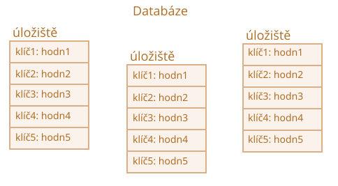
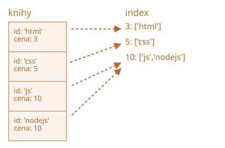

libs:
  - 'https://cdn.jsdelivr.net/npm/idb@3.0.2/build/idb.min.js'

---

# IndexedDB

IndexedDB je databáze zabudovaná do prohlížeče. Je mnohem silnější než `localStorage`.

- Umožňuje ukládat téměř jakýkoli druh hodnot podle klíčů, klíče mohou být několika typů.
- Podporuje transakce pro dosažení větší spolehlivosti.
- Podporuje dotazy podle rozsahu klíčů a indexy.
- Dokáže ukládat mnohem větší objemy dat než `localStorage`.

Tyto schopnosti jsou pro běžné aplikace klient-server obvykle příliš silné. IndexedDB je určena pro offline aplikace, pro kombinaci se ServiceWorkers a jinými technologiemi.

Nativní rozhraní IndexedDB, popsané ve specifikaci <https://www.w3.org/TR/IndexedDB>, je založeno na událostech.

Můžeme také použít `async/await` za pomoci obalu založeného na příslibech, například <https://github.com/jakearchibald/idb>. Je to praktické, ale obal není dokonalý a nedokáže nahradit události ve všech případech. Začneme tedy s událostmi a pak, až IndexedDB porozumíme, budeme používat obal.

```smart header="Kde jsou data uložena?"
Technicky se data obvykle ukládají do domovského adresáře návštěvníka, společně s nastavením prohlížeče, jeho rozšířeními a podobně.

Různé prohlížeče a různí uživatelé na úrovni OS mají každý své nezávislé úložiště.
```

## Otevření databáze

K zahájení práce s IndexedDB musíme nejprve otevřít databázi (připojit se k ní) funkcí `open`.

Syntaxe:

```js
let požadavekOtevření = indexedDB.open(název, verze);
```

- `název` -- řetězec s názvem databáze.
- `version` -- celé kladné číslo verze, standardně `1` (bude vysvětleno dále).

Můžeme mít mnoho databází s různými názvy, ale všechny budou existovat jen v rámci aktuálního původu (doména/protokol/port). Různá webová sídla nemohou navzájem přistupovat ke svým databázím.

Volání vrací objekt `požadavekOtevření`. Na něm bychom měli naslouchat událostem:
- `success`: databáze je připravena, `požadavekOtevření.result` obsahuje „objekt databáze“, který bychom měli používat pro další volání.
- `error`: otevření selhalo.
- `upgradeneeded`: databáze je připravena, ale její verze je zastaralá (viz dále).

**IndexedDB má vestavěný mechanismus „verzování schématu“, který v databázích na straně serveru chybí.**

Na rozdíl od databází na straně serveru je IndexedDB na straně klienta a data se ukládají v prohlížeči, takže my vývojáři k nim nemáme neustálý přístup. Když tedy vydáme novou verzi naší aplikace a uživatel navštíví naši webovou stránku, budeme možná muset aktualizovat jeho databázi.

Jestliže verze lokální databáze je nižší, než je uvedeno v `open`, spustí se speciální událost `upgradeneeded` a my můžeme porovnat verze a podle potřeby aktualizovat datové struktury.

Událost `upgradeneeded` se spustí i tehdy, když databáze ještě neexistuje (technicky je její verze `0`), takže můžeme provést inicializaci.

Řekněme, že jsme vydali první verzi naší aplikace.

Pak můžeme otevřít databázi s verzí `1` a provést inicializaci v handleru `upgradeneeded` následovně:

```js
let požadavekOtevření = indexedDB.open("úložiště", *!*1*/!*);

požadavekOtevření.onupgradeneeded = function() {
  // spustí se, pokud klient neměl žádnou databázi
  // ...provedeme inicializaci...
};

požadavekOtevření.onerror = function() {
  console.error("Chyba", požadavekOtevření.error);
};

požadavekOtevření.onsuccess = function() {
  let db = požadavekOtevření.result;
  // pokračujeme v práci s databází používáním objektu db
};
```

Pak později publikujeme druhou verzi.

Můžeme ji otevřít s verzí `2` a provést aktualizaci následovně:

```js
let požadavekOtevření = indexedDB.open("store", *!*2*/!*);

požadavekOtevření.onupgradeneeded = function(událost) {
  // verze existující databáze je menší než 2 (nebo databáze neexistuje)
  let db = požadavekOtevření.result;
  switch(událost.oldVersion) { // verze existující databáze
    case 0:
      // verze 0 znamená, že klient neměl žádnou databázi
      // provedeme inicializaci
    case 1:
      // klient měl verzi 1
      // aktualizace
  }
};
```

Prosíme všimněte si: protože naše aktuální verze je `2`, handler `onupgradeneeded` má větev kódu pro verzi `0`, určenou pro uživatele, kteří sem přistupují poprvé a ještě nemají žádnou databázi, i pro verzi `1` kvůli aktualizaci.

A teprve pak, jen pokud handler `onupgradeneeded` skončí bez chyb, spustí se `požadavekOtevření.onsuccess` a databáze se považuje za úspěšně otevřenou.

Pro smazání databáze:

```js
let požadavekSmazání = indexedDB.deleteDatabase(název)
// požadavekSmazání.onsuccess/onerror sleduje výsledek
```

```warn header="Nemůžeme otevřít databázi voláním open se starší verzí"
Jestliže aktuální uživatelova databáze má vyšší verzi, než je ve volání `open`, např. verze existující databáze je `3` a my se pokusíme otevřít `open(...2)`, pak nastane chyba a spustí se `požadavekOtevření.onerror`.

Stává se to vzácně, ale může se to stát, když si návštěvník načte zastaralý JavaScriptový kód, např. z mezipaměti v proxy. Kód je tedy starý, ale uživatelova databáze je nová.

Abychom se před takovými chybami chránili, měli bychom kontrolovat `db.version` a navrhovat aktualizaci stránky. Abyste se vyhnuli načtení starého kódu, používejte vhodné HTTP hlavičky pro mezipaměť. Pak takové problémy nikdy mít nebudete.
```

### Problém paralelní aktualizace

Když hovoříme o verzování, zmiňme se o malém souvisejícím problému.

Dejme tomu:
1. Návštěvník otevřel naše sídlo v záložce prohlížeče s verzí databáze `1`.
2. Pak jsme vydali aktualizaci, takže náš kód je novější.
3. A pak tentýž návštěvník otevře naše sídlo v jiné záložce.

Bude tedy mít záložku s otevřeným připojením k databázi verze `1`, zatímco druhá se ji pokusí ve svém handleru `upgradeneeded` aktualizovat na verzi `2`.

Problém je v tom, že databáze je sdílena mezi dvěma záložkami, protože obě mají stejné sídlo, stejný původ. A nemůže být současně v obou verzích `1` a `2`. Abychom mohli provést aktualizaci na verzi `2`, musejí být zavřena všechna připojení k verzi `1`, včetně připojení v první záložce.

Abychom to mohli zorganizovat, spustí se na „zastaralém“ databázovém objektu událost `versionchange`. Měli bychom jí naslouchat a připojení ke staré databázi zavřít (a pravděpodobně navrhnout uživateli aktualizaci stránky, aby si načetl aktualizovaný kód).

Pokud nebudeme naslouchat události `versionchange` a neuzavřeme staré připojení, pak se druhé, nové připojení nevytvoří. Objekt `požadavekOtevření` vyvolá místo události `success` událost `blocked`. Druhá záložka tedy nebude fungovat.

Následující kód správně ošetřuje paralelní aktualizaci. Instaluje handler `onversionchange`, který se spustí, když se aktuální připojení k databázi stane zastaralým (někde jinde bude aktualizována verze databáze), a uzavře připojení.

```js
let požadavekOtevření = indexedDB.open("store", 2);

požadavekOtevření.onupgradeneeded = ...;
požadavekOtevření.onerror = ...;

požadavekOtevření.onsuccess = function() {
  let db = požadavekOtevření.result;

  *!*
  db.onversionchange = function() {
    db.close();
    alert("Databáze není aktuální, prosím aktualizujte stránku.")
  };
  */!*

  // ...databáze je připravena, můžeme ji používat...
};

*!*
požadavekOtevření.onblocked = function() {
  // tato událost by se neměla spustit, pokud správně zpracujeme onversionchange

  // znamená, že ke stejné databázi existuje jiné otevřené připojení
  // a nebylo zavřeno poté, co se na ní spustila db.onversionchange
};
*/!*
```

...Jinými slovy, provádíme zde dvě věci:

1. Posluchač `db.onversionchange` nás informuje o paralelním pokusu o aktualizaci, když aktuální verze databáze přestala být aktuální.
2. Posluchač `požadavekOtevření.onblocked` nás informuje o opačné situaci: někde jinde existuje připojení k zastaralé verzi a nebylo zavřeno, takže nové připojení nelze vytvořit.

V `db.onversionchange` můžeme všechno ošetřit kultivovaněji, požádat návštěvníka o uložení dat před uzavřením připojení a podobně.

Alternativní přístup by byl nezavírat databázi v `db.onversionchange`, ale místo toho použít handler `onblocked` (v nové záložce), abychom návštěvníka upozornili, že novou verzi není možné načíst, dokud si nezavře ostatní záložky.

Tyto kolize aktualizací se stávají jen vzácně, ale měli bychom pro ně mít aspoň nějaké ošetření, minimálně handler `onblocked`, abychom zabránili tichému spadnutí našeho skriptu.

## Objektové úložiště

K ukládání čehokoli v IndexedDB potřebujeme *objektové úložiště*.

Objektové úložiště je jádrem konceptu IndexedDB. Jeho obdoby v jiných databázích se nazývají „tabulky“ nebo „kolekce“. Je to místo, do něhož se ukládají data. Databáze může obsahovat více úložišť: jedno pro uživatele, druhé pro zboží a tak dále.

Přestože se úložiště nazývá „objektové“, můžeme do něj ukládat i primitivy.

**Můžeme uložit téměř jakoukoli hodnotu včetně složitých objektů.**

IndexedDB používá k naklonování a uložení objektu [standardní serializační algoritmus](https://www.w3.org/TR/html53/infrastructure.html#section-structuredserializeforstorage). Podobá se `JSON.stringify`, ale je silnější a dokáže uložit mnohem více datových typů.

Příkladem objektu, který nelze uložit, je objekt s kruhovými odkazy. Takové objekty nejsou serializovatelné a selže na nich i `JSON.stringify`.

**Každá hodnota v úložišti musí mít unikátní `klíč`.**

Klíč musí být jednoho z těchto typů: číslo, datum, řetězec, binární objekt nebo pole. Je to unikátní identifikátor, takže podle něj můžeme vyhledávat, odstraňovat a měnit hodnoty.



Jak velmi brzy uvidíme, klíč můžeme uvést, když do úložiště přidáváme hodnotu, podobně jako do `localStorage`. Když však ukládáme objekty, IndexedDB nám umožňuje nastavit jako klíč některou vlastnost objektu, což je mnohem vhodnější. Můžeme také klíče automaticky generovat.

Napřed však musíme vytvořit objektové úložiště.

Syntaxe pro vytvoření objektového úložiště:

```js
db.createObjectStore(název[, volbyKlíče]);
```

Prosíme všimněte si, že tato operace je synchronní, není potřeba `await`.

- `název` je název úložiště, např. `"knihy"` pro knihy,
- `volbyKlíče` je nepovinný objekt obsahující jednu ze dvou vlastností:
  - `keyPath` -- cesta k vlastnosti objektu, kterou IndexedDB použije jako klíč, např. `id`.
  - `autoIncrement` -- pokud je `true`, pak se klíč nově uloženého objektu vygeneruje automaticky jako neustále se zvyšující číslo.

Jestliže neuvedeme `volbyKlíče`, budeme muset výslovně uvést klíč později, až budeme ukládat objekt.

Například toto objektové úložiště používá jako klíč vlastnost `id`:

```js
db.createObjectStore('knihy', {keyPath: 'id'});
```

**Objektové úložiště může být vytvořeno nebo měněno jen při aktualizaci verze databáze, v handleru `upgradeneeded`.**

To je technické omezení. Přidávat, odstraňovat a měnit data můžeme i mimo tento handler, ale objektová úložiště smíme vytvářet, odstraňovat a měnit jen při aktualizaci verze.

Aktualizaci verze databáze je možné provést v zásadě dvěma způsoby:

1. Můžeme implementovat funkce aktualizace pro každou verzi: z 1 na 2, z 2 na 3, z 3 na 4 atd. Pak můžeme v `upgradeneeded` porovnat verze (např. stará 2, nová 4) a spustit aktualizace pro jednotlivé verze krok za krokem, pro každou mezilehlou verzi (z 2 na 3, pak z 3 na 4).
2. Nebo můžeme prostě prozkoumat databázi: seznam existujících objektových úložišť získáme z `db.objectStoreNames`. To je objekt třídy [DOMStringList](https://html.spec.whatwg.org/multipage/common-dom-interfaces.html#domstringlist), který poskytuje metodu  `contains(název)` pro ověření existence. A pak můžeme provádět aktualizace podle toho, co existuje a co ne.

Pro malé databáze může být druhá varianta jednodušší.

Následuje demo druhého způsobu:

```js
let požadavekOtevření = indexedDB.open("db", 2);

// vytvoříme/aktualizujeme databázi bez kontroly verzí
požadavekOtevření.onupgradeneeded = function() {
  let db = požadavekOtevření.result;
  if (!db.objectStoreNames.contains('knihy')) { // pokud neexistuje úložiště "knihy",
    db.createObjectStore('knihy', {keyPath: 'id'}); // vytvoříme je
  }
};
```

Smazání objektového úložiště:

```js
db.deleteObjectStore('knihy')
```

## Transakce

„Transakce“ je obecný pojem, používaný v mnoha druzích databází.

Transakce je skupina operací, které musejí být úspěšně provedeny buď všechny, nebo žádná.

Například když si osoba něco koupí, musíme:

1. Odečíst peníze z jejího konta.
2. Přidat zakoupenou věc do jejího inventáře.

Bylo by velice špatné, kdybychom dokončili operaci 1 a pak se něco pokazilo, např. by byl vypnut proud, a my bychom neprovedli operaci 2. Obě operace by měly buď uspět (nákup kompletní, dobře!), nebo neuspět (pak aspoň osobě zůstanou peníze a bude to moci zkusit znovu).

Transakce to dokáží zaručit.

**Veškeré datové operace v IndexedDB musejí být vykonávány uvnitř transakce.**

Začátek transakce:

```js
db.transaction(úložiště[, typ]);
```

- `úložiště` je název úložiště, k němuž má transakce přistupovat, např. `"knihy"`. Pokud chceme přistupovat k více úložištím, může to být pole jejich názvů.
- `type` – typ transakce, jeden z následujících:
  - `readonly` -- může pouze číst, standardní.
  - `readwrite` -- může pouze číst a zapisovat data, ale ne vytvářet, odstraňovat nebo měnit objektová úložiště.

Existuje i typ transakce `versionchange`. Takové transakce mohou provádět cokoli, ale my je nemůžeme ručně vytvářet. Transakci typu `versionchange` vytváří IndexedDB automaticky, když otevírá databázi pro handler `upgradeneeded`. Proto je to jediné místo, kde můžeme aktualizovat databázovou strukturu a vytvářet nebo odstraňovat objektová úložiště.

```smart header="Proč existují různé typy transakcí?"
Důvodem, proč musíme transakce označovat jako `readonly` nebo `readwrite`, je výkonnost.

K jednomu úložišti může současně přistupovat více transakcí typu `readonly`, ale ne transakce typu `readwrite`. Transakce typu `readwrite` si „zamkne“ úložiště pro zápis. Než bude další transakce moci přistupovat ke stejnému úložišti, musí počkat, než předchozí transakce skončí.
```

Po vytvoření transakce můžeme přidat prvek do úložiště, například:

```js
let transakce = db.transaction("knihy", "readwrite"); // (1)

// získáme objektové úložiště, nad nímž budeme pracovat
*!*
let knihy = transakce.objectStore("knihy"); // (2)
*/!*

let kniha = {
  id: 'js',
  cena: 10,
  vytvořena: new Date()
};

*!*
let požadavek = knihy.add(kniha); // (3)
*/!*

požadavek.onsuccess = function() { // (4)
  console.log("Kniha přidána do úložiště", požadavek.result);
};

požadavek.onerror = function() {
  console.log("Chyba", požadavek.error);
};
```

Jsou to v zásadě čtyři kroky:

1. V `(1)` vytvoříme transakci a uvedeme všechna úložiště, k nimž chceme přistupovat.
2. V `(2)` získáme objekt úložiště voláním `transaction.objectStore(název)`.
3. V `(3)` provedeme požadavek na objektové úložiště `knihy.add(kniha)`.
4. ...V `(4)` zpracujeme úspěch/chybu požadavku, pak můžeme podle potřeby vytvářet další požadavky atd.

Objektová úložiště podporují dvě metody uložení hodnoty:

- **put(hodnota, [klíč])**
    Přidá do úložiště hodnotu `hodnota`. Musíme poskytnout `klíč` jen tehdy, pokud objektové úložiště nemá nastavenou volbu `keyPath` nebo `autoIncrement`. Pokud už obsahuje hodnotu se stejným klíčem, bude nahrazena novou.

- **add(hodnota, [klíč])**
    Totéž jako `put`, ale pokud už existuje hodnota se stejným klíčem, požadavek selže a bude vygenerována chyba nazvaná `"ConstraintError"`.

Podobně jako při otevření databáze můžeme poslat požadavek: `knihy.add(kniha)` a pak čekat na události `success/error`.

- U funkce `add` je `požadavek.result` klíč nového objektu.
- Chyba (pokud k ní došlo) se nachází v `požadavek.error`.

## Automatické provádění transakcí

V uvedeném příkladu jsme zahájili transakci a vytvořili požadavek `add`. Ale jak jsme již dříve uvedli, transakce může obsahovat více požadavků, které se musejí buď všechny úspěšně provést, nebo všechny neprovést. Jak oznámíme, že transakce je hotová a žádné další požadavky nepřijdou?

Stručná odpověď zní: nijak.

V další verzi specifikace 3.0 pravděpodobně bude způsob, jak ukončit transakci ručně, ale v současné verzi 2.0 neexistuje.

**Až budou všechny požadavky na transakce hotovy a [fronta mikroúloh](info:microtask-queue) bude prázdná, transakce se automaticky provede.**

Zpravidla můžeme předpokládat, že transakce se provede, až budou všechny její požadavky hotovy a průběh aktuálního kódu skončí.

V uvedeném příkladu tedy není k dokončení transakce nutné žádné speciální volání.

Princip automatického provádění transakcí má důležitý vedlejší efekt. Nemůžeme doprostřed transakce vkládat asynchronní operace, např. `fetch` nebo `setTimeout`. IndexedDB nebude s transakcí čekat na jejich dokončení.

V následujícím kódu `požadavek2` na řádku `(*)` selže, protože transakce již byla provedena a nelze v ní vytvořit žádný další požadavek:

```js
let požadavek1 = knihy.add(kniha);

požadavek1.onsuccess = function() {
  fetch('/').then(odpověď => {
*!*
    let požadavek2 = knihy.add(dalšíKniha); // (*)
*/!*
    požadavek2.onerror = function() {
      console.log(požadavek2.error.name); // TransactionInactiveError
    };
  });
};
```

Je to tím, že `fetch` je asynchronní operace, makroúloha. Transakce jsou uzavřeny dříve, než prohlížeč začne provádět makroúlohy.

Autoři specifikace IndexedDB se domnívají, že transakce by měly existovat jen krátce, zejména z výkonnostních důvodů.

Zejména transakce `readwrite` „zamykají“ úložiště pro zápis. Pokud tedy jedna část aplikace vyvolá `readwrite` na objektovém úložišti `knihy`, pak jiná část, která chce udělat totéž, musí počkat: nová transakce bude „viset“, dokud nebude první transakce hotová. To může vést ke zvláštním prodlevám, jestliže transakce budou trvat dlouhou dobu.

Co tedy můžeme dělat?

V uvedeném příkladu můžeme vytvořit novou `db.transaction` těsně před novým požadavkem `(*)`.

Ještě lepší však bude, když budeme provádět operace společně, v jedné transakci, abychom oddělili transakce IndexedDB od „jiných“ asynchronních záležitostí.

Nejprve zavoláme `fetch`, připravíme si potřebná data, a pak vytvoříme transakci a provedeme všechny databázové požadavky. To bude fungovat.

Abychom detekovali okamžik úspěšného splnění, můžeme naslouchat události `transakce.oncomplete`:

```js
let transakce = db.transaction("knihy", "readwrite");

// ...provedeme operace...

transakce.oncomplete = function() {
  console.log("Transakce je hotová");
};
```

Jedině `complete` nám zaručuje, že transakce je uložena jako celek. Jednotlivé požadavky mohou uspět, ale finální operace zápisu se může pokazit (např. kvůli I/O chybě nebo něčemu jinému).

Pro ruční zrušení transakce voláme:

```js
transakce.abort();
```

Tím se v ní zruší všechny změny, které učinily její požadavky, a vyvolá se událost `transaction.onabort`.


## Zpracování chyb

Požadavek na zápis může selhat.

To musíme očekávat, nejenom kvůli možným chybám na naší straně, ale i z důvodů, které se netýkají samotné transakce. Například může být překročena kapacita úložiště. Musíme tedy být připraveni takový případ ošetřit.

**Neúspěšný požadavek automaticky ukončí transakci a zruší všechny její změny.**

V některých situacích můžeme chtít neúspěch ošetřit (např. zkusit jiný požadavek) bez zrušení provedených změn a pokračovat v transakci. To je možné. Handler `požadavek.onerror` dokáže zabránit zrušení transakce voláním `událost.preventDefault()`.

V následujícím příkladu je přidána nová kniha se stejným klíčem (`id`), jaký už existuje. Metoda `store.add` v tom případě vygeneruje chybu `"ConstraintError"`. Ošetříme ji, aniž bychom zrušili transakci:

```js
let transakce = db.transaction("knihy", "readwrite");

let kniha = { id: 'js', cena: 10 };

let požadavek = transakce.objectStore("knihy").add(kniha);

požadavek.onerror = function(událost) {
  // ConstraintError nastane, když objekt se stejným id už existuje
  if (požadavek.error.name == "ConstraintError") {
    console.log("Kniha s tímto id již existuje"); // ošetříme chybu
    událost.preventDefault(); // nezrušíme transakci
    // použijeme pro knihu jiný klíč?
  } else {
    // neočekávaná chyba, nemůžeme ji ošetřit
    // transakce bude zrušena
  }
};

transakce.onabort = function() {
  console.log("Chyba", transakce.error);
};
```

### Delegování událostí

Potřebujeme onerror/onsuccess pro každý požadavek? Ne vždy. Můžeme místo toho použít delegování událostí.

**Události IndexedDB bublají: `požadavek` -> `transakce` -> `databáze`.**

Všechny události jsou DOM události a obsahují zachytávání a bublání. Obvykle se však využívá jen fáze bublání.

Můžeme tedy všechny chyby zachytávat v handleru `db.onerror`, pro oznámení nebo jiné účely:

```js
db.onerror = function(událost) {
  let požadavek = událost.target; // požadavek, který vyvolal chybu

  console.log("Chyba", požadavek.error);
};
```

...Ale co když je chyba zcela ošetřena? V takovém případě ji nechceme oznamovat.

Můžeme zastavit bublání a tedy i `db.onerror` voláním `událost.stopPropagation()` v `požadavek.onerror`.

```js
požadavek.onerror = function(událost) {
  if (požadavek.error.name == "ConstraintError") {
    console.log("Kniha s tímto id již existuje"); // zpracování chyby
    událost.preventDefault(); // nezrušíme transakci
    událost.stopPropagation(); // nenecháme chybu probublat výš, „pohltíme“ ji
  } else {
    // neděláme nic
    // transakce bude zrušena
    // o chybu se můžeme postarat v transakce.onabort
  }
};
```

## Hledání

V objektovém úložišti existují dva hlavní druhy hledání:

1. Podle hodnoty nebo rozsahu hodnot klíče. V našem úložišti „knihy“ by to byla hodnota nebo rozsah hodnot `kniha.id`.
2. Podle jiného objektového pole, např. `kniha.cena`. To vyžaduje další datovou strukturu, zvanou „index“.

### Podle klíče

Nejprve probereme první druh hledání: podle klíče.

Vyhledávací metody podporují jak přesné hodnoty klíče, tak tzv. „rozsahy hodnot“ -- objekty [IDBKeyRange](https://www.w3.org/TR/IndexedDB/#keyrange), které specifikují hledaný „rozsah klíče“.

Objekty `IDBKeyRange` se vytvářejí pomocí následujících volání:

- `IDBKeyRange.lowerBound(nejmenší, [otevřeně])` znamená: `≥nejmenší` (nebo `>nejmenší`, pokud `otevřeně` je true)
- `IDBKeyRange.upperBound(největší, [otevřeně])` znamená: `≤největší` (nebo `<největší`, pokud `otevřeně` je true)
- `IDBKeyRange.bound(nejmenší, největší, [nejmenšíOtevřeně], [největšíOtevřeně])` znamená: mezi `nejmenší` a `největší`. Pokud je některý přepínač otevřenosti true, není příslušný klíč do rozsahu zahrnut.
- `IDBKeyRange.only(klíč)` -- rozsah tvořený jediným klíčem `klíč`, používá se málokdy.

Praktické příklady jejich použití velmi brzy uvidíme.

K provádění samotného hledání slouží následující metody. Přijímají argument `dotaz`, kterým může být přesná hodnota nebo rozsah hodnot klíče:

- `store.get(dotaz)` -- hledá první hodnotu podle klíče nebo rozsahu.
- `store.getAll([dotaz], [počet])` -- hledá všechny hodnoty, pokud je uveden `počet`, hledá jich jen uvedený počet.
- `store.getKey(dotaz)` -- hledá první klíč, který odpovídá dotazu, dotazem je zpravidla rozsah.
- `store.getAllKeys([dotaz], [počet])` -- hledá všechny klíče, které odpovídají dotazu, dotazem je zpravidla rozsah, pokud je uveden `počet`, hledá jich jen uvedený počet.
- `store.počet([dotaz])` -- vrátí celkový počet klíčů, které odpovídají dotazu, dotazem je zpravidla rozsah.

V našem úložišti máme například spoustu knih. Nezapomeňte, že klíčem je pole `id`, takže všechny tyto metody hledají podle `id`.

Příklady požadavků:

```js
// vrátí jednu knihu
knihy.get('js')

// vrátí knihy s 'css' <= id <= 'html'
knihy.getAll(IDBKeyRange.bound('css', 'html'))

// vrátí knihy s id < 'html'
knihy.getAll(IDBKeyRange.upperBound('html', true))

// vrátí všechny knihy
knihy.getAll()

// vrátí všechny klíče, u nichž id > 'js'
knihy.getAllKeys(IDBKeyRange.lowerBound('js', true))
```

```smart header="Objektové úložiště je vždy seřazené"
V objektovém úložišti jsou hodnoty interně seřazeny podle klíčů.

Požadavek, který vrátí více hodnot, je tedy vrací vždy seřazené podle klíče.
```

### Podle pole s použitím indexu

Pro hledání podle jiných objektových polí musíme vytvořit další datovou strukturu nazvanou „index“.

Index je „přídavek“ do úložiště, který sleduje zadané objektové pole a pro každou hodnotu tohoto pole si ukládá seznam klíčů objektů, které mají tuto hodnotu. Podrobnější obrázek bude následovat.

Syntaxe:

```js
objectStore.createIndex(název, cestaKeKlíči, [volby]);
```

- **`název`** -- název indexu,
- **`cestaKeKlíči`** -- cesta k objektovému poli, které má index sledovat (podle tohoto pole se chystáme hledat),
- **`volby`** -- nepovinný objekt s těmito vlastnostmi:
  - **`unique`** -- pokud je true, pak v úložišti může být jen jeden objekt se zadanou hodnotou v `cestaKeKlíči`. Index to zajistí tak, že pokud se pokusíme přidat další objekt se stejnou hodnotou, vygeneruje chybu.
  - **`multiEntry`** -- používá se jen tehdy, když hodnotou `cestaKeKlíči` je pole. Standardně v takovém případě bude index s celým polem zacházet jako s klíčem. Pokud však `multiEntry` je true, pak si index bude udržovat seznam uložených objektů pro každou hodnotu v tomto poli. Klíči indexu se tedy stanou prvky pole.

V našem příkladu ukládáme knihy podle klíče `id`.

Řekněme, že chceme hledat podle pole `cena`.

Nejprve musíme vytvořit index. To musíme provést v `upgradeneeded`, stejně jako vytvoření objektového úložiště:

```js
požadavekOtevření.onupgradeneeded = function() {
  // index musíme vytvořit zde, v transakci typu versionchange
  let knihy = db.createObjectStore('knihy', {keyPath: 'id'});
*!*
  let index = knihy.createIndex('cena_idx', 'cena');
*/!*
};
```

- Index bude sledovat pole `cena`.
- Cena není unikátní, může existovat více knih se stejnou cenou, takže volbu `unique` nenastavíme.
- Cena není pole, takže přepínač `multiEntry` není aplikovatelný.

Představme si, že náš `inventář` obsahuje 4 knihy. Následující obrázek přesně zobrazuje, co je `index`:



Jak bylo řečeno, index si pro každou hodnotu pole `cena` (druhý argument) uchovává seznam klíčů, které mají tuto cenu.

Index se automaticky aktualizuje, o to se starat nemusíme.

Když nyní chceme hledat podle zadané ceny, můžeme na index jednoduše aplikovat stejné hledací metody:

```js
let transakce = db.transaction("knihy"); // jen pro čtení
let knihy = transakce.objectStore("knihy");
let indexPodleCeny = knihy.index("cena_idx");

*!*
let požadavek = indexPodleCeny.getAll(10);
*/!*

požadavek.onsuccess = function() {
  if (požadavek.result !== undefined) {
    console.log("Knihy", požadavek.result); // pole knih s cena=10
  } else {
    console.log("Žádná taková kniha není");
  }
};
```

Můžeme také pomocí `IDBKeyRange` vytvořit rozsah a hledat levné nebo drahé knihy:

```js
// najdeme knihy, jejichž cena <= 5
let požadavek = indexPodleCeny.getAll(IDBKeyRange.upperBound(5));
```

Indexy jsou vnitřně řazeny podle sledovaného objektového pole, v našem případě `cena`. Když tedy provádíme hledání, budou výsledky také seřazeny podle pole `cena`.

## Mazání z úložiště

Metoda `delete` vyhledá hodnoty podle dotazu a smaže je. Formát jejího volání je podobný `getAll`:

- **`delete(dotaz)`** -- smaže hodnoty, které odpovídají dotazu.

Příklad:

```js
// smaže knihu s id='js'
knihy.delete('js');
```

Pokud chceme smazat knihy podle ceny nebo jiného objektového pole, měli bychom napřed najít klíč v indexu a pak volat `delete`:

```js
// najdeme klíč, kde cena = 5
let požadavek = indexPodleCeny.getKey(5);

požadavek.onsuccess = function() {
  let id = požadavek.result;
  let požadavekSmazání = knihy.delete(id);
};
```

Smazání veškerého obsahu:

```js
knihy.clear(); // vyprázdní celé úložiště.
```

## Kurzory

Metody jako `getAll/getAllKeys` vracejí pole klíčů/hodnot.

Objektové úložiště však může být obrovské, větší než dostupná paměť. Pak `getAll` nedokáže vrátit všechny záznamy jako pole.

Co můžeme dělat?

Způsob, jak to překonat, poskytují kurzory.

***Kurzor* je speciální objekt, který prochází objektové úložiště podle zadaného dotazu a vrací vždy jeden klíč/hodnotu současně, čímž šetří paměť.**

Protože objektové úložiště je interně seřazeno podle klíče, kurzor je prochází v pořadí podle klíčů (standardně vzestupně).

Syntaxe:

```js
// podobně jako getAll, ale s kurzorem:
let požadavek = úložiště.openCursor(dotaz, [směr]);

// chceme-li získat klíče a ne hodnoty (jako getAllKeys): úložiště.openKeyCursor
```

- **`dotaz`** je klíč nebo rozsah klíčů, stejný jako u `getAll`.
- **`směr`** je nepovinný argument, který specifikuje pořadí:
  - `"next"` -- standardní, kurzor prochází záznamy nahoru od toho s nejnižším klíčem.
  - `"prev"` -- obrácené pořadí: směrem dolů od záznamu s nejvyšším klíčem.
  - `"nextunique"`, `"prevunique"` -- stejné jako výše uvedené, ale záznamy se stejným klíčem se přeskakují (jen pro kurzory nad indexy, např. při více knihách s cena=5 bude vrácena jen první).

**Hlavním rozdílem kurzoru je, že `požadavek.onsuccess` se spustí vícekrát: pro každý výsledek jednou.**

Následuje příklad, jak používat kurzor:

```js
let transakce = db.transaction("knihy");
let knihy = transakce.objectStore("knihy");

let požadavek = knihy.openCursor();

// volá se pro každou knihu, kterou kurzor najde
požadavek.onsuccess = function() {
  let kurzor = požadavek.result;
  if (kurzor) {
    let klíč = kurzor.key; // klíč knihy (pole id)
    let hodnota = kurzor.value; // objekt knihy
    console.log(klíč, hodnota);
    kurzor.continue();
  } else {
    console.log("Další knihy už nejsou");
  }
};
```

Hlavní metody kurzoru jsou:

- `advance(počet)` -- posune kurzor o `počet` kroků, přeskakuje hodnoty.
- `continue([klíč])` -- při hledání podle rozsahu posune kurzor k další hodnotě (nebo hned za `klíč`, pokud je uveden).

Ať existují další hodnoty odpovídající kurzoru nebo ne, je vyvolán `onsuccess` a z jeho `result` pak můžeme získat kurzor ukazující na další záznam nebo `undefined`.

V uvedeném příkladu byl kurzor vytvořen pro objektové úložiště.

Můžeme však také vytvořit kurzor nad indexem. Jak si pamatujeme, indexy nám umožňují hledat podle objektového pole. Kurzory nad indexy provádějí přesně totéž jako nad objektovými úložišti -- šetří paměť tím, že vracejí jednu hodnotu za druhou.

V kurzorech nad indexy je `kurzor.key` klíč indexu (např. cena) a pro objektový klíč bychom měli použít vlastnost `kurzor.primaryKey`:

```js
let požadavek = indexPodleCeny.openCursor(IDBKeyRange.upperBound(5));

// volá se pro každý záznam
požadavek.onsuccess = function() {
  let kurzor = požadavek.result;
  if (kurzor) {
    let primárníKlíč = kurzor.primaryKey; // další klíč objektového úložiště (pole id)
    let hodnota = kurzor.value; // další objekt v úložišti (objekt knihy)
    let klíč = kurzor.key; // další klíč indexu (cena)
    console.log(klíč, hodnota);
    kurzor.continue();
  } else {
    console.log("Další knihy už nejsou");
  }
};
```

## Příslibový obal

Přidávat `onsuccess/onerror` do každého požadavku je poměrně těžkopádný úkol. Někdy si můžeme usnadnit život použitím delegování událostí, např. nastavit handlery pro celou transakci, ale mnohem vhodnější je použít `async/await`.

Dále v této kapitole budeme používat krátký příslibový obal <https://github.com/jakearchibald/idb>, který vytváří globální objekt `idb` s [promisifikovanými](info:promisify) metodami IndexedDB.

Pak můžeme místo `onsuccess/onerror` psát takto:

```js
let db = await idb.openDB('store', 1, db => {
  if (db.oldVersion == 0) {
    // provedeme inicializaci
    db.createObjectStore('knihy', {keyPath: 'id'});
  }
});

let transakce = db.transaction('knihy', 'readwrite');
let knihy = transaction.objectStore('knihy');

try {
  await knihy.add(...);
  await knihy.add(...);

  await transakce.complete;

  console.log('jsbook uložena');
} catch(err) {
  console.log('chyba', err.message);
}
```

Máme tedy celý hezký „čistě asynchronní kód“ a blok „try..catch“.

### Ošetření chyb

Pokud nezachytíme chybu, propadne ven k nejbližšímu vnějšímu `try..catch`.

Nezachycená chyba se stane událostí „neošetřeného zamítnutí příslibu“ na objektu `window`.

Takové chyby můžeme ošetřit následovně:

```js
window.addEventListener('unhandledrejection', událost => {
  let požadavek = událost.target; // objekt nativního požadavku IndexedDB
  let error = událost.reason; // objekt neošetřené chyby, totéž jako požadavek.error
  ...hlášení chyby...
});
```

### Past „neaktivní transakce“

Jak už víme, transakce se automaticky provede hned, jakmile prohlížeč dokončí běh aktuálního kódu a mikroúloh. Když tedy doprostřed transakce umístíme *makroúlohu*, např. `fetch`, transakce nebude čekat na její dokončení a automaticky se provede. Příští požadavek v ní tedy selže.

U příslibového obalu a `async/await` je situace stejná.

Následuje příklad `fetch` uprostřed transakce:

```js
let transakce = db.transaction("inventář", "readwrite");
let inventář = transakce.objectStore("inventář");

await inventář.add({ id: 'js', cena: 10, vytvořeno: new Date() });

await fetch(...); // (*)

await inventář.add({ id: 'js', cena: 10, vytvořeno: new Date() }); // Chyba
```

Příští `inventář.add` po `fetch` `(*)` spadne s chybou „neaktivní transakce“, protože transakce již v tom okamžiku byla provedena a uzavřena.

Způsob, jak to obejít, je stejný jako při práci s nativním IndexedDB: buď vytvořit novou transakci, nebo jen oddělit operace.

1. Napřed připravit data a stáhnout vše, co je potřeba.
2. Pak ukládat do databáze.

### Získávání nativních objektů

Obal interně provádí nativní požadavek IndexedDB, přidává do něj `onerror/onsuccess` a vrací příslib, který bude zamítnut nebo splněn s výsledkem.

Ve většině případů to funguje správně. Příklady najdete na stránce knihovny <https://github.com/jakearchibald/idb>.

V některých vzácných případech, kdy potřebujeme původní objekt `požadavek`, k němu můžeme přistupovat přes vlastnost příslibu `příslib.request`:

```js
let příslib = knihy.add(kniha); // získáme příslib (nečekáme na jeho výsledek)

let požadavek = příslib.request; // objekt nativního požadavku
let transakce = požadavek.transaction; // objekt nativní transakce

// ...provedeme nějaké voodoo s nativní IndexedDB...

let výsledek = await příslib; // pokud je stále potřeba
```

## Shrnutí

IndexedDB můžeme považovat za „localStorage na steroidech“. Je to jednoduchá databáze klíč-hodnota, dostatečně silná pro offline aplikace, ale stále jednoduchá na používání.

Nejlepší manuál je specifikace, [aktuální](https://www.w3.org/TR/IndexedDB-2/) je verze 2.0, ale částečně podporuje i několik metod z [3.0](https://w3c.github.io/IndexedDB/) (není mezi nimi velký rozdíl).

Základní použití můžeme popsat v několika větách:

1. Získáme příslibový obal, např. [idb](https://github.com/jakearchibald/idb).
2. Otevřeme databázi: `idb.openDb(název, verze, onupgradeneeded)`
    - V handleru `onupgradeneeded` vytvoříme objektová úložiště a indexy nebo provedeme aktualizaci verze, je-li zapotřebí.
3. Pro požadavky:
    - Vytvoříme transakci `db.transaction('knihy')` (`readwrite`, je-li zapotřebí čtení i zápis).
    - Získáme objektové úložiště `transaction.objectStore('knihy')`.
4. Pak pro hledání podle klíče voláme přímo metody objektového úložiště.
    - Pro hledání podle pole objektu vytvoříme index.
5. Pokud se data nevejdou do paměti, použijeme kurzor.

Následuje malá demo aplikace:

[codetabs src="knihy" current="index.html"]
