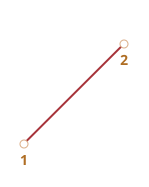
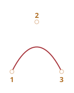
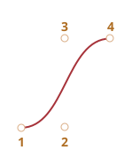
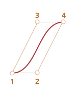
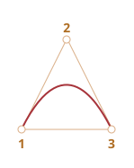
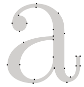
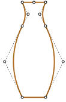
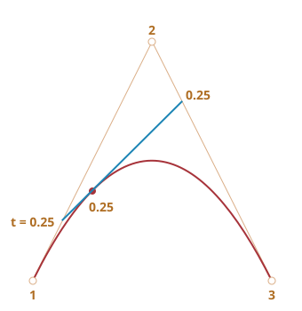
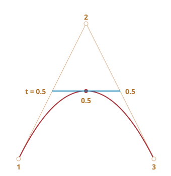

# Bézierovy křivky

Bézierovy křivky se používají v počítačové grafice ke kreslení tvarů, pro CSS animace a na mnoha dalších místech.

Jsou velmi jednoduché. Stačí si je jednou prostudovat a pak se budete ve světě vektorové grafiky a pokročilých animací cítit jako doma.

```smart header="Trochu teorie, prosím"
Tento článek poskytuje teoretický, ale velmi potřebný náhled na to, co Bézierovy křivky jsou, zatímco [další](info:css-animations#bezier-curve) ukazuje, jak je můžeme využít pro CSS animace.

Prosíme, udělejte si čas, abyste si ho přečetli a porozuměli konceptu. Dobře vám poslouží.
```

## Řídící body

[Bézierova křivka](https://en.wikipedia.org/wiki/B%C3%A9zier_curve) je definována řídícími body.

Mohou být 2, 3, 4 nebo jich může být víc.

Například dvoubodová křivka:



Tříbodová křivka:



Čtyřbodová křivka:



Pokud se na tyto křivky pozorně podíváte, můžete si okamžitě všimnout:

1. **Body nejsou vždy na křivce.** To je naprosto v pořádku. Později uvidíme, jak je křivka vytvořena.
2. **Řád křivky se rovná počtu bodů minus jedna.** Pro dva body máme lineární křivku (přímku), pro tři body kvadratickou křivku (parabolu), pro čtyři body kubickou křivku.
3. **Křivka je vždy uvnitř [konvexního obalu](https://cs.wikipedia.org/wiki/Konvexn%C3%AD_obal) řídících bodů:**

     

Díky této poslední vlastnosti je v počítačové grafice možné optimalizovat testy protínání. Pokud se konvexní obaly neprotínají, neprotínají se ani křivky. Prověření průniku konvexních obalů tedy může vydat velmi rychlou odpověď „křivky se neprotínají“. Prověřit průnik konvexních obalů je mnohem jednodušší, protože to jsou obdélníky, trojúhelníky a podobně (viz obrázek výše), mnohem jednodušší útvary než křivky.

**Hlavní výhodou Bézierových křivek pro kreslení je, že při posunu bodů se křivka mění *intuitivně zřejmým způsobem*.**

V následujícím příkladu zkuste posunovat řídící body myší:

[iframe src="demo.svg?nocpath=1&p=0,0,0.5,0,0.5,1,1,1" height=370]

**Jak si můžete všimnout, křivka se táhne podél tangenciálních čar 1 -> 2 a 3 -> 4.**

Po trošce tréninku vám bude jasné, jak umístit body, abyste získali požadovanou křivku. A spojením několika křivek můžeme získat prakticky cokoli.

Zde jsou příklady:

  

## De Casteljauův algoritmus

Pro Bézierovy křivky existuje matematický vzorec, ale probereme ho později, jelikož 
[de Casteljauův algoritmus](https://cs.wikipedia.org/wiki/De_Casteljau%C5%AFv_algoritmus) je identický matematické definici a vizuálně nám ukazuje, jak je křivka konstruována.

Nejprve se podívejme na 3-bodový příklad.

Zde je ukázka a vysvětlení bude následovat.

Řídící body (1, 2 a 3) můžete posunovat myší. Stisknutím tlačítka „Přehrát“ spustíte ukázku.

[iframe src="demo.svg?p=0,0,0.5,1,1,0&animate=1" height=370]

**De Casteljauův algoritmus vytvoření 3-bodové Bézierovy křivky:**

1. Nakreslete řídící body. V uvedené ukázce jsou označeny `1`, `2`, `3`.
2. Nakreslete úsečky mezi řídícími body 1 -> 2 -> 3. V uvedené ukázce jsou <span style="color:#825E28">hnědé</span>.
3. Parametr `t` nabývá hodnot od `0` do `1`. V uvedeném příkladu používáme krok `0.05`: smyčka jde přes `0, 0.05, 0.1, 0.15, ... 0.95, 1`.

    Pro každou z těchto hodnot `t`:

    - Na každé <span style="color:#825E28">hnědé</span> úsečce vezmeme bod umístěný v poměrné vzdálenosti `t` od jejího počátku. Protože úsečky jsou dvě, máme dva body.

        Například pro `t=0` budou oba body na začátku úseček, pro `t=0.25` ve 25% délky úsečky od počátku, pro `t=0.5` v 50% (uprostřed), pro `t=1` na konci úseček.

    - Tyto body spojíme. Na následujícím obrázku je spojovací úsečka zobrazena <span style="color:#167490">modře</span>.


| Pro `t=0.25`             | Pro `t=0.5`            |
| ------------------------ | ---------------------- |
|    |  |

4. Nyní na <span style="color:#167490">modré</span> úsečce vezmeme bod ve stejné poměrné vzdálenosti `t`. To znamená, že pro `t=0.25` (obrázek vlevo) máme bod na konci levé čtvrtiny úsečky, pro `t=0.5` (obrázek vpravo) bod uprostřed úsečky. Na uvedených obrázcích je tento bod vyznačen <span style="color:red">červeně</span>.

5. Protože `t` nabývá hodnot od `0` do `1`, každá hodnota `t` přidává na křivku jeden bod. Množina těchto bodů tvoří Bézierovu křivku. Na uvedených obrázcích je červená a parabolická.

To byl proces pro 3 body, ale proces pro 4 body je stejný.

Ukázka pro 4 body (body lze přesunovat myší):

[iframe src="demo.svg?p=0,0,0.5,0,0.5,1,1,1&animate=1" height=370]

Algoritmus pro 4 body:

- Spojíme řídící body úsečkami: 1 -> 2, 2 -> 3, 3 -> 4. Budou to 3 <span style="color:#825E28">hnědé</span> úsečky.
- Pro každé `t` v intervalu od `0` do `1`:
    - Vezmeme body na těchto úsečkách v poměrné vzdálenosti `t` od počátku. Tyto body spojíme, takže získáme dvě <span style="color:#0A0">zelené úsečky</span>.
    - Na těchto úsečkách vezmeme body v poměrné vzdálenosti `t`. Získáme jednu <span style="color:#167490">modrou úsečku</span>.
    - Na modré úsečce vezmeme bod v poměrné vzdálenosti `t`. V uvedeném příkladu je zobrazen <span style="color:red">červeně</span>.
- Tyto body dohromady tvoří Bézierovu křivku.

Tento algoritmus je rekurzívní a může být zobecněn pro libovolný počet řídících bodů.

Máme-li zadaných N řídících bodů:

1. Nejprve je spojíme, abychom získali N-1 úseček.
2. Pak pro každé `t` od `0` do `1` vezmeme na každé úsečce bod v poměrné vzdálenosti `t` a tyto body spojíme. Tím získáme N-2 úseček.
3. Opakujeme krok 2 tak dlouho, až nám zbude jen jeden bod.

Tyto body tvoří křivku.

```online
**Když budete spouštět a zastavovat příklady, jasně uvidíte úsečky a způsob, jakým se křivka vytváří.**
```


Křivka, která vypadá jako `y=1/t`:

[iframe src="demo.svg?p=0,0,0,0.75,0.25,1,1,1&animate=1" height=370]

Pěkně fungují i řídící body umístěné na přeskáčku:

[iframe src="demo.svg?p=0,0,1,0.5,0,0.5,1,1&animate=1" height=370]

Můžeme vytvořit i smyčku:

[iframe src="demo.svg?p=0,0,1,0.5,0,1,0.5,0&animate=1" height=370]

Nespojitá Bézierova křivka (ano, i to je možné):

[iframe src="demo.svg?p=0,0,1,1,0,1,1,0&animate=1" height=370]

```online
Pokud je vám na popisu algoritmu něco nejasného, podívejte se prosíme na uvedené živé příklady, abyste viděli, jak se křivka vytváří.
```

Protože algoritmus je rekurzívní, můžeme vytvořit Bézierovu křivku jakéhokoli řádu, tedy použít 5, 6 nebo více řídících bodů. V praxi je však velký počet bodů méně užitečný. Obvykle používáme 2-3 body a složitější čáry vytváříme spojením několika křivek dohromady. Je to jednodušší pro vývoj i pro výpočet.

```smart header="Jak nakreslit křivku *procházející* zadanými body?"
Ke specifikaci Bézierovy křivky používáme řídící body. Jak vidíme, kromě prvního a posledního neleží na samotné křivce.

Někdy máme jinou úlohu: nakreslit křivku *procházející několika body*, tak, aby všechny ležely na jedné spojité křivce. Tato úloha se nazývá [interpolace](https://cs.wikipedia.org/wiki/Interpolace) a zde se jí nebudeme zabývat.

Pro takové křivky existují matematické vzorce, například [Lagrangeova interpolace](https://cs.wikipedia.org/wiki/Lagrangeova_interpolace). V počítačové grafice se k vytvoření spojitých křivek procházejících mnoha body často používá [spline interpolace](https://en.wikipedia.org/wiki/Spline_interpolation).
```


## Matematika

Bézierovu křivku je možné popsat matematickým vzorcem.

Jak jsme viděli, ve skutečnosti není nutné jej znát, většina lidí kreslí křivku prostým posunováním bodů myší. Pokud se však zajímáte o matematiku, je tady.

Mějme zadány souřadnice řídících bodů <code>P<sub>i</sub></code>: první řídící bod má souřadnice <code>P<sub>1</sub> = (x<sub>1</sub>, y<sub>1</sub>)</code>, druhý <code>P<sub>2</sub> = (x<sub>2</sub>, y<sub>2</sub>)</code> a tak dále. Souřadnice křivky jsou popsány rovnicí, která závisí na parametru `t` z intervalu `[0,1]`.

- Vzorec 2-bodové křivky:

    <code>P = (1-t)P<sub>1</sub> + tP<sub>2</sub></code>
- Vzorec 3-bodové křivky:

    <code>P = (1−t)<sup>2</sup>P<sub>1</sub> + 2(1−t)tP<sub>2</sub> + t<sup>2</sup>P<sub>3</sub></code>
- Vzorec 4-bodové křivky:

    <code>P = (1−t)<sup>3</sup>P<sub>1</sub> + 3(1−t)<sup>2</sup>tP<sub>2</sub>  +3(1−t)t<sup>2</sup>P<sub>3</sub> + t<sup>3</sup>P<sub>4</sub></code>


Tyto rovnice jsou vektorové. Jinými slovy, za `P` můžeme dosadit `x` a `y`, abychom získali příslušné souřadnice.

Například 3-bodová křivka je tvořena body `(x,y)`, které se vypočítají následovně:

- <code>x = (1−t)<sup>2</sup>x<sub>1</sub> + 2(1−t)tx<sub>2</sub> + t<sup>2</sup>x<sub>3</sub></code>
- <code>y = (1−t)<sup>2</sup>y<sub>1</sub> + 2(1−t)ty<sub>2</sub> + t<sup>2</sup>y<sub>3</sub></code>

Za <code>x<sub>1</sub>, y<sub>1</sub>, x<sub>2</sub>, y<sub>2</sub>, x<sub>3</sub>, y<sub>3</sub></code> bychom měli dosadit souřadnice 3 řídících bodů. Když pak bude `t` nabývat hodnot od `0` do `1`, pro každou hodnotu `t` budeme mít bod `(x,y)` křivky.

Například pokud řídící body jsou `(0,0)`, `(0.5, 1)` a `(1, 0)`, v rovnicích dostaneme:

- <code>x = (1−t)<sup>2</sup> * 0 + 2(1−t)t * 0.5 + t<sup>2</sup> * 1 = (1-t)t + t<sup>2</sup> = t</code>
- <code>y = (1−t)<sup>2</sup> * 0 + 2(1−t)t * 1 + t<sup>2</sup> * 0 = 2(1-t)t = –2t<sup>2</sup> + 2t</code>

Když nyní `t` nabývá hodnot od `0` do `1`, množina hodnot `(x,y)` pro každé `t` tvoří křivku pro tyto řídící body.

## Shrnutí

Bézierovy křivky jsou definovány svými řídícími body.

Viděli jsme dvě definice Bézierových křivek:

1. Pomocí procesu vykreslování: de Casteljauův algoritmus.
2. Pomocí matematických vzorců.

Kladné vlastnosti Bézierových křivek:

- Můžeme kreslit spojité křivky posunováním řídících bodů myší.
- Z několika Bézierových křivek můžeme vytvořit složité útvary.

Použití:

- V počítačové grafice, modelování, vektorových grafických editorech. Fonty jsou popsány Bézierovými křivkami.
- Při vývoji webů pro grafiku na plátně a ve formátu SVG. Mimochodem, výše uvedené „živé“ příklady jsou napsány v SVG. Ve skutečnosti je to vždy jediný SVG dokument, který dostává jako své parametry různé body. Můžete si jej otevřít v samostatném okně a prohlédnout si zdrojový kód: [demo.svg](demo.svg?p=0,0,1,0.5,0,0.5,1,1&animate=1).
- V CSS animacích k popisu cesty a rychlosti animace.
