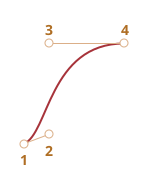
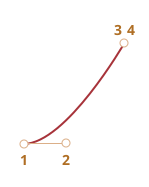
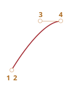
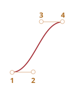
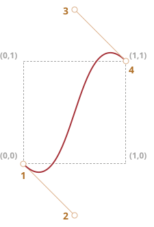

# CSS animace

CSS umožňuje vytvářet jednoduché animace zcela bez JavaScriptu.

V JavaScriptu můžeme CSS animace řídit nebo je vylepšit krátkým kódem.

## CSS přechody [#css-transition]

Myšlenka CSS přechodů je jednoduchá. Uvedeme vlastnost a způsob, jak se mají animovat její změny. Když se vlastnost změní, prohlížeč vykreslí animaci.

To znamená, že nám stačí změnit vlastnost a prohlížeč zobrazí plynulý přechod.

Například následující CSS animace mění vlastnost `background-color` během 3 sekund:

```css
.animováno {
  transition-property: background-color;
  transition-duration: 3s;
}
```

Když nyní má nějaký element třídu `.animováno`, každá změna jeho `background-color` bude animována v průběhu 3 sekund.

Kliknutím na následující tlačítko spustíte animaci jeho pozadí:

```html run autorun height=60
<button id="barva">Klikněte na mě</button>

<style>
  #barva {
    transition-property: background-color;
    transition-duration: 3s;
  }
</style>

<script>
  barva.onclick = function() {
    this.style.backgroundColor = 'red';
  };
</script>
```

K popisu CSS přechodů slouží 4 vlastnosti:

- `transition-property`
- `transition-duration`
- `transition-timing-function`
- `transition-delay`

Probereme je za okamžik. Prozatím poznamenejme, že společná vlastnost `transition` umožňuje deklarovat všechny najednou v pořadí: `property duration timing-function delay`, stejně jako animovat více vlastností současně.

Například toto tlačítko animuje vlastnosti `color` a `font-size`:

```html run height=80 autorun no-beautify
<button id="rostoucí">Klikněte na mě</button>

<style>
#rostoucí {
*!*
  transition: font-size 3s, color 2s;
*/!*
}
</style>

<script>
rostoucí.onclick = function() {
  this.style.fontSize = '36px';
  this.style.color = 'red';
};
</script>
```

Nyní probereme animační vlastnosti jednu po druhé.

## transition-property

Ve vlastnosti `transition-property` uvádíme seznam vlastností, které mají být animovány, například: `left`, `margin-left`, `height`, `color`. Nebo můžeme napsat `all`, což znamená „animovat všechny vlastnosti“.

Všimněte si však, že existují vlastnosti, které animovat nelze. Nicméně [většina obecně užívaných vlastností je animovatelná](https://developer.mozilla.org/en-US/docs/Web/CSS/CSS_animated_properties).

## transition-duration

Ve vlastnosti `transition-duration` můžeme specifikovat, jak dlouho má animace trvat. Čas by měl být v [časovém formátu CSS](https://www.w3.org/TR/css3-values/#time): v sekundách `s` nebo milisekundách `ms`.

## transition-delay

Ve vlastnosti `transition-delay` můžeme specifikovat prodlevu *před* animací. Například pokud `transition-delay` je `1s` a `transition-duration` je `2s`, pak se animace spustí 1 sekundu po změně vlastnosti a její celková doba trvání budou 2 sekundy.

Povoleny jsou i záporné hodnoty. Pak se animace spustí okamžitě, ale její počáteční bod bude v zadané hodnotě (čase). Například pokud `transition-delay` je `-1s` a `transition-duration` je `2s`, spustí se animace přesně od poloviny a bude trvat celkem 1 sekundu.

Následující animace posouvá čísla od `0` do `9` pomocí CSS vlastnosti `translate`:

[codetabs src="digits"]

Vlastnost `transform` se animuje následovně:

```css
#pás.animace {
  transform: translate(-90%);
  transition-property: transform;
  transition-duration: 9s;
}
```

V uvedeném příkladu JavaScript přidá elementu třídu `.animace` -- a animace začne:

```js
pás.classList.add('animace');
```

Pomocí záporné `transition-delay` bychom mohli také začít někde uprostřed přechodu, od určitého čísla, např. odpovídajícího aktuální sekundě.

Když zde kliknete na číslici, animace se spustí od aktuální sekundy:

[codetabs src="digits-negative-delay"]

JavaScript to provádí řádkem navíc:

```js
pás.onclick = function() {
  let sekunda = new Date().getSeconds() % 10;
*!*
  // například -3s zde spustí animaci od 3. sekundy
  pás.style.transitionDelay = '-' + sekunda + 's';
*/!*
  pás.classList.add('animace');
};
```

## transition-timing-function

Časovací funkce popisuje, jak je animační proces rozložen podél své časové linie. Zda začne pomalu a pak zrychlí, nebo naopak.

Na první pohled vypadá jako nejsložitější vlastnost, ale pokud jí věnujete trochu času, začne vám připadat velice jednoduchá.

Tato vlastnost přijímá dva druhy hodnot: Bézierovu křivku nebo kroky. Začneme křivkou, jelikož ta se používá častěji.

### Bézierova křivka

Časovací funkce může být nastavena jako [Bézierova křivka](/bezier-curve) se 4 řídícími body, které splňují tyto podmínky:

1. První řídící bod je `(0,0)`.
2. Poslední řídící bod je `(1,1)`.
3. Hodnota `x` mezilehlých bodů musí být v intervalu `0..1`, `y` může být jakákoli.

Syntaxe Bézierovy křivky v CSS: `cubic-bezier(x2, y2, x3, y3)`. Zde musíme specifikovat jen 2. a 3. řídící bod, protože první je pevně stanoven jako `(0,0)` a čtvrtý jako `(1,1)`.

Časovací funkce popisuje, jak rychle animační proces probíhá.

- Osa `x` představuje čas: `0` -- začátek, `1` -- konec `transition-duration`.
- Osa `y` specifikuje míru dokončení procesu: `0` -- počáteční hodnota vlastnosti, `1` -- konečná hodnota.

Nejjednodušší varianta je ta, kdy animace probíhá rovnoměrně, stále stejnou lineární rychlostí. To můžeme specifikovat křivkou `cubic-bezier(0, 0, 1, 1)`.

Tato křivka vypadá následovně:


...Jak vidíte, je to obyčejná přímka. Když probíhá čas (`x`), proces animace (`y`) rovnoměrně pokračuje od `0` k `1`.

V následujícím příkladu jede vláček zleva doprava stálou rychlostí (klikněte na něj):

[codetabs src="train-linear"]

CSS vlastnost `transition` je založena na této křivce:

```css
.vláček {
  left: 0;
  transition: left 5s cubic-bezier(0, 0, 1, 1);
  /* kliknutí na vláček nastaví vlastnost left na 450px, čímž spustí animaci */
}
```

...A jak můžeme zobrazit zpomalující vláček?

Můžeme použít jinou Bézierovu křivku: `cubic-bezier(0.0, 0.5, 0.5 ,1.0)`.

Graf:


Jak vidíme, proces začíná rychle: křivka strmě vzroste, ale pak zpomaluje a zpomaluje.

Časovací funkce v akci (klikněte na vláček):

[codetabs src="train"]

CSS:
```css
.vláček {
  left: 0;
  transition: left 5s cubic-bezier(0, .5, .5, 1);
  /* kliknutí na vláček nastaví vlastnost left na 450px, čímž spustí animaci */
}
```

Existuje několik vestavěných křivek: `linear`, `ease`, `ease-in`, `ease-out` a `ease-in-out`.

`linear` je zkratka pro `cubic-bezier(0, 0, 1, 1)` -- přímku, jakou jsme popsali výše.

Další názvy jsou zkratky pro následující `cubic-bezier`:

| <code>ease</code><sup>*</sup> | <code>ease-in</code> | <code>ease-out</code> | <code>ease-in-out</code> |
|-------------------------------|----------------------|-----------------------|--------------------------|
| <code>(0.25, 0.1, 0.25, 1.0)</code> | <code>(0.42, 0, 1.0, 1.0)</code> | <code>(0, 0, 0.58, 1.0)</code> | <code>(0.42, 0, 0.58, 1.0)</code> |
|  |  |  |  |

`*` -- není-li uvedena časovací funkce, standardně se používá `ease`.

Pro náš zpomalující vláček bychom tedy mohli použít `ease-out`:

```css
.vláček {
  left: 0;
  transition: left 5s ease-out;
  /* totéž jako transition: left 5s cubic-bezier(0, .5, .5, 1); */
}
```

Vypadá to však trochu jinak.

**Bézierova křivka může způsobit, že animace překročí svůj rozsah.**

Řídící body křivky mohou mít jakékoli souřadnice `y`, dokonce záporné nebo obrovské. Pak se i Bézierova křivka roztáhne velmi nízko nebo vysoko a způsobí, že animace opustí svůj obvyklý rozsah.

Následující příklad obsahuje tento animační kód:

```css
.vláček {
  left: 100px;
  transition: left 5s cubic-bezier(.5, -1, .5, 2);
  /* kliknutí na vláček nastaví vlastnost left na 450px */
}
```

Vlastnost `left` by měla být animována od `100px` do `400px`.

Když však kliknete na vláček, uvidíte tohle:

- Nejprve vláček jede *dozadu*: `left` poklesne pod `100px`.
- Pak jede dopředu, o něco dál než `400px`.
- A pak znovu zpět -- na `400px`.

[codetabs src="train-over"]

Proč se tak děje, nám bude zcela jasné, když se podíváme na graf zadané Bézierovy křivky:



Souřadnici `y` druhého bodu jsme nastavili pod nulu a třetího bodu nad `1`, takže křivka vyběhla ze svého „běžného“ kvadrantu. Souřadnice `y` je mimo „standardní“ rozsah `0..1`.

Jak víme, `y` znamená „míru dokončení procesu animace“. Hodnota `y = 0` odpovídá počáteční hodnotě vlastnosti a hodnota `y = 1` koncové hodnotě. Hodnoty `y<0` tedy posunují vlastnost před počáteční `left` a hodnoty `y>1` za koncovou `left`.

To je samozřejmě „měkká“ varianta. Jestliže nastavíme hodnoty `y` třeba na `-99` a `99`, pak vláček vyskočí z rozsahu mnohem dál.

Jak ale vytvoříme Bézierovu křivku pro specifický úkol? K tomu existuje mnoho nástrojů.

- Můžeme to například udělat na stránce <https://cubic-bezier.com>.
- Také prohlížečové vývojářské nástroje mají zvláštní podporu pro Bézierovy křivky v CSS:
    1. Otevřete si vývojářské nástroje klávesou `key:F12` (Mac: `key:Cmd+Opt+I`).
    2. Zvolte záložku `Elements` (`Prvky`) a věnujte pozornost subpanelu `Styles` (`Styly`) na pravé straně.
    3. CSS vlastnosti se slovem `cubic-bezier` budou mít před tímto slovem ikonu.
    4. Po kliknutí na tuto ikonu můžete editovat křivku.


### Kroky

Časovací funkce `steps(počet kroků[, start/end])` umožňuje rozdělit přechod do více kroků.

Podívejme se na to v příkladu s číslicemi.

Zde je seznam číslic bez jakýchkoli animací, jen jako zdroj:

[codetabs src="step-list"]

V HTML je pás číslic uzavřen do `<div id="číslice">` pevné délky:

```html
<div id="číslice">
  <div id="pás">0123456789</div>
</div>
```

Element `#digit` má pevnou šířku a ohraničení, proto vypadá jako červené okno.

Vytvoříme časovač: číslice se budou objevovat nespojitě jedna po druhé.

Abychom toho docílili, skryjeme `#pás` mimo `#číslice` pomocí `overflow: hidden` a pak budeme `#pás` posunovat doleva krok za krokem.

Bude to mít 9 kroků, pro každou číslici jeden krok-posun:

```css
#pás.animate  {
  transform: translate(-90%);
  transition: transform 9s *!*steps(9, start)*/!*;
}
```

První argument funkce `steps(9, start)` je počet kroků. Přechod bude rozdělen na 9 částí (každá 10%). Časový interval se rovněž automaticky rozdělí na 9 částí, takže `transition: 9s` nám dává 9 sekund na celou animaci -- 1 sekundu na každou číslici.

Druhý argument je jedno ze dvou slov: `start` nebo `end`.

`start` znamená, že první krok potřebujeme udělat okamžitě na začátku animace.

V akci:

[codetabs src="step"]

Po kliknutí se číslice okamžitě změní na `1` (první krok) a pak se změní na začátku další sekundy.

Proces postupuje následovně:

- `0s` -- `-10%` (první změna na začátku 1. sekundy, okamžitě)
- `1s` -- `-20%`
- ...
- `8s` -- `-90%`
- (poslední sekunda ukazuje konečnou hodnotu.)

První změna zde proběhla okamžitě v důsledku `start` ve `steps`.

Druhá možná hodnota `end` by znamenala, že změna se nebude aplikovat na začátku, ale na konci každé sekundy.

Proces pro `steps(9, end)` tedy bude probíhat takto:

- `0s` -- `0` (během první sekundy se nic nezmění)
- `1s` -- `-10%` (první změna na konci 1. sekundy)
- `2s` -- `-20%`
- ...
- `9s` -- `-90%`

Následuje `steps(9, end)` v akci (všimněte si prodlevy před první změnou číslice):

[codetabs src="step-end"]

Pro `steps(...)` existují i některé předdefinované zkratky:

- `step-start` -- totéž jako `steps(1, start)`. To znamená, že animace začne okamžitě a bude trvat 1 krok. Začne a skončí tedy okamžitě, jako by žádná animace nebyla.
- `step-end` -- totéž jako `steps(1, end)`: vykoná animaci v jediném kroku na konci `transition-duration`.

Tyto hodnoty se používají málokdy, jelikož nepředstavují skutečnou animaci, ale jednokrokovou změnu. Uvádíme je jen pro úplnost.

## Událost: „transitionend“

Když CSS animace skončí, spustí se událost `transitionend`.

Zhusta se používá k provedení akce po skončení animace. Můžeme také spojovat animace.

Například loď v následujícím příkladu začne po kliknutí plout sem a tam, pokaždé dál a dál doprava:

[iframe src="boat" height=300 edit link]

Animaci spustila funkce `pluj`, která se znovu spouští pokaždé, když přechod skončí, a obrátí směr plavby:

```js
boat.onclick = function() {
  //...
  let kolikrát = 1;

  function pluj() {
    if (kolikrát % 2) {
      // plujeme doprava
      boat.classList.remove('back');
      boat.style.marginLeft = 100 * kolikrát + 200 + 'px';
    } else {
      // plujeme doleva
      boat.classList.add('back');
      boat.style.marginLeft = 100 * kolikrát - 200 + 'px';
    }

  }

  pluj();

  boat.addEventListener('transitionend', function() {
    kolikrát++;
    pluj();
  });
};
```

Objekt události `transitionend` má dvě specifické vlastnosti:

`událost.propertyName`
: Vlastnost, jejíž animace skončila. Může se hodit, když animujeme více vlastností současně.

`událost.elapsedTime`
: Doba trvání animace (v sekundách) bez `transition-delay`.

## Keyframes

Pomocí CSS pravidla `@keyframes` můžeme spojit více jednoduchých animací dohromady.

Specifikuje „název“ animace a pravidla -- co, kdy a kde animovat. Pak můžeme pomocí vlastnosti `animation` připojit animaci k elementu a specifikovat její další parametry.

Následuje příklad s vysvětlením:

```html run height=60 autorun="no-epub" no-beautify
<div class="postup"></div>

<style>
*!*
  @keyframes pluj-zleva-doprava {   /* pojmenujeme ji: "pluj-zleva-doprava" */
    from { left: 0px; }             /* začátek animace left: 0px */
    to { left: calc(100% - 50px); } /* konec animace left: 100%-50px */
  }
*/!*

  .postup {
*!*
    animation: pluj-zleva-doprava 3s infinite alternate;
    /* aplikujeme animaci "pluj-zleva-doprava" na element
       trvání 3 sekundy
       počet opakování: nekonečný (infinite)
       pokaždé změní směr (alternate)
    */
*/!*

    position: relative;
    border: 2px solid green;
    width: 50px;
    height: 20px;
    background: lime;
  }
</style>
```

O `@keyframes` existuje mnoho článků a [detailní specifikace](https://drafts.csswg.org/css-animations/).

Pravděpodobně nebudete potřebovat `@keyframes` často, pokud na vašich stránkách není všechno v neustálém pohybu.

## Výkonnost

Většinu CSS vlastností je možné animovat, protože většina z nich má číselné hodnoty. Například `width`, `color`, `font-size` jsou všechny čísla. Když je budete animovat, prohlížeč postupně tato čísla mění krok za krokem, čímž vytváří plynulý efekt.

Ne všechny animace však budou vypadat tak hladce, jak byste si přáli, protože změna různých CSS vlastností trvá různou dobu.

Technické podrobnosti jsou takové, že když nastane změna stylu, prohlížeč projde 3 fáze, aby zobrazil nový vzhled:

1. **Layout (rozložení)**: přepočítá geometrii a pozici každého elementu, pak
2. **Paint (kreslení)**: přepočítá, jak má všechno vypadat na svých místech, včetně pozadí a barev,
3. **Composite (složení)**: zobrazí konečné výsledky do pixelů na obrazovce a aplikuje CSS přechody, pokud nějaké jsou.

Během CSS animace se tento proces opakuje v každém snímku. Avšak CSS vlastnosti, které nemají vliv na geometrii nebo pozici, např. `color`, mohou přeskočit fázi rozložení. Pokud se změní `color`, prohlížeč nepočítá žádnou novou geometrii a jde rovnou na kreslení -> složení. Existuje i několik vlastností, které přecházejí přímo ke složení. Delší seznam CSS vlastností a fází, které spouštějí, najdete na <https://csstriggers.com>.

Tyto výpočty mohou nějakou dobu trvat, zejména na stránkách s mnoha elementy a složitým rozložením. A na většině zařízení jsou tyto prodlevy viditelné, což vede k „trhání“, méně plynulým animacím.

Animace vlastností, které přeskakují fázi rozložení, jsou rychlejší. Ještě lepší je, když je přeskočeno i kreslení.

Vlastnost `transform` je skvělá volba, protože:
- CSS přechody ovlivňují box cílového elementu jako celek (otáčejí ho, obracejí, roztahují, přesunují).
- CSS přechody nikdy neovlivňují sousední elementy.

...Prohlížeče tedy aplikují `transform` „nad“ existujícími výpočty rozložení a kreslení, ve fázi složení.

Jinými slovy, prohlížeč vypočítá rozložení (velikosti, pozice), ve fázi kreslení vykreslí barvy, pozadí atd., a pak aplikuje `transform` na boxy elementů, které ji potřebují.

Změny (animace) vlastnosti `transform` nikdy nevyvolají kroky rozložení a kreslení. Kromě toho prohlížeč využívá pro CSS přechody grafický akcelerátor (speciální čip na CPU nebo grafické kartě), díky čemuž jsou velmi efektivní.

Naštěstí je vlastnost `transform` velmi silná. Používáním `transform` na elementu jej můžete otáčet, převracet, roztahovat a zmenšovat, přesunovat a [mnoho dalšího](https://developer.mozilla.org/docs/Web/CSS/transform#syntax). Místo vlastností `left/margin-left` tedy můžeme použít `transform: translateX(…)`, pro zvětšování elementu můžeme použít `transform: scale` atd.

Rovněž vlastnost `opacity` nikdy nespustí rozložení (v Mozille Gecku přeskakuje i kreslení). Můžeme ji používat pro efekty zobrazení/skrytí nebo zjevování/mizení.

Spojení `transform` a `opacity` nám obvykle dokáže vyřešit většinu našich potřeb a poskytnout plynulé, pěkně vypadající animace.

Například zde kliknutím na element `#loď` přidáte třídu s `transform: translateX(300px)` a `opacity: 0`, což přiměje loď přesunout se o `300px` doprava a zmizet:

```html run height=260 autorun no-beautify


<style>
#loď {
  cursor: pointer;
  transition: transform 2s ease-in-out, opacity 2s ease-in-out;
}

.posun {
  transform: translateX(300px);
  opacity: 0;
}
</style>
<script>
  loď.onclick = () => loď.classList.add('posun');
</script>
```

Následující příklad je složitější a obsahuje `@keyframes`:

```html run height=80 autorun no-beautify
<h2 onclick="this.classList.toggle('animated')">kliknutí sem spustí / zastaví animaci</h2>
<style>
  .animated {
    animation: hello-goodbye 1.8s infinite;
    width: fit-content;
  }
  @keyframes hello-goodbye {
    0% {
      transform: translateY(-60px) rotateX(0.7turn);
      opacity: 0;
    }
    50% {
      transform: none;
      opacity: 1;
    }
    100% {
      transform: translateX(230px) rotateZ(90deg) scale(0.5);
      opacity: 0;
    }
  }
</style>
```

## Shrnutí

CSS animace umožňují plynulé (nebo krokové) animované změny jedné nebo více CSS vlastností.

Hodí se pro většinu animačních úloh. Pro animace můžeme používat i JavaScript. Tomu je věnována příští kapitola.

Omezení CSS animací ve srovnání s JavaScriptovými animacemi:

```compare go="CSS animace" minus="JavaScript animace"
+ Jednoduché věci se dělají jednoduše.
+ Rychlé a nenáročné na CPU.
- JavaScriptové animace jsou flexibilní. Mohou implementovat jakoukoli animační logiku, např. „explozi“ elementu.
- Umějí nejen změny vlastností, ale v JavaScriptu můžeme v rámci animace i vytvářet nové elementy.
```

V počátečních příkladech v naší kapitole jsme animovali `font-size`, `left`, `width`, `height` atd. Ve skutečných projektech bychom měli pro lepší výkon používat `transform: scale()` a `transform: translate()`.

Většinu animací lze implementovat pomocí CSS podle popisu v této kapitole. Událost `transitionend` umožňuje po skončení animace spustit JavaScript, takže se dobře integruje s kódem.

V následující kapitole však budeme provádět animace v JavaScriptu, abychom pokryli složitější případy.
