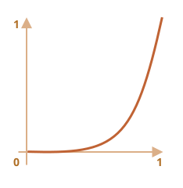
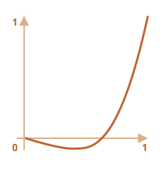
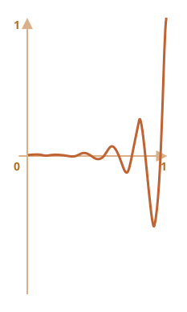
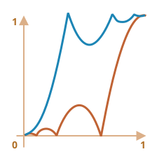
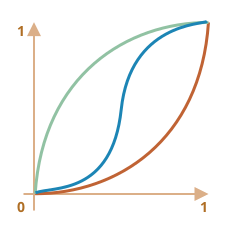

# Animace v JavaScriptu

Animace v JavaScriptu mohou zvládnout věci, které CSS nedokáže.

Například pohyb po složité cestě s časovací funkcí, která je jiná než Bézierova křivka, nebo animaci na plátně.

## Použití setInterval

Animaci je možné implementovat jako posloupnost snímků -- obvykle malých změn HTML/CSS vlastností.

Například při měnění `style.left` z `0px` na `100px` se bude posunovat element. A pokud jej zvětšíme v `setInterval` a budeme jej zvyšovat o `2px` s malými prodlevami, třeba 50krát za sekundu, pak to bude vypadat plynule. Je to stejný princip jako v kině: 24 snímků za sekundu stačí, aby film vypadal plynule.

Pseudokód může vypadat následovně:

```js
let časovač = setInterval(function() {
  if (animace je kompletní) clearInterval(časovač);
  else zvyš style.left o 2px
}, 20); // změna o 2px každých 20 ms, přibližně 50 snímků za sekundu
```

Úplnější příklad animace:

```js
    let začátek = Date.now(); // pamatujeme si čas začátku

    let časovač = setInterval(function() {
      // kolik času uplynulo od začátku?
      let uplynulýČas = Date.now() - začátek;

      if (uplynulýČas >= 2000) {
        clearInterval(časovač); // po 2 sekundách ukončíme animaci
        return;
      }

      // vykreslíme animaci v okamžiku uplynulýČas
      vykresli(uplynulýČas);

    }, 20);

    // když uplynulýČas postupuje od 0 do 2000
    // left nabývá hodnot od 0px do 400px
    function vykresli(uplynulýČas) {
      vláček.style.left = uplynulýČas / 5 + 'px';
    }
```

Pro ukázku klikněte sem:

[codetabs height=200 src="move"]

## Použití requestAnimationFrame

Představme si, že máme několik animací, které probíhají současně.

Pokud spustíme každou zvlášť, pak i když každá bude mít `setInterval(..., 20)`, prohlížeč bude muset překreslovat mnohem častěji než každých `20 ms`.

Je to tím, že každá má jiný počáteční čas, takže „každých 20 ms“ se mezi různými animacemi liší. Intervaly nejsou sjednocené. Budeme tedy mít několik nezávislých běhů každých `20 ms`.

Jinými slovy, toto:

```js
setInterval(function() {
  animace1();
  animace2();
  animace3();
}, 20)
```

...je lehčí než tři nezávislá volání:

```js
setInterval(animace1, 20); // nezávislé animace
setInterval(animace2, 20); // na různých místech skriptu
setInterval(animace3, 20);
```

Těchto několik nezávislých překreslení by mělo být seskupeno dohromady, abychom prohlížeči ulehčili překreslování. Tím budeme méně zatěžovat CPU a animace bude plynulejší.

Ještě jednu věc bychom měli mít na paměti. Někdy je CPU přetížená nebo existují jiné důvody, proč překreslovat méně často (například když je záložka prohlížeče skrytá), takže ve skutečnosti bychom neměli spouštět animaci každých `20 ms`.

Jak se o tom však dozvíme v JavaScriptu? Existuje specifikace [Časování animací](https://www.w3.org/TR/animation-timing/), která poskytuje funkci `requestAnimationFrame`. Ta řeší všechny tyto i další problémy.

Syntaxe:
```js
let idPožadavku = requestAnimationFrame(callback)
```

Tím se naplánuje spuštění funkce `callback` v nejbližším okamžiku, kdy prohlížeč bude chtít provádět animaci.

Pokud ve funkci `callback` provedeme změny v elementech, budou seskupeny dohromady s jinými callbacky `requestAnimationFrame` a s CSS animacemi. Místo mnoha přepočtů geometrie a překreslování se tedy provede pouze jeden.

Návratovou hodnotu `idPožadavku` můžeme použít ke zrušení volání:
```js
// zrušíme naplánované provedení callbacku
cancelAnimationFrame(idPožadavku);
```

Funkce `callback` má jeden argument -- čas v milisekundách uplynulý od začátku načítání stránky. Tento čas můžeme získat i voláním [performance.now()](mdn:api/Performance/now).

Obvykle se `callback` spouští velmi brzy, pokud není CPU přetížena, baterie laptopu není téměř vybitá nebo není jiný důvod k jeho nespuštění.

Následující kód zobrazuje čas mezi prvními 10 spuštěními `requestAnimationFrame`. Obvykle je to 10-20 ms:

```html run height=40 refresh
<script>
  let předchozí = performance.now();
  let kolikrát = 0;

  requestAnimationFrame(function měř(čas) {
    document.body.insertAdjacentHTML("beforeEnd", Math.floor(čas - předchozí) + " ");
    předchozí = čas;

    if (kolikrát++ < 10) requestAnimationFrame(měř);
  })
</script>
```

## Strukturovaná animace

Nyní můžeme vytvořit univerzálnější animační funkci, založenou na `requestAnimationFrame`:

```js
function animace({časování, vykreslení, trvání}) {

  let začátek = performance.now();

  requestAnimationFrame(function animace(čas) {
    // poměrČasu jde od 0 do 1
    let poměrČasu = (čas - začátek) / trvání;
    if (poměrČasu > 1) poměrČasu = 1;

    // vypočítáme aktuální stav animace
    let postup = časování(poměrČasu)

    vykreslení(postup); // vykreslíme ho

    if (poměrČasu < 1) {
      requestAnimationFrame(animace);
    }

  });
}
```

Funkce `animace` přijímá 3 parametry, které v zásadě popisují celou animaci:

`trvání`
: Celkový čas animace, například `1000`.

`časování(poměrČasu)`
: Časovací funkce, podobná CSS vlastnosti `transition-timing-function`, která obdrží poměr uplynulého času (`0` na začátku, `1` na konci) a vrátí míru dokončení animace (podobně jako `y` na Bézierově křivce).

    Například lineární funkce znamená, že animace pokračuje rovnoměrně stále stejnou rychlostí:

    ```js
    function lineární(poměrČasu) {
      return poměrČasu;
    }
    ```

    Její graf:
    
    

    Je to jako `transition-timing-function: linear`. Dále uvedeme zajímavější varianty.

`vykreslení(postup)`
: Funkce, která obdrží stav dokončení animace a vykreslí jej. Hodnota `postup=0` popisuje počáteční stav animace, `postup=1` koncový stav.

    Tato funkce zajistí skutečné vykreslení animace.

    Může přesunovat element:
    ```js
    function vykresli(postup) {
      vláček.style.left = postup + 'px';
    }
    ```

    ...Nebo provádět cokoli jiného, můžeme animovat cokoli jakýmkoli způsobem.

Animujme pomocí naší funkce šířku elementu `width` od `0` do `100%`.

Pro ukázku klikněte na element:

[codetabs height=60 src="width"]

Kód animace:

```js
animace({
  trvání: 1000,
  časování(poměrČasu) {
    return poměrČasu;
  },
  vykreslení(postup) {
    elem.style.width = postup * 100 + '%';
  }
});
```

Na rozdíl od CSS animací zde můžeme vytvořit jakoukoli časovací a jakoukoli vykreslovací funkci. Časovací funkce se neomezuje na Bézierovy křivky. A `vykreslení` může zacházet za vlastnosti, vytvořit nové elementy pro animaci ve stylu ohňostroje nebo cokoli jiného.

## Časovací funkce

Výše jsme viděli nejjednodušší, lineární časovací funkci.

Podívejme se na jiné. Vyzkoušíme animace pohybu s různými časovacími funkcemi, abychom viděli, jak fungují.

### Umocnění na n-tou

Jestliže chceme animaci urychlit, můžeme použít `postup` umocněný na `n`-tou.

Například parabolickou křivku:

```js
function naDruhou(poměrČasu) {
  return Math.pow(poměrČasu, 2)
}
```

Graf:


Prohlédněte si ji v akci (kliknutím ji aktivujete):

[iframe height=40 src="quad" link]

...Nebo kubickou křivku nebo ještě větší `n`. Zvýšení exponentu způsobí větší urychlení.

Zde je graf pro `postup` na `5`-tou:



V akci:

[iframe height=40 src="quint" link]

### Oblouk

Funkce:

```js
function kruh(poměrČasu) {
  return 1 - Math.sin(Math.acos(poměrČasu));
}
```

Graf:


[iframe height=40 src="circ" link]

### Zpět: výstřel z luku

Následující funkce provádí „výstřel z luku“. Nejprve „natáhneme tětivu“ a pak „vystřelíme“.

Na rozdíl od předchozích funkcí závisí na dalším parametru `x`, „koeficientu pružnosti“. Je jím definována délka „natažení tětivy“.

Kód:

```js
function zpět(x, poměrČasu) {
  return Math.pow(poměrČasu, 2) * ((x + 1) * poměrČasu - x)
}
```

**Graf pro `x = 1.5`:**



Pro animaci ji použijeme se specifickou hodnotou `x`. Příklad pro `x = 1.5`:

[iframe height=40 src="back" link]

### Skákání

Představme si, že upustíme míč. Dopadne na zem, několikrát odskočí a pak se zastaví.

Funkce `skákání` provádí totéž, ale v obráceném pořadí: „skákání“ začne okamžitě. Používá k tomu několik speciálních koeficientů:

```js
function skákání(poměrČasu) {
  for (let a = 0, b = 1; 1; a += b, b /= 2) {
    if (poměrČasu >= (7 - 4 * a) / 11) {
      return -Math.pow((11 - 6 * a - 11 * poměrČasu) / 4, 2) + Math.pow(b, 2)
    }
  }
}
```

V akci:

[iframe height=40 src="bounce" link]

### Elastická animace

Další „elastická“ funkce, která přijímá další parametr `x` jako „úvodní rozsah“:

```js
function elastická(x, poměrČasu) {
  return Math.pow(2, 10 * (poměrČasu - 1)) * Math.cos(20 * Math.PI * x / 3 * poměrČasu)
}
```

**Graf pro `x=1.5`:**



V akci pro `x=1.5`:

[iframe height=40 src="elastic" link]

## Opak: ease*

Máme tedy sadu časovacích funkcí. Jejich přímá aplikace se nazývá „easeIn“.

Někdy potřebujeme zobrazit animaci v obráceném pořadí. To provedeme pomocí transformace „easeOut“.

### easeOut

V režimu „easeOut“ je funkce `časování` umístěna do obalu `časováníEaseOut`:

```js
časováníEaseOut(poměrČasu) = 1 - časování(1 - poměrČasu)
```

Jinými slovy, máme „transformační“ funkci `vytvořEaseOut`, která vezme „obyčejnou“ časovací funkci a vrátí obal kolem ní:

```js
// přijímá časovací funkci, vrací transformovanou variantu
function vytvořEaseOut(časování) {
  return function(poměrČasu) {
    return 1 - časování(1 - poměrČasu);
  }
}
```

Můžeme například vzít výše uvedenou funkci `skákání` a aplikovat ji:

```js
let skákáníEaseOut = vytvořEaseOut(skákání);
```

Pak skákání nebude na začátku, ale na konci animace. Vypadá to ještě lépe:

[codetabs src="bounce-easeout"]

Zde vidíme, jak transformace mění chování funkce:



Pokud je nějaký efekt, například skákání, na začátku animace, zobrazí se na konci.

V uvedeném grafu má <span style="color:#EE6B47">obvyklé skákání</span> červenou barvu a <span style="color:#62C0DC">skákání easeOut</span> modrou.

- Obvyklé skákání -- objekt skáče na spodku, pak nakonec ostře vyskočí na vrch.
- Po `easeOut` -- nejprve skočí na vrch, pak skáče tam.

### easeInOut

Můžeme také zobrazit efekt jak na začátku, tak na konci animace. Tato transformace se nazývá „easeInOut“.

Ze zadané časovací funkce vypočítáme stav animace následovně:

```js
if (poměrČasu <= 0.5) { // první polovina animace
  return časování(2 * poměrČasu) / 2;
} else { // druhá polovina animace
  return (2 - časování(2 * (1 - poměrČasu))) / 2;
}
```

Kód obalu:

```js
function vytvořEaseInOut(časování) {
  return function(poměrČasu) {
    if (poměrČasu < .5)
      return časování(2 * poměrČasu) / 2;
    else
      return (2 - časování(2 * (1 - poměrČasu))) / 2;
  }
}

skákáníEaseInOut = vytvořEaseInOut(skákání);
```

V akci, `skákáníEaseInOut`:

[codetabs src="bounce-easeinout"]

Transformace „easeInOut“ spojuje dva grafy do jednoho: `easeIn` (obvyklé) pro první polovinu animace a `easeOut` (obrácené) pro druhou polovinu.

Efekt jasně uvidíme, když si porovnáme grafy `easeIn`, `easeOut` a `easeInOut` časovací funkce `kruh`:



- <span style="color:#EE6B47">Červená</span> je obvyklá varianta funkce `kruh` (`easeIn`).
- <span style="color:#8DB173">Zelená</span> -- `easeOut`.
- <span style="color:#62C0DC">Modrá</span> -- `easeInOut`.

Jak vidíme, graf první poloviny animace je zmenšený `easeIn` a druhé poloviny zmenšený `easeOut`. Výsledkem je, že animace začne a skončí stejným efektem.

## Zajímavější vykreslování

Místo přesunutí elementu můžeme udělat něco jiného. Stačí napsat vhodnou funkci `vykreslení`.

Zde je animované „skákající“ psaní textu:

[codetabs src="text"]

## Shrnutí

JavaScript může pomoci s animacemi, které CSS nedokáže správně zvládnout nebo které potřebují hlubší kontrolu. Animace v JavaScriptu by měly být implementovány funkcí `requestAnimationFrame`. Tato zabudovaná metoda umožňuje nastavit callbackovou funkci, která se spustí, až bude prohlížeč připravovat překreslení. Obvykle k tomu dochází velmi brzy, ale přesný čas závisí na prohlížeči.

Když je stránka na pozadí, nedochází k žádným překreslením, takže callback se nespustí: animace bude pozastavena a nebude spotřebovávat zdroje. To je výborné.

Následující pomocná funkce `animace` slouží k nastavení většiny animací:

```js
function animace({časování, vykreslení, trvání}) {

  let začátek = performance.now();

  requestAnimationFrame(function animace(čas) {
    // poměrČasu jde od 0 do 1
    let poměrČasu = (čas - začátek) / trvání;
    if (poměrČasu > 1) poměrČasu = 1;

    // vypočítáme aktuální stav animace
    let postup = časování(poměrČasu);

    vykreslení(postup); // vykreslíme ho

    if (poměrČasu < 1) {
      requestAnimationFrame(animace);
    }

  });
}
```

Její volby:

- `trvání` -- celkový čas animace v milisekundách.
- `časování` -- funkce počítající postup animace. Obdrží poměr času od 0 do 1 a vrátí postup animace, obvykle také od 0 do 1.
- `vykreslení` -- funkce vykreslující animaci.

Samozřejmě bychom ji mohli vylepšit a přidat další vychytávky, ale animace v JavaScriptu se nepoužívají každý den. Používají se k provedení něčeho zajímavého a nestandardního. Další vlastnosti tedy budete chtít přidat až ve chvíli, kdy je budete potřebovat.

Animace v JavaScriptu mohou využívat jakoukoli časovací funkci. Uvedli jsme mnoho příkladů a transformací, abychom je učinili ještě všestrannějšími. Na rozdíl od CSS se zde nemusíme omezovat na Bézierovy křivky.

Totéž platí pro `vykreslení`: můžeme animovat cokoli, nejenom CSS vlastnosti.
