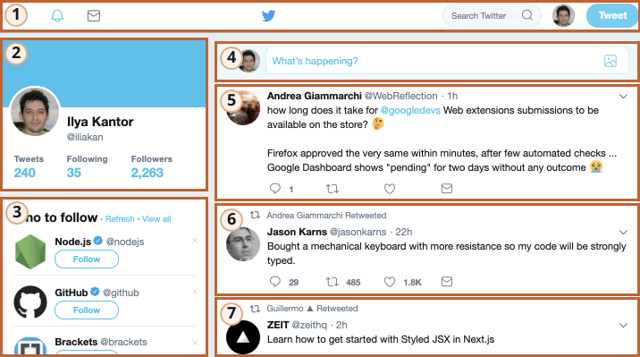

# Z oběžné dráhy

Tato část popisuje sadu moderních standardů pro „webové komponenty“.

V současnosti jsou tyto standardy ve fázi vývoje. Některé vlastnosti jsou široce podporovány a integrovány do moderního HTML/DOM standardu, jiné jsou zatím ve fázi návrhu. Příklady si můžete vyzkoušet v kterémkoli prohlížeči, nejaktualizovanější co do těchto prvků je pravděpodobně Google Chrome. Hádáte správně, je to tím, že za mnoha souvisejícími specifikacemi stojí lidé z Googlu.

## Co mají společného...

Celá myšlenka komponent není nic nového. Používá se v mnoha frameworcích i jinde.

Než se pustíme do implementačních podrobností, podívejme se na tento ohromný úspěch lidstva:

To je Mezinárodní vesmírná stanice (International Space Station, ISS).

A takto je vytvořena uvnitř (přibližně):

 Mezinárodní vesmírná stanice:
- Skládá se z mnoha komponent.
- Každá komponenta obsahuje uvnitř množství dalších menších detailů.
- Tyto komponenty jsou velmi složité, mnohem složitější než většina webových sídel.
- Komponenty jsou vyvíjeny mezinárodně, pracují na nich týmy z různých zemí hovořící různými jazyky.

...A celá ta věc létá a udržuje lidi ve vesmíru naživu!

Jak se taková složitá zařízení vyrábějí?

Které principy bychom si odtud mohli vypůjčit, abychom při našem vývoji dosáhli stejné úrovně spolehlivosti a rozšiřitelnosti? Nebo se jí aspoň přiblížili?

## Komponentová architektura

Dobře známé pravidlo pro vývoj složitého softwaru zní: nevytvářejte složitý software.

Pokud se něco stane složitým, rozdělte to na jednodušší části a spojte je tím nejzřejmějším způsobem.

**Dobrý architekt je takový, který dokáže učinit složité věci jednoduchými.**

Můžeme rozdělit uživatelské rozhraní na vizuální komponenty: každá z nich má na stránce své místo, dokáže „splnit“ dobře popsaný úkol a je oddělená od ostatních.

Podívejme se na webovou stránku, například Twitter (dnes X).

Je přirozeně rozdělena na komponenty:

1. Hlavní navigace.
2. Informace o uživateli.
3. Návrhy sledování.
4. Odesílací formulář.
5. (a také 6, 7) -- zprávy.

Komponenty mohou obsahovat vnitřní komponenty, např. zprávy mohou být součástí komponenty vyšší úrovně „seznam zpráv“. Obrázek uživatele, na který lze kliknout, může být komponenta a tak dále.

Jak rozhodneme, co je komponenta? To je otázka intuice, zkušeností a zdravého rozumu. Obvykle je to oddělená vizuální entita, kterou můžeme popsat podle toho, co dělá a jak interaguje se stránkou. V uvedeném případě stránka obsahuje bloky, každý z nich hraje svou vlastní roli, je tedy logické udělat z nich komponenty.

Komponenta má:
- Svou vlastní třídu v JavaScriptu.
- Strukturu DOMu, kterou spravuje výhradně její třída a vnější kód k ní nepřistupuje (princip „zapouzdření“).
- CSS styly, aplikované na komponentu.
- API: události, třídní metody atd., k interakci s ostatními komponentami.

Opakujeme, že celý „komponentový“ přístup není nic zvláštního.

Pro vytváření komponent existuje řada frameworků a vývojových metodik, každá má své vlastní speciality. K vytváření „komponentového dojmu“ se zpravidla používají speciální CSS třídy a konvence -- rozsah platnosti CSS a zapouzdření DOMu.

„Webové komponenty“ k tomu poskytují zabudované prohlížečové schopnosti, takže je už nebudeme muset emulovat.

- [Vlastní elementy](https://html.spec.whatwg.org/multipage/custom-elements.html#custom-elements) -- k definici vlastních HTML elementů.
- [Stínový DOM](https://dom.spec.whatwg.org/#shadow-trees) -- k vytvoření vnitřního DOMu komponenty, ukrytého před ostatními.
- [Rozsah platnosti CSS](https://drafts.csswg.org/css-scoping/) -- k deklaraci stylů, které se aplikují pouze uvnitř stínového DOMu komponenty.
- [Přesměrování událostí](https://dom.spec.whatwg.org/#retarget) a další méně důležité záležitosti, aby bylo možné vlastní komponenty lépe vyvíjet.

V příští kapitole podrobně probereme „vlastní elementy“ -- základní a hojně podporovaný prvek webových komponent, který je dobrý sám o sobě.
