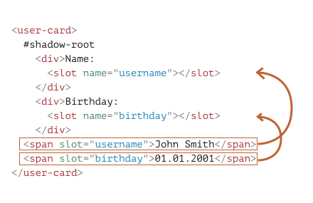

# Sloty a kompozice stínového DOMu

Mnoho druhů komponent, například záložky, menu, obrázkové galerie a podobně, potřebuje vykreslit obsah.

Stejně jako zabudovaná prohlížečová značka `<select>` očekává položky `<option>`, naše `<vlastni-zalozky>` mohou očekávat, že do nich bude předán skutečný obsah záložek. A `<vlastni-menu>` může očekávat položky menu.

Kód, který využívá `<vlastni-menu>`, může vypadat následovně:

```html
<vlastni-menu>
  <title>Nabídka sladkostí</title>
  <item>Lízátko</item>
  <item>Ovocný toast</item>
  <item>Košíčky</item>
</vlastni-menu>
```

...Pak by je naše komponenta měla správně vykreslit jako pěkné menu se zadaným titulkem a položkami, zpracovávat události menu a tak dále.

Jak to implementovat?

Můžeme se pokusit analyzovat obsah elementu a dynamicky zkopírovat a přeskládat DOM uzly. To je možné, ale když budeme přesunovat elementy do stínového DOMu, nebudou se v nich aplikovat CSS styly z dokumentu, takže můžeme ztratit vizuální stylizaci. Navíc to vyžaduje napsat nějaký ten kód.

Naštěstí to nemusíme dělat. Stínový DOM podporuje elementy `<slot>`, které se automaticky naplní obsahem ze světlého DOMu.

## Pojmenované sloty

Na jednoduchém příkladu se podívejme, jak sloty fungují.

Zde stínový DOM značky `<karta-uzivatele>` poskytuje dva sloty, naplňované ze světlého DOMu:

```html run autorun="no-epub" untrusted height=80
<script>
customElements.define('karta-uzivatele', class extends HTMLElement {
  connectedCallback() {
    this.attachShadow({mode: 'open'});
    this.shadowRoot.innerHTML = `
      <div>Jméno:
*!*
        <slot name="uživatel"></slot>
*/!*
      </div>
      <div>Datum narození:
*!*
        <slot name="narození"></slot>
*/!*
      </div>
    `;
  }
});
</script>

<karta-uzivatele>
  <span *!*slot="uživatel"*/!*>Jan Novák</span>
  <span *!*slot="narození"*/!*>01.01.2001</span>
</karta-uzivatele>
```

Ve stínovém DOMu `<slot name="X">` definuje „bod vložení“, místo, kam budou vykresleny elementy obsahující `slot="X"`.

Prohlížeč pak provede „kompozici“: vezme elementy ze světlého DOMu a vykreslí je do odpovídajících slotů stínového DOMu. Na konci budeme mít přesně to, co jsme chtěli -- komponentu, která může být vyplněna daty.

Zde je struktura DOMu po provedení skriptu, nebereme-li v úvahu kompozici:

```html
<karta-uzivatele>
  #shadow-root
    <div>Jméno:
      <slot name="uživatel"></slot>
    </div>
    <div>Datum narození:
      <slot name="narození"></slot>
    </div>
  <span slot="uživatel">Jan Novák</span>
  <span slot="narození">01.01.2001</span>
</karta-uzivatele>
```

Vytvořili jsme stínový DOM, takže je zde pod `#shadow-root`. Nyní element obsahuje světlý i stínový DOM.

Pro účely vykreslení prohlížeč pro každou značku `<slot name="...">` ve stínovém DOMu vyhledá `slot="..."` se stejným názvem ve světlém DOMu. Tyto elementy jsou vykresleny do slotů:



Výsledek se nazývá „zploštělý“ (flattened) DOM:

```html
<karta-uzivatele>
  #shadow-root
    <div>Jméno:
      <slot name="uživatel">
        <!-- do slotu je vložen element se slotem -->
        <span slot="uživatel">Jan Novák</span>
      </slot>
    </div>
    <div>Datum narození:
      <slot name="narození">
        <span slot="narození">01.01.2001</span>
      </slot>
    </div>
</karta-uzivatele>
```

...Zploštělý DOM však existuje výhradně pro účely vykreslování a zpracování událostí. Je svým způsobem „virtuální“. Je to způsob, jak se vše zobrazuje. Ale ve skutečnosti nejsou uzly v dokumentu přesunuty!

To si můžeme snadno zkontrolovat, jestliže spustíme `querySelectorAll`: uzly budou stále na svých místech.

```js
// uzly <span> světlého DOMu jsou stále na stejných místech, pod `<karta-uzivatele>`
alert( document.querySelectorAll('karta-uzivatele span').length ); // 2
```

Zploštělý DOM je tedy odvozen ze stínového DOMu vložením slotů. Prohlížeč jej vykreslí a použije pro zdědění stylů a propagaci událostí (více o tom později). JavaScript však stále vidí dokument tak, „jak je“, před zploštěním.

````warn header="Atribut slot=\"...\" mohou mít jen děti na nejvyšší úrovni"
Atribut `slot="..."` platí jen u přímých dětí stínového hostitele (v našem příkladu elementu `<karta-uzivatele>`). U vnořených elementů je ignorován.

Například druhý `<span>` zde je ignorován (protože to není dítě `<karta-uzivatele>` nejvyšší úrovně):
```html
<karta-uzivatele>
  <span slot="uživatel">Jan Novák</span>
  <div>
    <!-- nesprávný slot, musí být přímým dítětem elementu karta-uzivatele -->
    <span slot="narození">01.01.2001</span>
  </div>
</karta-uzivatele>
```
````

Pokud je ve světlém DOMu více elementů se stejným názvem slotu, budou vloženy do slotu jeden po druhém.

Například tohle:

```html
<karta-uzivatele>
  <span slot="uživatel">Jan</span>
  <span slot="uživatel">Novák</span>
</karta-uzivatele>
```

vydá následující zploštělý DOM se dvěma elementy ve `<slot name="uživatel">`:

```html
<karta-uzivatele>
  #shadow-root
    <div>Jméno:
      <slot name="uživatel">
        <span slot="uživatel">Jan</span>
        <span slot="uživatel">Novák</span>
      </slot>
    </div>
    <div>Datum narození:
      <slot name="narození"></slot>
    </div>
</karta-uzivatele>
```

## Záložní obsah slotu

Pokud vložíme něco do značky `<slot>`, stane se to záložním, „standardním“ obsahem. Prohlížeč to zobrazí, jestliže světlý DOM nebude obsahovat odpovídající náplň.

Například v tomto kousku stínového DOMu se zobrazí `Anonym`, jestliže ve světlém DOMu nebude žádný `slot="uživatel"`.

```html
<div>Jméno:
  <slot name="uživatel">Anonym</slot>
</div>
```

## Standardní slot: první nepojmenovaný

První `<slot>` ve stínovém DOMu, který nemá žádný název, je „standardní“ slot. Získá všechny uzly ze světlého DOMu, které nejsou vloženy do jiného slotu.

Přidejme například do našeho elementu `<karta-uzivatele>` standardní slot, který zobrazí všechny informace o uživateli, které nebyly vloženy do slotů:

```html run autorun="no-epub" untrusted height=140
<script>
customElements.define('karta-uzivatele', class extends HTMLElement {
  connectedCallback() {
    this.attachShadow({mode: 'open'});
    this.shadowRoot.innerHTML = `
    <div>Jméno:
      <slot name="uživatel"></slot>
    </div>
    <div>Datum narození:
      <slot name="narození"></slot>
    </div>
    <fieldset>
      <legend>Další informace</legend>
*!*
      <slot></slot>
*/!*
    </fieldset>
    `;
  }
});
</script>

<karta-uzivatele>
*!*
  <div>Rád plavu.</div>
*/!*
  <span slot="uživatel">Jan Novák</span>
  <span slot="narození">01.01.2001</span>
*!*
  <div>...A taky hraji volejbal!</div>
*/!*
</karta-uzivatele>
```

Veškerý obsah světlého DOMu, který nebyl vložen do slotů, se dostane do sady polí „Další informace“.

Elementy se do slotu vkládají jeden za druhým, takže oba nevložené kousky informace budou společně ve standardním slotu.

Zploštělý DOM vypadá následovně:

```html
<karta-uzivatele>
  #shadow-root
    <div>Name:
      <slot name="uživatel">
        <span slot="uživatel">Jan Novák</span>
      </slot>
    </div>
    <div>Datum narození:
      <slot name="narození">
        <span slot="narození">01.01.2001</span>
      </slot>
    </div>
    <fieldset>
      <legend>Další informace</legend>
*!*
      <slot>
        <div>Rád plavu.</div>
        <div>...A taky hraji volejbal!</div>
      </slot>
*/!*
    </fieldset>
</karta-uzivatele>
```

## Příklad menu

Nyní se vraťme k `<vlastni-menu>`, zmíněnému na začátku kapitoly.

K předání elementů můžeme použít sloty.

Zde je kód pro `<vlastni-menu>`:

```html
<vlastni-menu>
  <span slot="titulek">Nabídka sladkostí</span>
  <li slot="položka">Lízátko</li>
  <li slot="položka">Ovocný toast</li>
  <li slot="položka">Košíčky</li>
</vlastni-menu>
```

Šablona stínového DOMu s příslušnými sloty:

```html
<template id="šablona">
  <style> /* styly menu */ </style>
  <div class="menu">
    <slot name="titulek"></slot>
    <ul><slot name="položka"></slot></ul>
  </div>
</template>
```

1. `<span slot="titulek">` bude vložen do `<slot name="titulek">`.
2. V elementu `<vlastni-menu>` je mnoho položek `<li slot="položka">`, ale v šabloně je jen jedna `<slot name="položka">`. Všechny tyto elementy `<li slot="položka">` se tedy vloží do `<slot name="položka">` jeden po druhém, čímž vytvoří seznam.

Zploštělý DOM bude vypadat takto:

```html
<vlastni-menu>
  #shadow-root
    <style> /* styly menu */ </style>
    <div class="menu">
      <slot name="titulek">
        <span slot="titulek">Nabídka sladkostí</span>
      </slot>
      <ul>
        <slot name="položka">
          <li slot="položka">Lízátko</li>
          <li slot="položka">Ovocný toast</li>
          <li slot="položka">Košíčky</li>
        </slot>
      </ul>
    </div>
</vlastni-menu>
```

Můžeme si všimnout, že v platném DOMu `<li>` musí být přímým dítětem `<ul>`, ale tohle je zploštělý DOM, který popisuje, jak budou komponenty vykresleny, takže takové věci se tady běžně stávají.

Potřebujeme už jen přidat handler `click` k otevření a zavření seznamu a `<vlastni-menu>` je hotové:

```js
customElements.define('vlastni-menu', class extends HTMLElement {
  connectedCallback() {
    this.attachShadow({mode: 'open'});

    // šablona je šablona stínového DOMu (výše)
    this.shadowRoot.append( šablona.content.cloneNode(true) );

    // nemůžeme vybírat uzly světlého DOMu, takže budeme zpracovávat kliknutí na slot
    this.shadowRoot.querySelector('slot[name="titulek"]').onclick = () => {
      // otevře/zavře menu
      this.shadowRoot.querySelector('.menu').classList.toggle('closed');
    };
  }
});
```

Zde je celá ukázka:

[iframe src="menu" height=140 edit]

Samozřejmě do ní můžeme přidávat další funkcionalitu: události, metody a podobně.

## Aktualizace slotů

Co když vnější kód chce dynamicky přidávat a odstraňovat položky menu?

**Prohlížeč sleduje sloty a aktualizuje vykreslení, pokud jsou přidány nebo odstraněny elementy do slotů.**

Navíc, protože uzly světlého DOMu se nekopírují, ale jen vykreslují do slotů, změny uvnitř nich budou okamžitě viditelné.

Pro aktualizaci vykreslování tedy nemusíme dělat nic. Jestliže však kód komponenty chce vědět o změnách slotů, má k dispozici událost `slotchange`.

Například zde je po 1 sekundě dynamicky vložena položka menu a po 2 sekundách se změní titulek:

```html run untrusted height=80
<vlastni-menu id="menu">
  <span slot="titulek">Nabídka sladkostí</span>
</vlastni-menu>

<script>
customElements.define('vlastni-menu', class extends HTMLElement {
  connectedCallback() {
    this.attachShadow({mode: 'open'});
    this.shadowRoot.innerHTML = `<div class="menu">
      <slot name="titulek"></slot>
      <ul><slot name="položka"></slot></ul>
    </div>`;

    // shadowRoot nemůže mít handlery událostí, použijeme tedy první dítě
    this.shadowRoot.firstElementChild.addEventListener('slotchange',
      e => alert("slotchange: " + e.target.name)
    );
  }
});

setTimeout(() => {
  menu.insertAdjacentHTML('beforeEnd', '<li slot="položka">Lízátko</li>')
}, 1000);

setTimeout(() => {
  menu.querySelector('[slot="titulek"]').innerHTML = "Nové menu";
}, 2000);
</script>
```

Vykreslování menu se pokaždé aktualizuje bez našeho zásahu.

Nastanou tady dvě události `slotchange`:

1. Při inicializaci:

    `slotchange: titulek` se spustí okamžitě, když se `slot="titulek"` ze světlého DOMu vloží do příslušného slotu.
2. Po 1 sekundě:

    `slotchange: položka` se spustí, když je přidána nová `<li slot="položka">`.

Prosíme všimněte si, že po 2 sekundách, když se změní obsah `slot="titulek"`, událost `slotchange` nenastane. Je to proto, že při tom nedojde ke změně slotu. Modifikujeme obsah elementu vloženého do slotu, to je něco jiného.

Kdybychom chtěli v JavaScriptu sledovat vnitřní modifikace světlého DOMu, je to rovněž možné pomocí obecnějšího mechanismu: [MutationObserver](info:mutation-observer).

## API pro sloty

Na závěr uveďme metody JavaScriptu pro práci se sloty.

Jak jsme již viděli, JavaScript se dívá na „skutečný“, nezploštělý DOM. Pokud však stínový strom má `{mode: 'open'}`, můžeme zjistit, které elementy jsou přiřazeny do slotu, a naopak, najít slot podle elementu uvnitř něj:

- `uzel.assignedSlot` -- vrátí element `<slot>`, do něhož je přiřazen `uzel`.
- `slot.assignedNodes({flatten: true/false})` -- DOM uzly, přiřazené do slotu. Volba `flatten` je standardně `false`. Pokud je výslovně nastavena na `true`, metoda se podívá hlouběji do zploštělého DOMu, v případě vnořených komponent vrátí vnořené sloty a není-li žádný uzel přiřazen, vrátí záložní obsah.
- `slot.assignedElements({flatten: true/false})` -- DOM elementy přiřazené do slotu (totéž jako předchozí metoda, ale jen elementové uzly).

Tyto metody jsou užitečné, když chceme obsah vložený do slotů nejen zobrazovat, ale i zpracovávat v JavaScriptu.

Například jestliže komponenta `<vlastni-menu>` chce vědět, co zobrazuje, může sledovat `slotchange` a získat položky ze `slot.assignedElements`:

```html run untrusted height=120
<vlastni-menu id="menu">
  <span slot="titulek">Nabídka sladkostí</span>
  <li slot="položka">Lízátko</li>
  <li slot="položka">Ovocný toast</li>
</vlastni-menu>

<script>
customElements.define('vlastni-menu', class extends HTMLElement {
  položky = []

  connectedCallback() {
    this.attachShadow({mode: 'open'});
    this.shadowRoot.innerHTML = `<div class="menu">
      <slot name="titulek"></slot>
      <ul><slot name="položka"></slot></ul>
    </div>`;

    // spustí se, když se obsah slotu změní
*!*
    this.shadowRoot.firstElementChild.addEventListener('slotchange', e => {
      let slot = e.target;
      if (slot.name == 'položka') {
        this.položky = slot.assignedElements().map(elem => elem.textContent);
        alert("Položky: " + this.položky);
      }
    });
*/!*
  }
});

// aktualizujeme položky po 1 sekundě
setTimeout(() => {
  menu.insertAdjacentHTML('beforeEnd', '<li slot="položka">Košíčky</li>')
}, 1000);
</script>
```


## Shrnutí

Když element obsahuje stínový DOM, jeho světlý DOM se zpravidla nezobrazí. Sloty umožňují zobrazit elementy ze světlého DOMu na stanovených místech stínového DOMu.

Sloty se dělí do dvou druhů:

- Pojmenované sloty: `<slot name="X">...</slot>` -- obdrží děti ze světlého DOMu obsahující `slot="X"`.
- Standardní slot: první `<slot>` bez názvu (další nepojmenované sloty jsou ignorovány) -- obdrží děti ze světlého DOMu nevložené do jiných slotů.
- Pokud pro stejný slot existuje více elementů, budou vloženy jeden za druhým.
- Obsah elementu `<slot>` se používá jako záloha. Zobrazí se, jestliže pro tento slot nejsou ve světlém DOMu žádné děti.

Proces vykreslování elementů uvnitř jejich slotů se nazývá „kompozice“. Výsledek se nazývá „zploštělý DOM“.

Kompozice ve skutečnosti nepřesunuje uzly, z pohledu JavaScriptu je DOM stále stejný.

JavaScript může přistupovat ke slotům pomocí těchto metod:
- `slot.assignedNodes/Elements()` -- vrací uzly/elementy uvnitř `slot`.
- `node.assignedSlot` -- opačná vlastnost, vrací slot podle uzlu.

Jestliže chceme vědět, co zobrazujeme, můžeme sledovat obsah slotu pomocí:
- událost `slotchange` -- spustí se poprvé, kdy je slot naplněn, a při všech operacích přidání, odstranění a nahrazení elementu ve slotu, ale ne jeho dětí. Tento slot je v `událost.target`.
- [MutationObserver](info:mutation-observer) pro vstup hlouběji do obsahu slotu a sledování změn uvnitř něj.

Když teď víme, jak zobrazovat elementy ze světlého DOMu ve stínovém DOMu, podívejme se, jak jim správně nastavit styly. Základní pravidlo zní, že styly stínových elementů se nastavují uvnitř a styly světlých vně, ale existují významné výjimky.

Podrobnosti probereme v příští kapitole.
