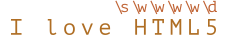

# Znakové třídy

Uvažujme praktickou úlohu: máme telefonní číslo, například `"+7(903)-123-45-67"`, a potřebujeme je převést na čisté číslo obsahující jen číslice: `79031234567`.

Můžeme to udělat tak, že najdeme a odstraníme vše, co není číslice. Mohou nám s tím pomoci znakové třídy.

*Znaková třída* je speciální zápis, kterému odpovídají všechny symboly z určité množiny.

Na začátku vysvětlíme třídu „číslic“. Zapisuje se `pattern:\d` a odpovídá „jedné libovolné číslici“.

Najděme například první číslici v telefonním čísle:

```js run
let řetězec = "+7(903)-123-45-67";

let rv = /\d/;

alert( řetězec.match(rv) ); // 7
```

Bez příznaku `pattern:g` regulární výraz hledá pouze první shodu, kterou je první číslice `pattern:\d`.

Přidejme příznak `pattern:g`, abychom našli všechny číslice:

```js run
let řetězec = "+7(903)-123-45-67";

let rv = /\d/g;

alert( řetězec.match(rv) ); // pole shod: 7,9,0,3,1,2,3,4,5,6,7

// vytvořme z nich telefonní číslo skládající se jen z číslic:
alert( řetězec.match(rv).join('') ); // 79031234567
```

To byla znaková třída pro číslice. Existují i jiné znakové třídy.

Nejpoužívanější jsou:

`pattern:\d` („d“ od slova „digit“, číslice)
: Číslice: znak od `0` do `9`.

`pattern:\s` („s“ od slova „space“, mezera)
: Mezerový symbol: patří sem mezery, tabelátory `\t`, nové řádky `\n` a několik dalších vzácných znaků, např. `\v`, `\f` a `\r`.

`pattern:\w` („w“ od slova „word“, slovo)
: „Slovní“ znak: písmeno latinské abecedy, číslice nebo podtržítko `_`. Znaky nelatinských abeced (např. kyrilice nebo hindi) *(včetně písmen s diakritickými znaménky -- pozn. překl.)* do `pattern:\w` nepatří.

Například `pattern:\d\s\w` znamená „číslici“ následovanou „mezerovým znakem“ následovaným „slovním znakem“, například `match:1 a`.

**Regulární výraz může obsahovat regulární symboly a znakové třídy současně.**

Například výrazu `pattern:CSS\d` odpovídá řetězec `match:CSS` následovaný číslicí:

```js run
let řetězec = "Je tam CSS4?";
let rv = /CSS\d/

alert( řetězec.match(rv) ); // CSS4
```

Můžeme použít i více znakových tříd najednou:

```js run
alert( "I love HTML5!".match(/\s\w\w\w\w\d/) ); // ' HTML5'
```

Shoda (každá znaková třída regulárního výrazu má ve výsledku odpovídající znak):



## Inverzní třídy

Ke každé znakové třídě existuje „inverzní třída“, označovaná stejným, ale velkým písmenem.

„Inverzní“ znamená, že odpovídá všem ostatním znakům, například:

`pattern:\D`
: Nečíslice: jakýkoli znak kromě `pattern:\d`, například písmeno.

`pattern:\S`
: Nemezerový znak: jakýkoli znak kromě `pattern:\s`, například písmeno.

`pattern:\W`
: Neslovní znak: cokoli kromě `pattern:\w`, například nelatinské písmeno nebo mezera.

Na začátku kapitoly jsme viděli, jak z řetězce jako `subject:+7(903)-123-45-67` vytvořit telefonní číslo obsahující pouze číslice: najdeme všechny číslice a spojíme je.

```js run
let řetězec = "+7(903)-123-45-67";

alert( řetězec.match(/\d/g).join('') ); // 79031234567
```

Alternativním, kratším způsobem je najít všechny nečíslicové znaky `pattern:\D` a odstranit je z řetězce:

```js run
let řetězec = "+7(903)-123-45-67";

alert( řetězec.replace(/\D/g, "") ); // 79031234567
```

## Tečka znamená „libovolný znak“

Tečka `pattern:.` je speciální znaková třída, které odpovídá „jakýkoli znak kromě konce řádku“.

Příklad:

```js run
alert( "Z".match(/./) ); // Z
```

Nebo uprostřed regulárního výrazu:

```js run
let rv = /CS.4/;

alert( "CSS4".match(rv) ); // CSS4
alert( "CS-4".match(rv) ); // CS-4
alert( "CS 4".match(rv) ); // CS 4 (mezera je také znak)
```

Prosíme všimněte si, že tečka znamená „libovolný znak“, ale ne „žádný znak“. Musí tam být znak, který jí bude odpovídat:

```js run
alert( "CS4".match(/CS.4/) ); // null, beze shody, protože pro tečku tam není žádný znak
```

### Tečka jako doslova jakýkoli znak s příznakem „s“

Standardně tečce neodpovídá znak nového řádku `\n`.

Například regulárnímu výrazu `pattern:A.B` odpovídá `match:A` a pak `match:B` s libovolným znakem mezi nimi kromě nového řádku `\n`:

```js run
alert( "A\nB".match(/A.B/) ); // null (není shoda)
```

V mnoha situacích bychom chtěli, aby tečka znamenala doslova „jakýkoli znak“ včetně nového řádku.

To zajistí příznak `pattern:s`. Pokud ho regulární výraz obsahuje, pak tečka `pattern:.` znamená doslova libovolný znak:

```js run
alert( "A\nB".match(/A.B/s) ); // A\nB (shoda!)
```

````warn header="Není podporován v IE"
Příznak `pattern:s` není podporován v IE.

Naštěstí je tady alternativa, která funguje všude. K nalezení „libovolného znaku“ můžeme použít regulární výraz jako `pattern:[\s\S]` (tento vzor vysvětlíme v článku <info:regexp-character-sets-and-ranges>).

```js run
alert( "A\nB".match(/A[\s\S]B/) ); // A\nB (shoda!)
```

Vzor `pattern:[\s\S]` říká doslova: „mezerový znak NEBO nemezerový znak“. Jinými slovy: „cokoli“. Můžeme použít i jinou dvojici doplňujících se tříd, např. `pattern:[\d\D]`, na tom nezáleží. Nebo dokonce vzor `pattern:[^]` -- tomu odpovídá jakýkoli znak kromě žádného.

Tento trik můžeme použít i tehdy, když chceme ve stejném vzoru mít oba druhy „teček“: obvyklou tečku `pattern:.` chovající se běžným způsobem („kromě nového řádku“) a také způsob, jak najít „libovolný znak“ pomocí vzoru `pattern:[\s\S]` nebo podobného.
````

````warn header="Dávejte pozor na mezery"
Mezerám obvykle nevěnujeme velkou pozornost. Řetězce `subject:1-5` a `subject:1 - 5` jsou pro nás téměř stejné.

Pokud však regulární výraz nebude brát mezery v úvahu, může fungovat nesprávně.

Zkusme najít číslice oddělené pomlčkou:

```js run
alert( "1 - 5".match(/\d-\d/) ); // null, není shoda!
```

Opravme to přidáním mezer do regulárního výrazu `pattern:\d - \d`:

```js run
alert( "1 - 5".match(/\d - \d/) ); // 1 - 5, nyní funguje
// nebo můžeme použít třídu \s:
alert( "1 - 5".match(/\d\s-\s\d/) ); // 1 - 5, také funguje
```

**Mezera je znak. Je stejně důležitý jako kterýkoli jiný znak.**

Nemůžeme do regulárního výrazu přidat nebo z něj odstranit mezery a očekávat, že bude fungovat stále stejně.

Jinými slovy, v regulárním výrazu záleží na všech znacích včetně mezer.
````

## Shrnutí

Existují následující znakové třídy:

- `pattern:\d` -- číslice.
- `pattern:\D` -- nečíslice.
- `pattern:\s` -- mezerové symboly, tabelátory, nové řádky.
- `pattern:\S` -- všechno kromě `pattern:\s`.
- `pattern:\w` -- latinská písmena, číslice, podtržítko `'_'`.
- `pattern:\W` -- všechno kromě `pattern:\w`.
- `pattern:.` -- s příznakem `'s'` libovolný znak, bez něj libovolný znak kromě nového řádku `\n`.

...To však není všechno!

Kódování Unicode, které JavaScript používá pro řetězce, poskytuje mnoho vlastností znaků, například: do kterého jazyka znak patří (pokud je to písmeno), zda je to interpunkční znaménko a podobně.

I podle těchto vlastností můžeme vyhledávat. Potřebujeme k tomu příznak `pattern:u`, který probereme v příštím článku.
