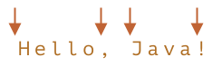

# Hranice slov: \b

Hranice slov `pattern:\b` je test, podobně jako `pattern:^` a `pattern:$`.

Když motor regulárních výrazů (programový modul, který implementuje hledání RV) narazí na `pattern:\b`, prověří, zda tato pozice v řetězci je hranicí slova.

Za hranici slova se považují celkem tři různé pozice:

- Na začátku řetězce, jestliže první znak v řetězci je slovní znak `pattern:\w`.
- Mezi dvěma znaky v řetězci, jestliže jeden z nich je slovní znak `pattern:\w` a druhý ne.
- Na konci řetězce, jestliže poslední znak v řetězci je slovní znak `pattern:\w`.

Například regulární výraz `pattern:\bJava\b` bude nalezen v `subject:Hello, Java!`, kde je `subject:Java` samostatné slovo, ale ne v `subject:Hello, JavaScript!`.

```js run
alert( "Hello, Java!".match(/\bJava\b/) ); // Java
alert( "Hello, JavaScript!".match(/\bJava\b/) ); // null
```

V řetězci `subject:Hello, Java!` odpovídají `pattern:\b` následující pozice:



Odpovídá tedy vzoru `pattern:\bHello\b`, protože:

1. První test `pattern:\b` najde shodu na začátku řetězce.
2. Pak se shoduje slovo `pattern:Hello`.
3. Pak znovu najde shodu test `pattern:\b`, jelikož jsme mezi `subject:o` a čárkou.

Vzor `pattern:\bHello\b` tedy najde shodu, ale vzor `pattern:\bHell\b` ne (protože za `l` není hranice slova) a `Java!\b` také ne (protože vykřičník není slovní znak `pattern:\w`, takže za ním nenásleduje hranice slova).

```js run
alert( "Hello, Java!".match(/\bHello\b/) ); // Hello
alert( "Hello, Java!".match(/\bJava\b/) );  // Java
alert( "Hello, Java!".match(/\bHell\b/) );  // null (žádná shoda)
alert( "Hello, Java!".match(/\bJava!\b/) ); // null (žádná shoda)
```

Můžeme používat `pattern:\b` nejenom se slovy, ale i s číslicemi.

Například vzor `pattern:\b\d\d\b` hledá samostatná 2-ciferná čísla. Jinými slovy, hledá 2-ciferná čísla, která jsou obklopena jinými znaky než `pattern:\w`, například mezerami nebo interpunkčními znaménky (nebo začátkem/koncem textu).

```js run
alert( "1 23 456 78".match(/\b\d\d\b/g) ); // 23,78
alert( "12,34,56".match(/\b\d\d\b/g) ); // 12,34,56
```

```warn header="Hranice slov `pattern:\b` nefunguje pro nelatinské abecedy"
Test hranice slova `pattern:\b` prověřuje, zda je na jedné straně pozice `pattern:\w` a na druhé „něco jiného než `pattern:\w`“.

Avšak `pattern:\w` znamená písmeno latinské abecedy `a-z` (nebo číslici či podtržítko), takže na jiných znacích, např. písmenech kyrilice nebo hieroglyfech, test nebude fungovat.
```
