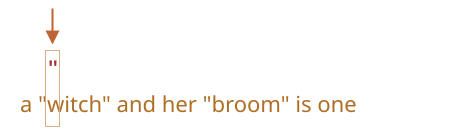
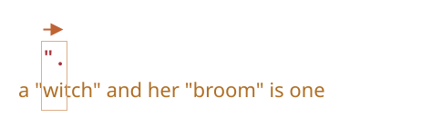
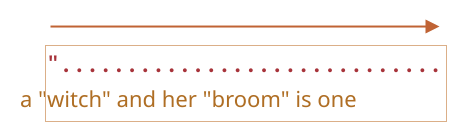
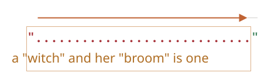
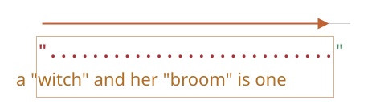
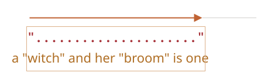
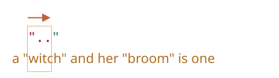
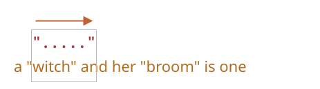
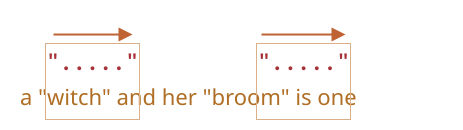

# Hltavé a liknavé kvantifikátory

Na první pohled jsou kvantifikátory velice jednoduché, ale ve skutečnosti mohou být záludné.

Pokud plánujeme hledat něco složitějšího než `pattern:/\d+/`, měli bychom velmi dobře rozumět tomu, jak hledání funguje.

Jako příklad si vezměme následující úlohu.

Máme text a potřebujeme v něm nahradit všechny uvozovky `"..."` francouzskými: `«...»`. Ty jsou preferovány v typografii v mnoha zemích.

Například z `"Ahoj, světe"` by se mělo stát `«Ahoj, světe»`. Existují i jiné uvozovky, například `„Witaj, świecie!”` (polské), `„Ahoj, světe“` (české) nebo `「你好，世界」` (čínské), ale pro naši úlohu jsme si vybrali `«...»`.

Jako první musíme najít řetězce v uvozovkách a pak je můžeme nahradit.

Regulární výraz jako `pattern:/".+"/g` (uvozovky, pak něco a pak další uvozovky) se může jevit jako vyhovující, ale není!

Zkusme to:

```js run
let rv = /".+"/g;

let řetězec = 'a "witch" and her "broom" is one';

alert( řetězec.match(rv) ); // "witch" and her "broom"
```

...Vidíme, že to nefunguje tak, jak jsme zamýšleli!

Místo nalezení dvou shod `match:"witch"` a `match:"broom"` byla nalezena jen jedna: `match:"witch" and her "broom"`.

Můžeme to popsat jako „nenasytnost je příčinou všeho zla“.

## Hltavé hledání

Aby motor regulárních výrazů našel shodu, používá následující algoritmus:

- Pro každou pozici v řetězci:
    - Zkusí nalézt vzor na této pozici.
    - Pokud není vzor nalezen, přejde k další pozici.

Z tohoto obyčejného vysvětlení není jasné, proč tento RV selhal. Proto vysvětlíme, jak hledání funguje, na vzoru `pattern:".+"`.

1. Prvním znakem vzoru jsou uvozovky `pattern:"`.

    Motor regulárních výrazů se snaží najít je na nulové pozici zdrojového řetězce `subject:a "witch" and her "broom" is one`, ale tam je `subject:a`, takže v tomto okamžiku není žádná shoda.
    
    Pak pokračuje: jde ve zdrojovém řetězci na další pozice a snaží se na nich najít první znak vzoru, znovu selže a nakonec najde uvozovky na 3. pozici:

    

2. Uvozovky jsou detekovány a pak se motor pokusí najít shodu se zbytkem vzoru. Podívá se, zda zbytek prohledávaného řetězce odpovídá vzoru `pattern:.+"`.

    V našem případě je dalším znakem vzoru `pattern:.` (tečka). Ta znamená „libovolný znak kromě nového řádku“, takže další písmeno řetězce `match:'w'` odpovídá:

    

3. Pak se tečka opakuje kvůli kvantifikátoru `pattern:.+`. Motor regulárních výrazů přidává do shody jeden znak za druhým.

    ...Jak dlouho? Všechny znaky odpovídají tečce, takže se zastaví až tehdy, když narazí na konec řetězce:

    

4. Nyní motor skončil s opakováním `pattern:.+` a snaží se najít další znak vzoru. Tím jsou uvozovky `pattern:"`. Tady je však problém: řetězec skončil a další znaky neobsahuje!

    Motor regulárních výrazů pochopí, že si vzal příliš mnoho `pattern:.+`, a zahájí *zpětný průchod*.

    Jinými slovy, zkrátí shodu pro kvantifikátor o jeden znak:

    

    Nyní předpokládá, že `pattern:.+` končí jeden znak před koncem řetězce, a snaží se najít shodu se zbytkem vzoru od této pozice.

    Kdyby tam byly uvozovky, hledání by skončilo, ale poslední znak je `subject:'e'`, takže shoda nenastane.

5. ...Motor tedy sníží počet opakování vzoru `pattern:.+` o další znak:

    

    Uvozovky `pattern:'"'` se neshodují s `subject:'n'`.

6. Motor pokračuje ve zpětném průchodu: snižuje počet opakování `pattern:'.'`, dokud se neshoduje zbytek vzoru (v našem případě `pattern:'"'`):

    

7. Shoda je kompletní.

8. První shoda je tedy `match:"witch" and her "broom"`. Jestliže regulární výraz obsahuje příznak `pattern:g`, bude hledání pokračovat od místa, kde první shoda skončila. Ve zbytku řetězce `subject:is one` žádné další uvozovky nejsou, takže další výsledky se nenajdou.

To není pravděpodobně to, co jsme očekávali, ale takhle to funguje.

**V hltavém (greedy) režimu (standardním) se kvantifikovaný znak opakuje tolikrát, kolikrát je to možné.**

Motor RV přidává do shody s `pattern:.+` tolik znaků, kolik může, a pak shodu zkracuje po jednom znaku, dokud zbytek vzoru nesouhlasí.

V naší úloze však potřebujeme něco jiného. Tady nám může pomoci liknavý režim.

## Liknavý režim

Liknavý (lazy) režim kvantifikátorů je opakem hltavého režimu. Znamená „co nejmenší počet opakování“.

Můžeme jej povolit uvedením otazníku `pattern:'?'` za kvantifikátorem, takže se z něj stane `pattern:*?` nebo `pattern:+?` nebo dokonce `pattern:??` pro `pattern:'?'`.

Aby to bylo jasné: otazník `pattern:?` je obvykle sám o sobě kvantifikátor (žádný nebo jeden), ale pokud je přidán *za jiný kvantifikátor (třeba i za sebe)*, získá odlišný význam -- přepne režim shody z hltavého do liknavého.

Regulární výraz `pattern:/".+?"/g` funguje tak, jak jsme zamýšleli: nalezne `match:"witch"` a `match:"broom"`:

```js run
let rv = /".+?"/g;

let řetězec = 'a "witch" and her "broom" is one';

alert( řetězec.match(rv) ); // "witch", "broom"
```

Abychom změnu správně pochopili, projděme si hledání krok za krokem.

1. První krok je stejný: nalezne začátek vzoru `pattern:'"'` na 3. pozici:

    

2. Další krok je podobný: motor najde shodu s tečkou `pattern:'.'`:

    

3. A nyní se hledání začne chovat odlišně. Protože pro `pattern:+?` máme liknavý režim, motor se nepokusí najít další tečku, ale hned teď se zastaví a pokusí se najít shodu se zbytkem vzoru `pattern:'"'`:

    

    Kdyby tam byly uvozovky, hledání by skončilo, ale je tam `'i'`, takže shoda nenastane.
4. Pak motor regulárních výrazů zvýší počet opakování tečky a pokusí se znovu o totéž:

    

    Opět neúspěch. Pak se počet opakování zvyšuje znovu a znovu...
5. ...Dokud nebude nalezena shoda se zbytkem vzoru:

    

6. Další hledání začne od konce aktuální shody a vydá jeden další výsledek:

    

V tomto příkladu jsme viděli, jak liknavý režim funguje pro vzor `pattern:+?`. Kvantifikátory `pattern:*?` a `pattern:??` fungují podobně -- motor RV zvyšuje počet opakování jen tehdy, pokud se zbytek vzoru na dané pozici neshoduje.

**Liknavý režim je povolen pouze u kvantifikátorů s `?`.**

Ostatní kvantifikátory zůstanou hltavé.

Příklad:

```js run
alert( "123 456".match(/\d+ \d+?/) ); // 123 4
```

1. Vzor `pattern:\d+` se pokusí najít co nejvíce číslic (hltavý režim), takže najde `match:123` a zastaví se, protože další znak je mezera `pattern:' '`.
2. Pak je ve vzoru mezera, shoduje se.
3. Pak je `pattern:\d+?`. Kvantifikátor je v liknavém režimu, takže najde jednu číslici `match:4` a pokusí se ověřit, zda se zbytek vzoru shoduje od této pozice.

    ...Ve vzoru však po `pattern:\d+?` nic nenásleduje.

    Liknavý režim neopakuje nic, pokud to není nutné. Vzor skončil, takže jsme hotovi. Máme shodu `match:123 4`.

```smart header="Optimalizace"
Moderní motory regulárních výrazů mohou své vnitřní algoritmy optimalizovat, aby fungovaly rychleji. Mohou tedy fungovat trochu odlišně od popisovaného algoritmu.

K pochopení, jak regulární výrazy fungují a jak je vytvářet, o tom však nemusíme nic vědět. To se používá jen interně pro optimalizaci.

Složité regulární výrazy se optimalizují obtížně, takže hledání může fungovat přesně tak, jak je zde popsáno.
```

## Alternativní přístup

U regulárních výrazů často existuje více způsobů, jak udělat totéž.

V našem případě můžeme najít řetězce v uvozovkách bez liknavého režimu regulárním výrazem `pattern:"[^"]+"`:

```js run
let rv = /"[^"]+"/g;

let řetězec = 'a "witch" and her "broom" is one';

alert( řetězec.match(rv) ); // "witch", "broom"
```

Regulární výraz `pattern:"[^"]+"` dává správné výsledky, protože hledá uvozovky `pattern:'"'`, po nichž následuje jeden nebo více jiných znaků než uvozovky `pattern:[^"]` a pak uzavírací uvozovky.

Když motor RV hledá `pattern:[^"]+`, zastaví opakování ve chvíli, kdy narazí na uzavírací uvozovky, a je hotov.

Prosíme všimněte si, že tato logika nenahrazuje liknavé kvantifikátory!

Je to jen něco jiného. Jsou chvíle, kdy potřebujeme jedno nebo druhé.

**Podívejme se na příklad, kdy liknavé kvantifikátory selžou a tato varianta funguje správně.**

Například chceme najít odkazy ve tvaru `<a href="..." class="doc">` s jakýmkoli `href`.

Jaký regulární výraz použijeme?

První myšlenka by mohla být: `pattern:/<a href=".*" class="doc">/g`.

Ověřme to:
```js run
let řetězec = '...<a href="link" class="doc">...';
let rv = /<a href=".*" class="doc">/g;

// Funguje!
alert( řetězec.match(rv) ); // <a href="link" class="doc">
```

Fungovalo to. Ale co se stane, když je v textu více odkazů?

```js run
let řetězec = '...<a href="link1" class="doc">... <a href="link2" class="doc">...';
let rv = /<a href=".*" class="doc">/g;

// Ouha! Dva odkazy v jedné shodě!
alert( řetězec.match(rv) ); // <a href="link1" class="doc">... <a href="link2" class="doc">
```

Nyní je výsledek nesprávný ze stejného důvodu jako v našem příkladu s „čarodějnicí“ („witch“). Kvantifikátor `pattern:.*` vzal příliš mnoho znaků.

Shoda vypadá takto:

```html
<a href="....................................." class="doc">
<a href="link1" class="doc">... <a href="link2" class="doc">
```

Modifikujme vzor tak, že kvantifikátor `pattern:.*?` učiníme liknavým:

```js run
let řetězec = '...<a href="link1" class="doc">... <a href="link2" class="doc">...';
let rv = /<a href=".*?" class="doc">/g;

// Funguje to!
alert( řetězec.match(rv) ); // <a href="link1" class="doc">, <a href="link2" class="doc">
```

Nyní se zdá, že to funguje, našly se dvě shody:

```html
<a href="....." class="doc">    <a href="....." class="doc">
<a href="link1" class="doc">... <a href="link2" class="doc">
```

...Ale otestujme to na jiném textovém vstupu:

```js run
let řetězec = '...<a href="link1" class="špatná">... <p style="" class="doc">...';
let rv = /<a href=".*?" class="doc">/g;

// Špatná shoda!
alert( řetězec.match(rv) ); // <a href="link1" class="špatná">... <p style="" class="doc">
```

Nyní to selže. Shoda neobsahuje jen odkaz, ale i spoustu textu za ním včetně `<p...>`.

Proč?

Stane se následující:

1. Nejprve RV najde začátek odkazu `match:<a href="`.
2. Pak hledá `pattern:.*?`: vezme jeden znak (liknavě!) a prověří, zda je shoda s `pattern:" class="doc">` (není).
3. Pak vezme do `pattern:.*?` další znak a tak dále... až nakonec dorazí k `match:" class="doc">`.

Problém je však v tom, že    tento text je už za odkazem `<a...>`, v jiné značce `<p>`. To není to, co chceme.

Zde je obrázek shody zarovnané s textem:

```html
<a href="...................................." class="doc">
<a href="link1" class="špatná">... <p style="" class="doc">
```

Potřebujeme tedy, aby vzor hledal `<a href="...něco..." class="doc">`, ale hltavá i liknavá varianta tady mají problém.

Správná varianta může být: `pattern:href="[^"]*"`. Vezme všechny znaky uvnitř atributu `href` až do nejbližších uvozovek, což je přesně to, co potřebujeme.

Fungující příklad:

```js run
let řetězec1 = '...<a href="link1" class="špatná">... <p style="" class="doc">...';
let řetězec2 = '...<a href="link1" class="doc">... <a href="link2" class="doc">...';
let rv = /<a href="[^"]*" class="doc">/g;

// Funguje!
alert( řetězec1.match(rv) ); // null, žádná shoda, to je správně
alert( řetězec2.match(rv) ); // <a href="link1" class="doc">, <a href="link2" class="doc">
```

## Shrnutí

Kvantifikátory mají dva režimy práce:

Hltavý
: Standardně se motor regulárních výrazů snaží opakovat kvantifikovaný znak tolikrát, kolikrát je to možné. Například `pattern:\d+` pohltí všechny možné číslice. Až přestane být možné pohlcovat další (další číslice nejsou nebo řetězec skončil), pokračuje v porovnávání se zbytkem vzoru. Pokud nenajde shodu, sníží počet opakování (zpětný průchod) a zkusí to znovu.

Liknavý
: Nastavuje se otazníkem `pattern:?` za kvantifikátorem. Motor RV se pokusí porovnat zbytek vzoru před každým opakováním kvantifikovaného znaku.

Jak jsme viděli, liknavý režim není „všelékem“ oproti hltavému hledání. Alternativou je „vyladěné“ hltavé hledání s uvedením vyloučení, jako ve vzoru `pattern:"[^"]+"`.
