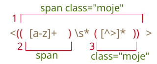

# Zachytávací skupiny

Část vzoru můžeme uzavřít do závorek `pattern:(...)`. Tato část se pak nazývá „zachytávací skupina“.

Má dva efekty:

1. Umožňuje nám získat část shody jako samostatný prvek pole výsledků.
2. Jestliže za závorky umístíme kvantifikátor, aplikuje se na závorky jako na celek.

## Příklady

Na příkladech se podívejme, jak závorky fungují.

### Příklad: gogogo

Vzor `pattern:go+` bez závorek znamená znak `subject:g`, po němž následuje jednou nebo vícekrát opakované `subject:o`, například `match:goooo` nebo `match:gooooooooo`.

Závorky seskupují znaky dohromady, takže `pattern:(go)+` znamená `match:go`, `match:gogo`, `match:gogogo` a tak dále.

```js run
alert( 'Gogogo teď!'.match(/(go)+/ig) ); // "Gogogo"
```

### Příklad: doména

Vytvořme něco složitějšího -- regulární výraz pro hledání domény webového sídla.

Příklad:

```
mail.com
users.mail.com
smith.users.mail.com
```

Jak vidíme, doména se skládá z opakovaných slov a po každém z nich kromě posledního následuje tečka.

V regulárních výrazech to je `pattern:(\w+\.)+\w+`:

```js run
let rv = /(\w+\.)+\w+/g;

alert( "site.com my.site.com".match(rv) ); // site.com,my.site.com
```

Hledání funguje, ale vzor nenajde doménu s pomlčkou, např. `my-site.com`, protože pomlčka nepatří do třídy `pattern:\w`.

Můžeme to opravit nahrazením `pattern:\w` za `pattern:[\w-]` v každém slově kromě posledního: `pattern:([\w-]+\.)+\w+`.

### Příklad: e-mail

Předchozí příklad můžeme rozšířit. Můžeme na jeho základě vytvořit regulární výraz pro e-maily.

Formát e-mailu je: `jméno@doména`. Jméno může být libovolné slovo, jsou povoleny i pomlčky a tečky. V regulárních výrazech to je `pattern:[-.\w]+`.

Vzor:

```js run
let rv = /[-.\w]+@([\w-]+\.)+[\w-]+/g;

alert("my@mail.com @ his@site.com.uk".match(rv)); // my@mail.com, his@site.com.uk
```

Tento regulární výraz není dokonalý, ale většinou funguje a pomáhá opravovat neúmyslné překlepy. Jediná skutečně spolehlivá kontrola e-mailu je poslat na něj zprávu.

## Obsah závorek ve shodě

Závorky jsou číslovány zleva doprava. Vyhledávací motor si pamatuje obsah každé z nich v nalezené shodě a umožňuje ho načíst ve výsledku.

Metoda `řetězec.match(rv)`, pokud `rv` nemá příznak `g`, najde první shodu a vrátí ji jako pole:

1. Na indexu `0`: celá shoda.
2. Na indexu `1`: obsah prvních závorek.
3. Na indexu `2`: obsah druhých závorek.
4. ...a tak dále...

Například chceme najít HTML značky `pattern:<.*?>` a zpracovat je. Bylo by vhodné mít obsah značky (to, co je v lomených závorkách) v samostatné proměnné.

Uzavřeme vnitřní obsah do závorek: `pattern:<(.*?)>`.

Nyní ve výsledném poli získáme jak značku jako celek `match:<h1>`, tak její obsah `match:h1`:

```js run
let řetězec = '<h1>Ahoj, světe!</h1>';

let značka = řetězec.match(/<(.*?)>/);

alert( značka[0] ); // <h1>
alert( značka[1] ); // h1
```

### Vnořené skupiny

Závorky mohou být vnořené. I v takovém případě se číslují zleva doprava.

Například když hledáme značku ve `subject:<span class="moje">`, může nás zajímat:

1. Obsah značky jako celek: `match:span class="moje"`.
2. Název značky: `match:span`.
3. Atributy značky: `match:class="moje"`.

Přidejme pro ně závorky: `pattern:<(([a-z]+)\s*([^>]*))>`.

Budou očíslovány následovně (zleva doprava podle otevírací závorky):



V akci:

```js run
let řetězec = '<span class="moje">';

let rv = /<(([a-z]+)\s*([^>]*))>/;

let výsledek = řetězec.match(rv);
alert(výsledek[0]); // <span class="moje">
alert(výsledek[1]); // span class="moje"
alert(výsledek[2]); // span
alert(výsledek[3]); // class="moje"
```

Nulový index pole `výsledek` obsahuje vždy celou shodu.

Pak následují skupiny, očíslované zleva doprava podle otevírací závorky. První skupina je vrácena ve `výsledek[1]`. V tomto případě obsahuje celý obsah značky.

Pak `výsledek[2]` obsahuje skupinu ze druhé otevírací závorky `pattern:([a-z]+)` - název značky, pak `výsledek[3]` obsahuje značku: `pattern:([^>]*)`.

Obsah každé skupiny v řetězci:


### Nepovinné skupiny

I když je skupina nepovinná a ve shodě se nevyskytuje (např. má kvantifikátor `pattern:(...)?`), odpovídající prvek pole `výsledek` bude přítomen a bude se rovnat `undefined`.

Uvažujme například regulární výraz `pattern:a(z)?(c)?`. Hledá `"a"`, po němž může následovat `"z"`, po němž může následovat `"c"`.

Pokud jej spustíme na řetězci obsahujícím jediné písmeno `subject:a`, výsledek bude:

```js run
let shoda = 'a'.match(/a(z)?(c)?/);

alert( shoda.length ); // 3
alert( shoda[0] ); // a (celá shoda)
alert( shoda[1] ); // undefined
alert( shoda[2] ); // undefined
```

Pole má délku `3`, ale všechny skupiny jsou prázdné.

A zde je složitější shoda pro řetězec `subject:ac`:

```js run
let shoda = 'ac'.match(/a(z)?(c)?/)

alert( shoda.length ); // 3
alert( shoda[0] ); // ac (celá shoda)
alert( shoda[1] ); // undefined, protože pro (z)? tam nic není
alert( shoda[2] ); // c
```

Délka pole je stále stejná: `3`. Pro skupinu `pattern:(z)?` tam však nic není, takže výsledek je `["ac", undefined, "c"]`.

## Hledání všech shod se skupinami: matchAll

```warn header="`matchAll` je nová metoda, možná bude zapotřebí polyfill"
Metoda `matchAll` není podporována ve starých prohlížečích.

Může být zapotřebí polyfill, například <https://github.com/ljharb/String.prototype.matchAll>.
```

Když hledáme všechny shody (příznak `pattern:g`), metoda `match` nevrací obsahy skupin.

Najděme například všechny značky v řetězci:

```js run
let řetězec = '<h1> <h2>';

let značky = řetězec.match(/<(.*?)>/g);

alert( značky ); // <h1>,<h2>
```

Výsledkem je pole shod, ale bez detailů o každé z nich. V praxi však zpravidla ve výsledku potřebujeme obsahy zachytávacích skupin.
 
Abychom je získali, měli bychom hledat metodou `řetězec.matchAll(rv)`.

Byla do JavaScriptu přidána až dlouho po `match` jako její „nová a vylepšená verze“.

Hledá shody stejně jako `match`, ale jsou tady 3 rozdíly:

1. Nevrací pole, ale iterovatelný objekt.
2. Pokud je uveden příznak `pattern:g`, vrací každou shodu jako pole se skupinami.
3. Nejsou-li žádné shody, nevrací `null`, ale prázdný iterovatelný objekt.

Příklad:

```js run
let výsledky = '<h1> <h2>'.matchAll(/<(.*?)>/gi);

// výsledky není pole, ale iterovatelný objekt
alert(výsledky); // [object RegExp String Iterator]

alert(výsledky[0]); // undefined (*)

výsledky = Array.from(výsledky); // změníme ho na pole

alert(výsledky[0]); // <h1>,h1 (1. značka)
alert(výsledky[1]); // <h2>,h2 (2. značka)
```

Jak vidíme, první rozdíl je velmi důležitý, jak je ukázáno na řádku `(*)`. Nemůžeme načíst shodu jako `výsledky[0]`, protože tento objekt je pseudopole. Můžeme z něj udělat opravdové `Array` pomocí `Array.from`. Další podrobnosti o pseudopolích a iterovatelných objektech naleznete v článku <info:iterable>.

Pokud výsledky procházíme v cyklu, není `Array.from` nutné:

```js run
let výsledky = '<h1> <h2>'.matchAll(/<(.*?)>/gi);

for(let výsledek of výsledky) {
  alert(výsledek);
  // první alert: <h1>,h1
  // druhý: <h2>,h2
}
```

...Nebo při použití destrukturace:

```js
let [značka1, značka2] = '<h1> <h2>'.matchAll(/<(.*?)>/gi);
```

Každá shoda, vrácená metodou `matchAll`, má stejný formát, jako by ji vrátila metoda `match` bez příznaku `pattern:g`: je to pole s dalšími vlastnostmi `index` (index shody v řetězci) a `input` (zdrojový řetězec):

```js run
let výsledky = '<h1> <h2>'.matchAll(/<(.*?)>/gi);

let [značka1, značka2] = výsledky;

alert( značka1[0] ); // <h1>
alert( značka1[1] ); // h1
alert( značka1.index ); // 0
alert( značka1.input ); // <h1> <h2>
```

```smart header="Proč je výsledkem `matchAll` iterovatelný objekt a ne pole?"
Proč je tato metoda navržena zrovna takto? Důvod je jednoduchý -- kvůli optimalizaci.

Volání `matchAll` neprovádí hledání. Místo toho vrátí iterovatelný objekt, zpočátku bez výsledků. Hledání je prováděno pokaždé, kdy nad ním iterujeme, např. v cyklu.

Bude tedy nalezeno tolik výsledků, kolik potřebujeme, ne více.

Například v textu může být 100 shod, ale v cyklu `for..of` nalezneme 5 z nich a pak se rozhodneme, že to stačí, a zavoláme `break`. Motor pak nebude ztrácet čas hledáním dalších 95 shod.
```

## Pojmenované skupiny

Pamatovat si skupiny podle čísel je těžké. U jednoduchých vzorů to dokážeme, ale u složitějších je počítání závorek nepraktické. Máme mnohem lepší možnost: pojmenovat závorky.

Učiníme to uvedením `pattern:?<jméno>` hned za otevírací závorkou.

Hledejme například datum ve formátu „rok-měsíc-den“:

```js run
*!*
let rvDatum = /(?<rok>[0-9]{4})-(?<měsíc>[0-9]{2})-(?<den>[0-9]{2})/;
*/!*
let řetězec = "2019-04-30";

let skupiny = řetězec.match(rvDatum).groups;

alert(skupiny.rok); // 2019
alert(skupiny.měsíc); // 04
alert(skupiny.den); // 30
```

Jak vidíte, skupiny se nacházejí ve vlastnosti shody `.groups`.

Chceme-li najít všechna data, můžeme přidat příznak `pattern:g`.

Potřebujeme také `matchAll` k získání celých shod společně se skupinami:

```js run
let rvDatum = /(?<rok>[0-9]{4})-(?<měsíc>[0-9]{2})-(?<den>[0-9]{2})/g;

let řetězec = "2019-10-30 2020-01-01";

let výsledky = řetězec.matchAll(rvDatum);

for(let výsledek of výsledky) {
  let {rok, měsíc, den} = výsledek.groups;

  alert(`${den}.${měsíc}.${rok}`);
  // první alert: 30.10.2019
  // druhý: 01.01.2020
}
```

## Zachytávací skupiny při nahrazování

Metoda `řetězec.replace(rv, náhrada)`, která nahrazuje všechny shody s regulárním výrazem `rv` v řetězci `řetězec`, umožňuje použít obsah závorek v řetězci `náhrada`. To se provádí pomocí `pattern:$n`, kde `pattern:n` je číslo skupiny.

Příklad:

```js run
let řetězec = "Jan Novak";
let rv = /(\w+) (\w+)/;

alert( řetězec.replace(rv, '$2, $1') ); // Novak, Jan
```

Odkaz na pojmenované závorky bude `pattern:$<jméno>`.

Například přeformátujme data z formátu „rok-měsíc-den“ na „den.měsíc.rok“:

```js run
let rv = /(?<rok>[0-9]{4})-(?<měsíc>[0-9]{2})-(?<den>[0-9]{2})/g;

let řetězec = "2019-10-30, 2020-01-01";

alert( řetězec.replace(rv, '$<den>.$<měsíc>.$<rok>') );
// 30.10.2019, 01.01.2020
```

## Nezachytávací skupiny s ?:

Někdy potřebujeme závorky k tomu, abychom správně aplikovali kvantifikátor, ale jejich obsah nechceme mít ve výsledcích.

Skupinu můžeme vyloučit z výsledků uvedením `pattern:?:` na jejím začátku.

Například když chceme najít `pattern:(go)+`, ale nechceme mít obsah závorek (`go`) jako samostatný prvek pole, můžeme napsat: `pattern:(?:go)+`.

V následujícím příkladu získáme jako samostatný prvek shody jedině jméno `match:Jan`:

```js run
let řetězec = "Gogogo Jan!";

*!*
// ?: vyloučí 'go' ze zachytávání
let rv = /(?:go)+ (\w+)/i;
*/!*

let výsledek = řetězec.match(rv);

alert( výsledek[0] ); // Gogogo Jan (celá shoda)
alert( výsledek[1] ); // Jan
alert( výsledek.length ); // 2 (pole neobsahuje další prvky)
```

## Shrnutí

Závorky seskupují dohromady část regulárního výrazu, takže kvantifikátor se na ně aplikuje jako na celek.

Závorkové skupiny jsou očíslovány zleva doprava a mohou být pojmenovány pomocí `(?<jméno>...)`.

Obsah, kterému odpovídá skupina, můžeme získat ve výsledcích:

- Metoda `řetězec.match` vrací zachytávací skupiny jen bez příznaku `pattern:g`.
- Metoda `řetězec.matchAll` vrací zachytávací skupiny vždy.

Pokud závorky nemají jméno, je jejich obsah dostupný v poli shod podle jejich čísla. Pojmenované závorky jsou k dispozici i ve vlastnosti `groups`.

Obsah závorek můžeme použít i v nahrazovacím řetězci v metodě `řetězec.replace`: podle čísla `$n` nebo jména `$<jméno>`.

Skupinu můžeme vyloučit z číslování uvedením `pattern:?:` na jejím začátku. To používáme, když potřebujeme aplikovat kvantifikátor na celou skupinu, ale nechceme ji jako samostatný prvek v poli výsledků. Na takové závorky se také nemůžeme odkazovat v nahrazovacím řetězci.
